## เอกสารประกอบ API

โดยปกติ API จะมีเอกสารประกอบเพื่อให้นักพัฒนาทราบวิธีการใช้และรวมเข้ากับ API

เอกสารสามารถอยู่ในรูปแบบที่มนุษย์อ่านได้และที่เครื่องอ่านได้ เอกสารที่มนุษย์อ่านได้ถูกออกแบบเพื่อให้นักพัฒนาเข้าใจวิธีการใช้ API อาจรวมถึงคำอธิบายโดยละเอียด ตัวอย่าง และสถานการณ์การใช้งาน เอกสารที่เครื่องอ่านได้ถูกออกแบบให้ถูกประมวลผลโดยซอฟต์แวร์เพื่อทำงานอัตโนมัติ เช่น การรวม API และการตรวจสอบ เขียนในรูปแบบโครงสร้างเช่น JSON หรือ XML

เอกสารประกอบ API มักพร้อมใช้งานสาธารณะ โดยเฉพาะหาก API มีไว้สำหรับใช้โดยนักพัฒนาภายนอก หากเป็นเช่นนั้น ให้เริ่มการสอบหาโดยการทบทวนเอกสารเสมอ

### การค้นพบเอกสารประกอบ API

แม้ว่าเอกสารประกอบ API จะไม่พร้อมใช้งานอย่างเปิดเผย คุณอาจยังสามารถเข้าถึงได้โดยการเรียกดูแอปพลิเคชันที่ใช้ API

ในการทำเช่นนี้ คุณสามารถใช้ Burp Scanner เพื่อรวบรวมข้อมูล API คุณยังสามารถเรียกดูแอปพลิเคชันด้วยตนเองโดยใช้เบราว์เซอร์ของ Burp มองหาจุดปลายที่อาจอ้างอิงถึงเอกสารประกอบ API ตัวอย่างเช่น:

- `/api`
- `/swagger/index.html`
- `/openapi.json`

หากคุณระบุจุดปลายสำหรับทรัพยากร ให้แน่ใจว่าได้ตรวจสอบเส้นทางฐาน ตัวอย่างเช่น หากคุณระบุจุดปลายทรัพยากร `/api/swagger/v1/users/123` คุณควรตรวจสอบเส้นทางต่อไปนี้:

- `/api/swagger/v1`
- `/api/swagger`
- `/api`

คุณยังสามารถใช้รายการเส้นทางทั่วไปเพื่อค้นหาเอกสารโดยใช้ Intruder
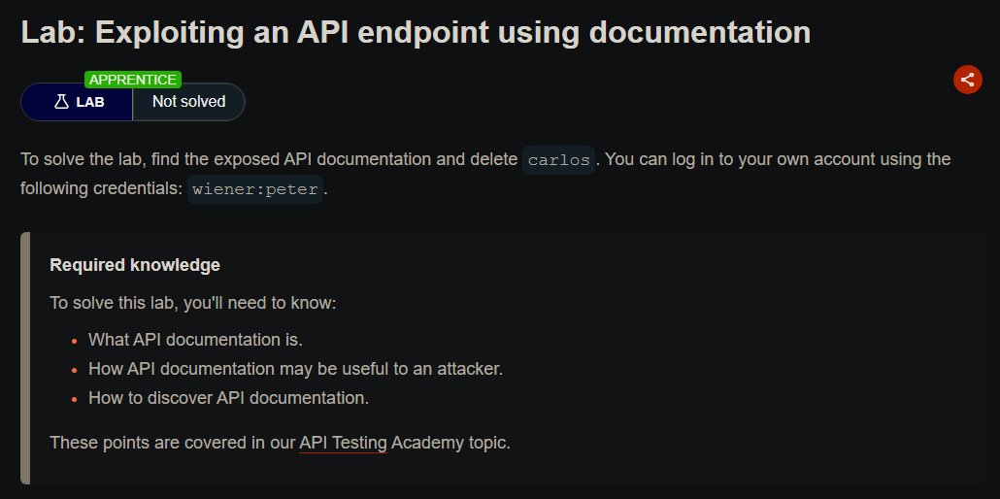

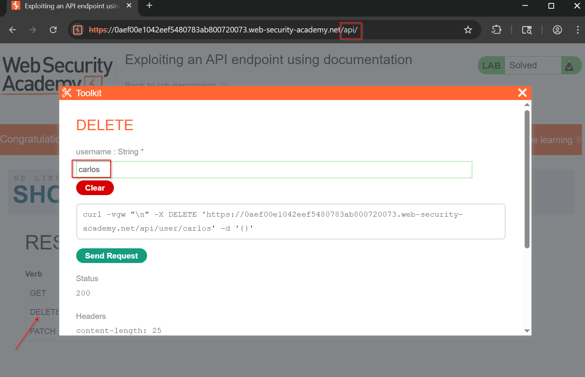
### การใช้เอกสารที่เครื่องอ่านได้

คุณสามารถใช้เครื่องมืออัตโนมัติหลากหลายเครื่องมือเพื่อวิเคราะห์เอกสารประกอบ API ที่เครื่องอ่านได้ที่คุณพบ

คุณสามารถใช้ Burp Scanner เพื่อรวบรวมและตรวจสอบเอกสาร OpenAPI หรือเอกสารอื่นๆ ในรูปแบบ JSON หรือ YAML คุณยังสามารถแยกวิเคราะห์เอกสาร OpenAPI โดยใช้ OpenAPI Parser BApp

คุณอาจสามารถใช้เครื่องมือเฉพาะทางเพื่อทดสอบจุดปลายที่เอกสารระบุ เช่น Postman หรือ SoapUI

## การระบุจุดปลาย API

คุณยังสามารถรวบรวมข้อมูลจำนวนมากโดยการเรียกดูแอปพลิเคชันที่ใช้ API สิ่งนี้มักคุ้มค่าที่จะทำแม้ว่าคุณจะสามารถเข้าถึงเอกสารประกอบ API ได้ เนื่องจากบางครั้งเอกสารอาจไม่ถูกต้องหรือล้าสมัย

คุณสามารถใช้ Burp Scanner เพื่อรวบรวมข้อมูลแอปพลิเคชัน จากนั้นตรวจสอบพื้นผิวการโจมตีที่น่าสนใจด้วยตนเองโดยใช้เบราว์เซอร์ของ Burp

ขณะเรียกดูแอปพลิเคชัน มองหารูปแบบที่บ่งบอกถึงจุดปลาย API ในโครงสร้าง URL เช่น `/api/` ยังต้องระวังไฟล์ JavaScript ไฟล์เหล่านี้อาจมีการอ้างอิงถึงจุดปลาย API ที่คุณไม่ได้เรียกใช้โดยตรงผ่านเว็บเบราว์เซอร์ Burp Scanner แยกจุดปลายบางส่วนโดยอัตโนมัติระหว่างการรวบรวมข้อมูล แต่สำหรับการแยกที่หนักกว่า ให้ใช้ JS Link Finder BApp คุณยังสามารถทบทวนไฟล์ JavaScript ใน Burp ด้วยตนเอง

## การโต้ตอบกับจุดปลาย API

เมื่อคุณระบุจุดปลาย API แล้ว ให้โต้ตอบกับพวกมันโดยใช้ Burp Repeater และ Burp Intruder สิ่งนี้ช่วยให้คุณสังเกตพฤติกรรมของ API และค้นพบพื้นผิวการโจมตีเพิ่มเติม ตัวอย่างเช่น คุณสามารถตรวจสอบว่า API ตอบสนองอย่างไรต่อการเปลี่ยนเมธอด HTTP และประเภทสื่อ

ขณะที่คุณโต้ตอบกับจุดปลาย API ให้ทบทวนข้อความแสดงข้อผิดพลาดและการตอบสนองอื่นๆ อย่างใกล้ชิด บางครั้งสิ่งเหล่านี้รวมข้อมูลที่คุณสามารถใช้เพื่อสร้างคำขอ HTTP ที่ถูกต้อง

### การระบุเมธอด HTTP ที่รองรับ

เมธอด HTTP ระบุการดำเนินการที่จะดำเนินการกับทรัพยากร ตัวอย่างเช่น:

- **GET** - ดึงข้อมูลจากทรัพยากร
- **PATCH** - นำการเปลี่ยนแปลงบางส่วนไปใช้กับทรัพยากร
- **OPTIONS** - ดึงข้อมูลเกี่ยวกับประเภทของเมธอดคำขอที่สามารถใช้กับทรัพยากร

จุดปลาย API อาจรองรับเมธอด HTTP ที่แตกต่างกัน จึงเป็นสิ่งสำคัญที่จะต้องทดสอบเมธอดที่เป็นไปได้ทั้งหมดเมื่อคุณตรวจสอบจุดปลาย API สิ่งนี้อาจช่วยให้คุณระบุฟังก์ชันจุดปลายเพิ่มเติม เปิดพื้นผิวการโจมตีมากขึ้น

ตัวอย่างเช่น จุดปลาย `/api/tasks` อาจรองรับเมธอดต่อไปนี้:

- `GET /api/tasks` - ดึงรายการงาน
- `POST /api/tasks` - สร้างงานใหม่
- `DELETE /api/tasks/1` - ลบงาน

คุณสามารถใช้รายการ HTTP verbs ในตัวใน Burp Intruder เพื่อวนผ่านเมธอดต่างๆ โดยอัตโนมัติ

**หมายเหตุ:** เมื่อทดสอบเมธอด HTTP ที่แตกต่างกัน ให้เป้าหมายออบเจ็กต์ที่มีความสำคัญต่ำ สิ่งนี้ช่วยให้แน่ใจว่าคุณหลีกเลี่ยงผลที่ไม่ต้องการ เช่น การเปลี่ยนแปลงรายการสำคัญหรือการสร้างระเบียนมากเกินไป
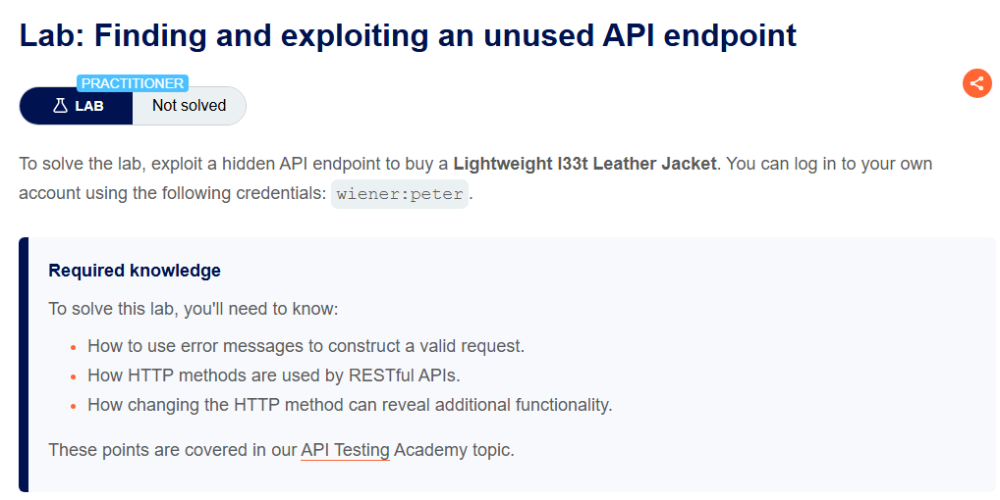

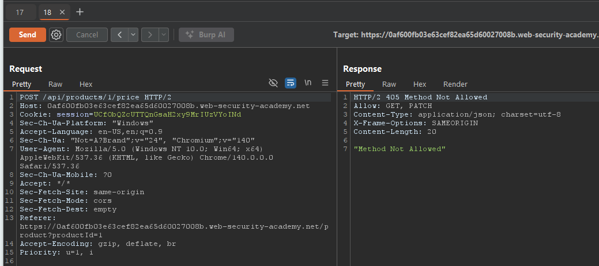

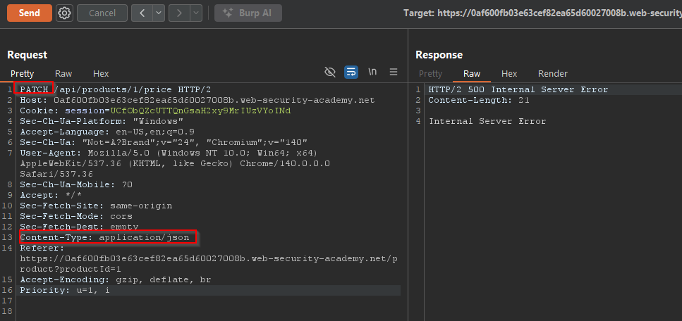

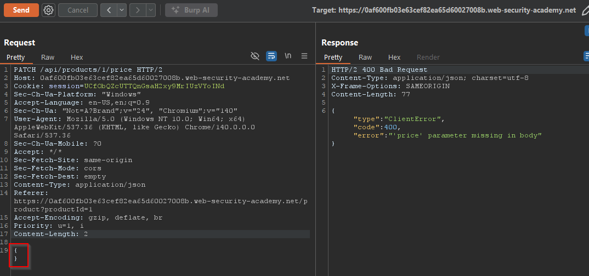

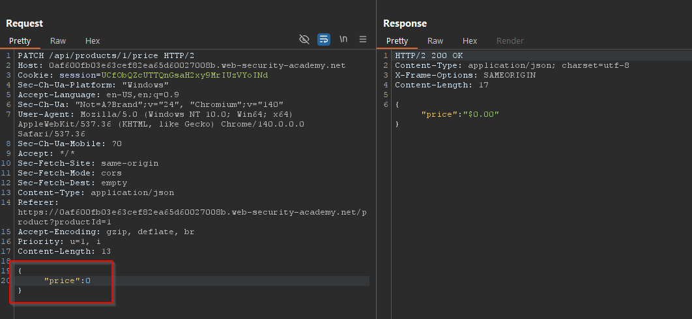


### การระบุประเภทเนื้อหาที่รองรับ

จุดปลาย API มักคาดหวังข้อมูลในรูปแบบเฉพาะ ดังนั้นจึงอาจทำงานแตกต่างกันไปขึ้นอยู่กับประเภทเนื้อหาของข้อมูลที่ให้ในคำขอ การเปลี่ยนประเภทเนื้อหาอาจช่วยให้คุณ:

- เรียกข้อผิดพลาดที่เปิดเผยข้อมูลที่เป็นประโยชน์
- หลีกเลี่ยงการป้องกันที่มีข้อบกพร่อง
- ใช้ประโยชน์จากความแตกต่างในตรรกะการประมวลผล ตัวอย่างเช่น API อาจปลอดภัยเมื่อจัดการข้อมูล JSON แต่เสี่ยงต่อการโจมตีแบบ injection เมื่อจัดการ XML

เพื่อเปลี่ยนประเภทเนื้อหา ให้แก้ไขส่วนหัว Content-Type จากนั้นปรับรูปแบบเนื้อหาคำขอตามนั้น คุณสามารถใช้ Content type converter BApp เพื่อแปลงข้อมูลที่ส่งภายในคำขอระหว่าง XML และ JSON โดยอัตโนมัติ

### การใช้ Intruder เพื่อค้นหาจุดปลายที่ซ่อนอยู่

เมื่อคุณระบุจุดปลาย API เริ่มต้นบางส่วนแล้ว คุณสามารถใช้ Intruder เพื่อเปิดเผยจุดปลายที่ซ่อนอยู่ ตัวอย่างเช่น พิจารณาสถานการณ์ที่คุณระบุจุดปลาย API ต่อไปนี้สำหรับการอัปเดตข้อมูลผู้ใช้:

```
PUT /api/user/update
```

เพื่อระบุจุดปลายที่ซ่อนอยู่ คุณสามารถใช้ Burp Intruder เพื่อค้นหาทรัพยากรอื่นที่มีโครงสร้างเดียวกัน ตัวอย่างเช่น คุณสามารถเพิ่ม payload ไปยังตำแหน่ง `/update` ของเส้นทางด้วยรายการฟังก์ชันทั่วไปอื่นๆ เช่น delete และ add

เมื่อมองหาจุดปลายที่ซ่อนอยู่ ให้ใช้ wordlists ที่อิงตามแบบแผนการตั้งชื่อ API ทั่วไปและศัพท์อุตสาหกรรม ให้แน่ใจว่าได้รวมศัพท์ที่เกี่ยวข้องกับแอปพลิเคชันด้วย ตามการสอบหาเริ่มต้นของคุณ

## การค้นหาพารามิเตอร์ที่ซ่อนอยู่

เมื่อคุณทำการสอบหา API คุณอาจพบพารามิเตอร์ที่ไม่มีในเอกสารที่ API รองรับ คุณสามารถพยายามใช้สิ่งเหล่านี้เพื่อเปลี่ยนพฤติกรรมของแอปพลิเคชัน Burp มีเครื่องมือหลายอย่างที่ช่วยคุณระบุพารามิเตอร์ที่ซ่อนอยู่:

- **Burp Intruder** ช่วยให้คุณค้นพบพารามิเตอร์ที่ซ่อนอยู่โดยอัตโนมัติ โดยใช้ wordlist ของชื่อพารามิเตอร์ทั่วไปเพื่อแทนที่พารามิเตอร์ที่มีอยู่หรือเพิ่มพารามิเตอร์ใหม่ ให้แน่ใจว่าได้รวมชื่อที่เกี่ยวข้องกับแอปพลิเคชันด้วย ตามการสอบหาเริ่มต้นของคุณ

- **Param miner BApp** ช่วยให้คุณเดาชื่อพารามิเตอร์ได้โดยอัตโนมัติสูงสุด 65,536 ชื่อต่อคำขอ Param miner เดาชื่อที่เกี่ยวข้องกับแอปพลิเคชันโดยอัตโนมัติ ตามข้อมูลที่ได้จากขอบเขต

- **เครื่องมือ Content discovery** ช่วยให้คุณค้นพบเนื้อหาที่ไม่ได้เชื่อมโยงจากเนื้อหาที่มองเห็นซึ่งคุณสามารถเรียกดูได้ รวมถึงพารามิเตอร์

## ช่องโหว่ Mass Assignment

Mass assignment (หรือที่เรียกว่า auto-binding) อาจสร้างพารามิเตอร์ที่ซ่อนอยู่โดยไม่ตั้งใจ เกิดขึ้นเมื่อเฟรมเวิร์กซอฟต์แวร์ผูกพารามิเตอร์คำขอกับฟิลด์บนออบเจ็กต์ภายในโดยอัตโนมัติ Mass assignment จึงอาจส่งผลให้แอปพลิเคชันรองรับพารามิเตอร์ที่นักพัฒนาไม่เคยตั้งใจให้ประมวลผล

### การระบุพารามิเตอร์ที่ซ่อนอยู่

เนื่องจาก mass assignment สร้างพารามิเตอร์จากฟิลด์ออบเจ็กต์ คุณมักสามารถระบุพารามิเตอร์ที่ซ่อนอยู่เหล่านี้ได้โดยตรวจสอบออบเจ็กต์ที่ API ส่งคืนด้วยตนเอง

ตัวอย่างเช่น พิจารณาคำขอ `PATCH /api/users/` ซึ่งช่วยให้ผู้ใช้อัปเดตชื่อผู้ใช้และอีเมล และรวม JSON ต่อไปนี้:

```json
{
    "username": "wiener",
    "email": "wiener@example.com",
}
```

คำขอ `GET /api/users/123` ที่เกิดขึ้นพร้อมกันจะส่งคืน JSON ต่อไปนี้:

```json
{
    "id": 123,
    "name": "John Doe",
    "email": "john@example.com",
    "isAdmin": "false"
}
```

สิ่งนี้อาจบ่งชี้ว่าพารามิเตอร์ที่ซ่อนอยู่ `id` และ `isAdmin` ถูกผูกกับออบเจ็กต์ผู้ใช้ภายใน พร้อมกับพารามิเตอร์ username และ email ที่อัปเดตแล้ว

### การทดสอบช่องโหว่ Mass Assignment

เพื่อทดสอบว่าคุณสามารถแก้ไขค่าพารามิเตอร์ `isAdmin` ที่แจกแจงได้หรือไม่ ให้เพิ่มเข้าไปในคำขอ PATCH:

```json
{
    "username": "wiener",
    "email": "wiener@example.com",
    "isAdmin": false,
}
```

นอกจากนี้ ให้ส่งคำขอ PATCH ด้วยค่าพารามิเตอร์ `isAdmin` ที่ไม่ถูกต้อง:

```json
{
    "username": "wiener",
    "email": "wiener@example.com",
    "isAdmin": "foo",
}
```

หากแอปพลิเคชันทำงานแตกต่างกัน อาจแสดงว่าค่าที่ไม่ถูกต้องส่งผลต่อตรรกะแบบสอบถาม แต่ค่าที่ถูกต้องไม่ส่งผล สิ่งนี้อาจบ่งชี้ว่าพารามิเตอร์สามารถอัปเดตโดยผู้ใช้ได้สำเร็จ

จากนั้นคุณสามารถส่งคำขอ PATCH โดยตั้งค่าพารามิเตอร์ `isAdmin` เป็น true เพื่อพยายามแสวงหาประโยชน์จากช่องโหว่:

```json
{
    "username": "wiener",
    "email": "wiener@example.com",
    "isAdmin": true,
}
```

หากค่า `isAdmin` ในคำขอถูกผูกกับออบเจ็กต์ผู้ใช้โดยไม่มีการตรวจสอบและการทำความสะอาดที่เพียงพอ ผู้ใช้ wiener อาจได้รับสิทธิ์ผู้ดูแลระบบอย่างไม่ถูกต้อง เพื่อกำหนดว่าเป็นกรณีนี้หรือไม่ ให้เรียกดูแอปพลิเคชันในฐานะ wiener เพื่อดูว่าคุณสามารถเข้าถึงฟังก์ชันผู้ดูแลระบบได้หรือไม่

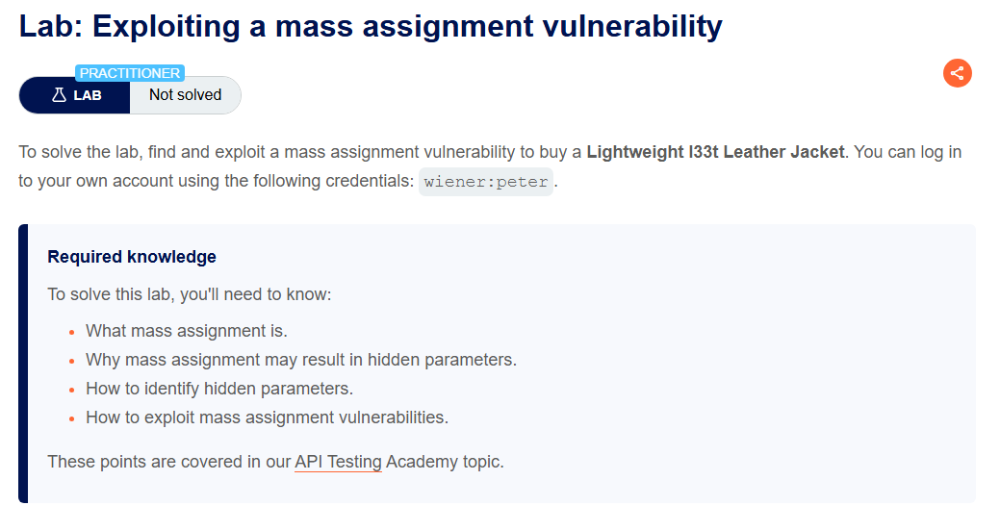

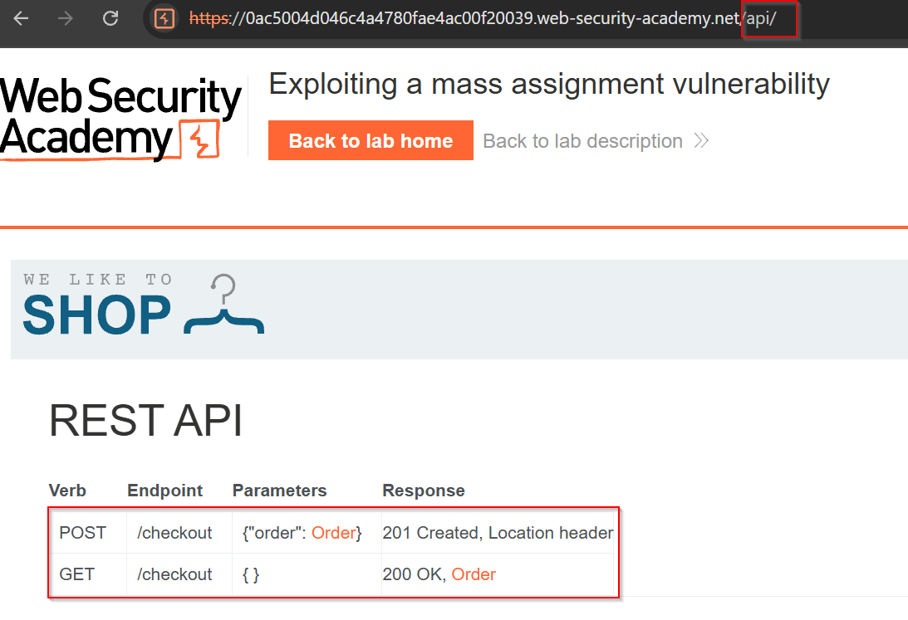

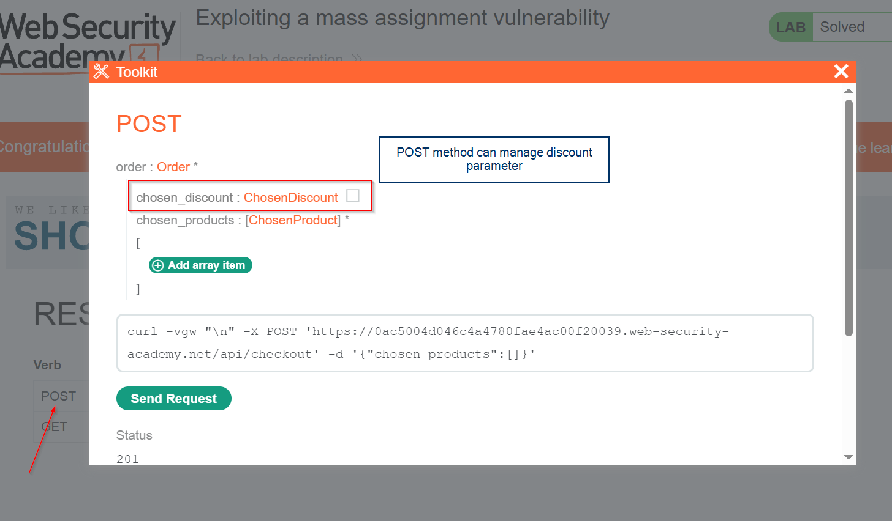

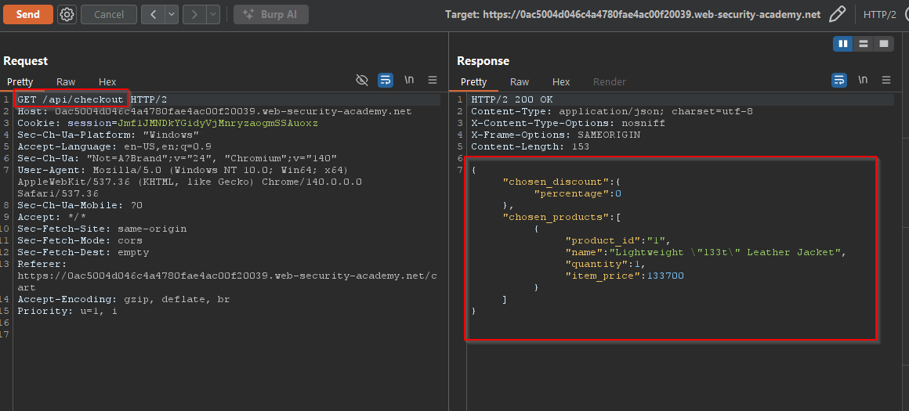

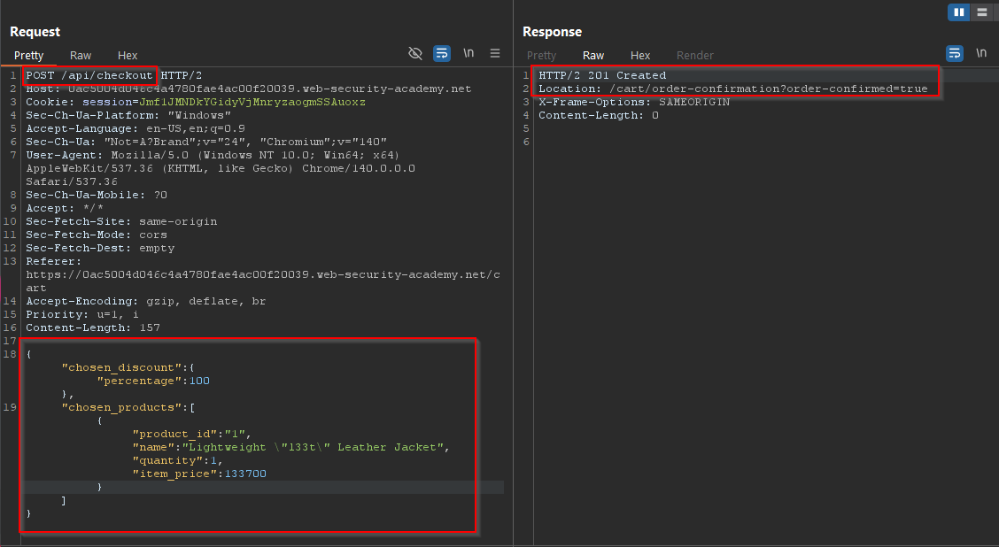


## การป้องกันช่องโหว่ใน API

เมื่อออกแบบ API ให้แน่ใจว่าความปลอดภัยเป็นข้อพิจารณาตั้งแต่เริ่มต้น โดยเฉพาะ ให้แน่ใจว่าคุณ:

- รักษาความปลอดภัยเอกสารของคุณหากคุณไม่ต้องการให้ API ของคุณเข้าถึงได้สาธารณะ
- ให้แน่ใจว่าเอกสารของคุณได้รับการอัปเดตเพื่อให้ผู้ทดสอบที่ถูกกฎหมายมีทัศนวิสัยเต็มรูปแบบของพื้นผิวการโจมตีของ API
- ใช้รายการอนุญาตของเมธอด HTTP ที่อนุญาต
- ตรวจสอบว่าประเภทเนื้อหาตรงกับที่คาดหวังสำหรับแต่ละคำขอหรือการตอบสนอง
- ใช้ข้อความแสดงข้อผิดพลาดทั่วไปเพื่อหลีกเลี่ยงการให้ข้อมูลที่อาจเป็นประโยชน์สำหรับผู้โจมตี
- ใช้มาตรการป้องกันในทุกเวอร์ชันของ API ไม่ใช่เพียงเวอร์ชันการผลิตปัจจุบัน

เพื่อป้องกันช่องโหว่ mass assignment ให้สร้างรายการอนุญาตของคุณสมบัติที่สามารถอัปเดตโดยผู้ใช้ และสร้างรายการบล็อกของคุณสมบัติที่ไวต่อการโจมตีที่ไม่ควรอัปเดตโดยผู้ใช้