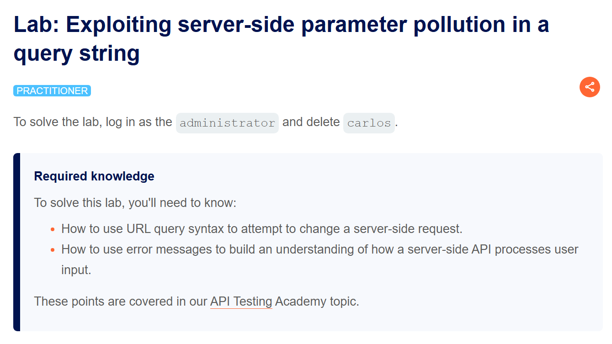
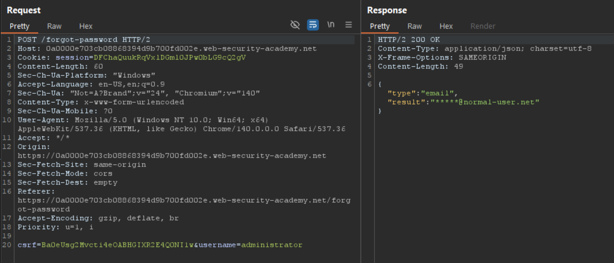
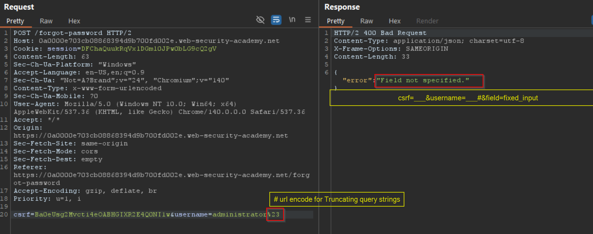
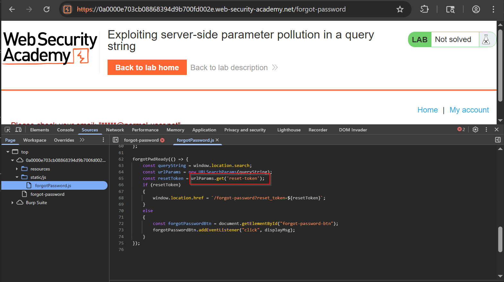
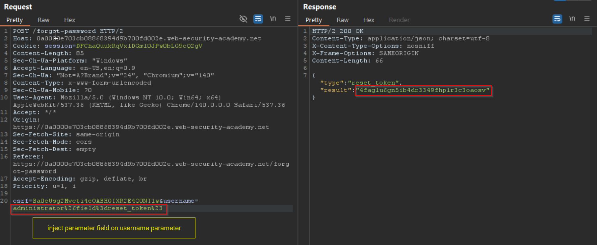
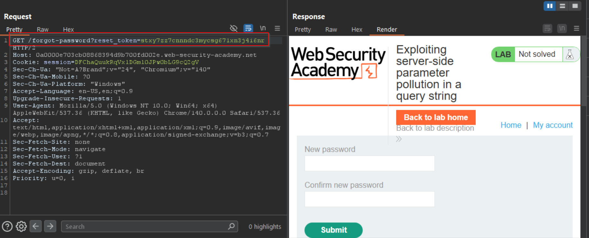

## เอกสารประกอบ API

โดยปกติ API จะมีเอกสารประกอบเพื่อให้นักพัฒนาทราบวิธีการใช้และรวมเข้ากับ API

เอกสารสามารถอยู่ในรูปแบบที่มนุษย์อ่านได้และที่เครื่องอ่านได้ เอกสารที่มนุษย์อ่านได้ถูกออกแบบเพื่อให้นักพัฒนาเข้าใจวิธีการใช้ API อาจรวมถึงคำอธิบายโดยละเอียด ตัวอย่าง และสถานการณ์การใช้งาน เอกสารที่เครื่องอ่านได้ถูกออกแบบให้ถูกประมวลผลโดยซอฟต์แวร์เพื่อทำงานอัตโนมัติ เช่น การรวม API และการตรวจสอบ เขียนในรูปแบบโครงสร้างเช่น JSON หรือ XML

เอกสารประกอบ API มักพร้อมใช้งานสาธารณะ โดยเฉพาะหาก API มีไว้สำหรับใช้โดยนักพัฒนาภายนอก หากเป็นเช่นนั้น ให้เริ่มการสอบหาโดยการทบทวนเอกสารเสมอ

### การค้นพบเอกสารประกอบ API

แม้ว่าเอกสารประกอบ API จะไม่พร้อมใช้งานอย่างเปิดเผย คุณอาจยังสามารถเข้าถึงได้โดยการเรียกดูแอปพลิเคชันที่ใช้ API

ในการทำเช่นนี้ คุณสามารถใช้ Burp Scanner เพื่อรวบรวมข้อมูล API คุณยังสามารถเรียกดูแอปพลิเคชันด้วยตนเองโดยใช้เบราว์เซอร์ของ Burp มองหาจุดปลายที่อาจอ้างอิงถึงเอกสารประกอบ API ตัวอย่างเช่น:

- `/api`
- `/swagger/index.html`
- `/openapi.json`

หากคุณระบุจุดปลายสำหรับทรัพยากร ให้แน่ใจว่าได้ตรวจสอบเส้นทางฐาน ตัวอย่างเช่น หากคุณระบุจุดปลายทรัพยากร `/api/swagger/v1/users/123` คุณควรตรวจสอบเส้นทางต่อไปนี้:

- `/api/swagger/v1`
- `/api/swagger`
- `/api`

คุณยังสามารถใช้รายการเส้นทางทั่วไปเพื่อค้นหาเอกสารโดยใช้ Intruder


### การใช้เอกสารที่เครื่องอ่านได้

คุณสามารถใช้เครื่องมืออัตโนมัติหลากหลายเครื่องมือเพื่อวิเคราะห์เอกสารประกอบ API ที่เครื่องอ่านได้ที่คุณพบ

คุณสามารถใช้ Burp Scanner เพื่อรวบรวมและตรวจสอบเอกสาร OpenAPI หรือเอกสารอื่นๆ ในรูปแบบ JSON หรือ YAML คุณยังสามารถแยกวิเคราะห์เอกสาร OpenAPI โดยใช้ OpenAPI Parser BApp

คุณอาจสามารถใช้เครื่องมือเฉพาะทางเพื่อทดสอบจุดปลายที่เอกสารระบุ เช่น Postman หรือ SoapUI

## การระบุจุดปลาย API

คุณยังสามารถรวบรวมข้อมูลจำนวนมากโดยการเรียกดูแอปพลิเคชันที่ใช้ API สิ่งนี้มักคุ้มค่าที่จะทำแม้ว่าคุณจะสามารถเข้าถึงเอกสารประกอบ API ได้ เนื่องจากบางครั้งเอกสารอาจไม่ถูกต้องหรือล้าสมัย

คุณสามารถใช้ Burp Scanner เพื่อรวบรวมข้อมูลแอปพลิเคชัน จากนั้นตรวจสอบพื้นผิวการโจมตีที่น่าสนใจด้วยตนเองโดยใช้เบราว์เซอร์ของ Burp

ขณะเรียกดูแอปพลิเคชัน มองหารูปแบบที่บ่งบอกถึงจุดปลาย API ในโครงสร้าง URL เช่น `/api/` ยังต้องระวังไฟล์ JavaScript ไฟล์เหล่านี้อาจมีการอ้างอิงถึงจุดปลาย API ที่คุณไม่ได้เรียกใช้โดยตรงผ่านเว็บเบราว์เซอร์ Burp Scanner แยกจุดปลายบางส่วนโดยอัตโนมัติระหว่างการรวบรวมข้อมูล แต่สำหรับการแยกที่หนักกว่า ให้ใช้ JS Link Finder BApp คุณยังสามารถทบทวนไฟล์ JavaScript ใน Burp ด้วยตนเอง

## การโต้ตอบกับจุดปลาย API

เมื่อคุณระบุจุดปลาย API แล้ว ให้โต้ตอบกับพวกมันโดยใช้ Burp Repeater และ Burp Intruder สิ่งนี้ช่วยให้คุณสังเกตพฤติกรรมของ API และค้นพบพื้นผิวการโจมตีเพิ่มเติม ตัวอย่างเช่น คุณสามารถตรวจสอบว่า API ตอบสนองอย่างไรต่อการเปลี่ยนเมธอด HTTP และประเภทสื่อ

ขณะที่คุณโต้ตอบกับจุดปลาย API ให้ทบทวนข้อความแสดงข้อผิดพลาดและการตอบสนองอื่นๆ อย่างใกล้ชิด บางครั้งสิ่งเหล่านี้รวมข้อมูลที่คุณสามารถใช้เพื่อสร้างคำขอ HTTP ที่ถูกต้อง

### การระบุเมธอด HTTP ที่รองรับ

เมธอด HTTP ระบุการดำเนินการที่จะดำเนินการกับทรัพยากร ตัวอย่างเช่น:

- **GET** - ดึงข้อมูลจากทรัพยากร
- **PATCH** - นำการเปลี่ยนแปลงบางส่วนไปใช้กับทรัพยากร
- **OPTIONS** - ดึงข้อมูลเกี่ยวกับประเภทของเมธอดคำขอที่สามารถใช้กับทรัพยากร

จุดปลาย API อาจรองรับเมธอด HTTP ที่แตกต่างกัน จึงเป็นสิ่งสำคัญที่จะต้องทดสอบเมธอดที่เป็นไปได้ทั้งหมดเมื่อคุณตรวจสอบจุดปลาย API สิ่งนี้อาจช่วยให้คุณระบุฟังก์ชันจุดปลายเพิ่มเติม เปิดพื้นผิวการโจมตีมากขึ้น

ตัวอย่างเช่น จุดปลาย `/api/tasks` อาจรองรับเมธอดต่อไปนี้:

- `GET /api/tasks` - ดึงรายการงาน
- `POST /api/tasks` - สร้างงานใหม่
- `DELETE /api/tasks/1` - ลบงาน

คุณสามารถใช้รายการ HTTP verbs ในตัวใน Burp Intruder เพื่อวนผ่านเมธอดต่างๆ โดยอัตโนมัติ

**หมายเหตุ:** เมื่อทดสอบเมธอด HTTP ที่แตกต่างกัน ให้เป้าหมายออบเจ็กต์ที่มีความสำคัญต่ำ สิ่งนี้ช่วยให้แน่ใจว่าคุณหลีกเลี่ยงผลที่ไม่ต้องการ เช่น การเปลี่ยนแปลงรายการสำคัญหรือการสร้างระเบียนมากเกินไป


### การระบุประเภทเนื้อหาที่รองรับ

จุดปลาย API มักคาดหวังข้อมูลในรูปแบบเฉพาะ ดังนั้นจึงอาจทำงานแตกต่างกันไปขึ้นอยู่กับประเภทเนื้อหาของข้อมูลที่ให้ในคำขอ การเปลี่ยนประเภทเนื้อหาอาจช่วยให้คุณ:

- เรียกข้อผิดพลาดที่เปิดเผยข้อมูลที่เป็นประโยชน์
- หลีกเลี่ยงการป้องกันที่มีข้อบกพร่อง
- ใช้ประโยชน์จากความแตกต่างในตรรกะการประมวลผล ตัวอย่างเช่น API อาจปลอดภัยเมื่อจัดการข้อมูล JSON แต่เสี่ยงต่อการโจมตีแบบ injection เมื่อจัดการ XML

เพื่อเปลี่ยนประเภทเนื้อหา ให้แก้ไขส่วนหัว Content-Type จากนั้นปรับรูปแบบเนื้อหาคำขอตามนั้น คุณสามารถใช้ Content type converter BApp เพื่อแปลงข้อมูลที่ส่งภายในคำขอระหว่าง XML และ JSON โดยอัตโนมัติ

### การใช้ Intruder เพื่อค้นหาจุดปลายที่ซ่อนอยู่

เมื่อคุณระบุจุดปลาย API เริ่มต้นบางส่วนแล้ว คุณสามารถใช้ Intruder เพื่อเปิดเผยจุดปลายที่ซ่อนอยู่ ตัวอย่างเช่น พิจารณาสถานการณ์ที่คุณระบุจุดปลาย API ต่อไปนี้สำหรับการอัปเดตข้อมูลผู้ใช้:

```
PUT /api/user/update
```

เพื่อระบุจุดปลายที่ซ่อนอยู่ คุณสามารถใช้ Burp Intruder เพื่อค้นหาทรัพยากรอื่นที่มีโครงสร้างเดียวกัน ตัวอย่างเช่น คุณสามารถเพิ่ม payload ไปยังตำแหน่ง `/update` ของเส้นทางด้วยรายการฟังก์ชันทั่วไปอื่นๆ เช่น delete และ add

เมื่อมองหาจุดปลายที่ซ่อนอยู่ ให้ใช้ wordlists ที่อิงตามแบบแผนการตั้งชื่อ API ทั่วไปและศัพท์อุตสาหกรรม ให้แน่ใจว่าได้รวมศัพท์ที่เกี่ยวข้องกับแอปพลิเคชันด้วย ตามการสอบหาเริ่มต้นของคุณ

## การค้นหาพารามิเตอร์ที่ซ่อนอยู่

เมื่อคุณทำการสอบหา API คุณอาจพบพารามิเตอร์ที่ไม่มีในเอกสารที่ API รองรับ คุณสามารถพยายามใช้สิ่งเหล่านี้เพื่อเปลี่ยนพฤติกรรมของแอปพลิเคชัน Burp มีเครื่องมือหลายอย่างที่ช่วยคุณระบุพารามิเตอร์ที่ซ่อนอยู่:

- **Burp Intruder** ช่วยให้คุณค้นพบพารามิเตอร์ที่ซ่อนอยู่โดยอัตโนมัติ โดยใช้ wordlist ของชื่อพารามิเตอร์ทั่วไปเพื่อแทนที่พารามิเตอร์ที่มีอยู่หรือเพิ่มพารามิเตอร์ใหม่ ให้แน่ใจว่าได้รวมชื่อที่เกี่ยวข้องกับแอปพลิเคชันด้วย ตามการสอบหาเริ่มต้นของคุณ

- **Param miner BApp** ช่วยให้คุณเดาชื่อพารามิเตอร์ได้โดยอัตโนมัติสูงสุด 65,536 ชื่อต่อคำขอ Param miner เดาชื่อที่เกี่ยวข้องกับแอปพลิเคชันโดยอัตโนมัติ ตามข้อมูลที่ได้จากขอบเขต

- **เครื่องมือ Content discovery** ช่วยให้คุณค้นพบเนื้อหาที่ไม่ได้เชื่อมโยงจากเนื้อหาที่มองเห็นซึ่งคุณสามารถเรียกดูได้ รวมถึงพารามิเตอร์

## ช่องโหว่ Mass Assignment

Mass assignment (หรือที่เรียกว่า auto-binding) อาจสร้างพารามิเตอร์ที่ซ่อนอยู่โดยไม่ตั้งใจ เกิดขึ้นเมื่อเฟรมเวิร์กซอฟต์แวร์ผูกพารามิเตอร์คำขอกับฟิลด์บนออบเจ็กต์ภายในโดยอัตโนมัติ Mass assignment จึงอาจส่งผลให้แอปพลิเคชันรองรับพารามิเตอร์ที่นักพัฒนาไม่เคยตั้งใจให้ประมวลผล

### การระบุพารามิเตอร์ที่ซ่อนอยู่

เนื่องจาก mass assignment สร้างพารามิเตอร์จากฟิลด์ออบเจ็กต์ คุณมักสามารถระบุพารามิเตอร์ที่ซ่อนอยู่เหล่านี้ได้โดยตรวจสอบออบเจ็กต์ที่ API ส่งคืนด้วยตนเอง

ตัวอย่างเช่น พิจารณาคำขอ `PATCH /api/users/` ซึ่งช่วยให้ผู้ใช้อัปเดตชื่อผู้ใช้และอีเมล และรวม JSON ต่อไปนี้:

```json
{
    "username": "wiener",
    "email": "wiener@example.com",
}
```

คำขอ `GET /api/users/123` ที่เกิดขึ้นพร้อมกันจะส่งคืน JSON ต่อไปนี้:

```json
{
    "id": 123,
    "name": "John Doe",
    "email": "john@example.com",
    "isAdmin": "false"
}
```

สิ่งนี้อาจบ่งชี้ว่าพารามิเตอร์ที่ซ่อนอยู่ `id` และ `isAdmin` ถูกผูกกับออบเจ็กต์ผู้ใช้ภายใน พร้อมกับพารามิเตอร์ username และ email ที่อัปเดตแล้ว

### การทดสอบช่องโหว่ Mass Assignment

เพื่อทดสอบว่าคุณสามารถแก้ไขค่าพารามิเตอร์ `isAdmin` ที่แจกแจงได้หรือไม่ ให้เพิ่มเข้าไปในคำขอ PATCH:

```json
{
    "username": "wiener",
    "email": "wiener@example.com",
    "isAdmin": false,
}
```

นอกจากนี้ ให้ส่งคำขอ PATCH ด้วยค่าพารามิเตอร์ `isAdmin` ที่ไม่ถูกต้อง:

```json
{
    "username": "wiener",
    "email": "wiener@example.com",
    "isAdmin": "foo",
}
```

หากแอปพลิเคชันทำงานแตกต่างกัน อาจแสดงว่าค่าที่ไม่ถูกต้องส่งผลต่อตรรกะแบบสอบถาม แต่ค่าที่ถูกต้องไม่ส่งผล สิ่งนี้อาจบ่งชี้ว่าพารามิเตอร์สามารถอัปเดตโดยผู้ใช้ได้สำเร็จ

จากนั้นคุณสามารถส่งคำขอ PATCH โดยตั้งค่าพารามิเตอร์ `isAdmin` เป็น true เพื่อพยายามแสวงหาประโยชน์จากช่องโหว่:

```json
{
    "username": "wiener",
    "email": "wiener@example.com",
    "isAdmin": true,
}
```

หากค่า `isAdmin` ในคำขอถูกผูกกับออบเจ็กต์ผู้ใช้โดยไม่มีการตรวจสอบและการทำความสะอาดที่เพียงพอ ผู้ใช้ wiener อาจได้รับสิทธิ์ผู้ดูแลระบบอย่างไม่ถูกต้อง เพื่อกำหนดว่าเป็นกรณีนี้หรือไม่ ให้เรียกดูแอปพลิเคชันในฐานะ wiener เพื่อดูว่าคุณสามารถเข้าถึงฟังก์ชันผู้ดูแลระบบได้หรือไม่


# การปนเปื้อนพารามิเตอร์ฝั่งเซิร์ฟเวอร์ (Server-side Parameter Pollution)

บางระบบมี internal API ที่ไม่สามารถเข้าถึงได้โดยตรงจากอินเทอร์เน็ต การปนเปื้อนพารามิเตอร์ฝั่งเซิร์ฟเวอร์เกิดขึ้นเมื่อเว็บไซต์เอา input ของผู้ใช้ไปแทรกในคำขอฝั่งเซิร์ฟเวอร์ไปยัง internal API โดยไม่ได้ encode อย่างเหมาะสม หมายความว่าผู้โจมตีอาจจะสามารถจัดการหรือแทรกพารามิเตอร์ได้ ซึ่งจะทำให้พวกเขาสามารถ:

- Override พารามิเตอร์เดิมที่มีอยู่
- เปลี่ยนพฤติกรรมของแอปพลิเคชัน
- เข้าถึงข้อมูลที่ไม่ได้รับอนุญาต

คุณสามารถทดสอบ user input ใดๆ หาการปนเปื้อนพารามิเตอร์ได้ เช่น query parameters, form fields, headers, และ URL path parameters ต่างๆ อาจจะมีช่องโหว่ได้หมด

**หมายเหตุ:** ช่องโหว่นี้บางครั้งเรียกว่า HTTP parameter pollution แต่คำนี้ยังใช้เรียกเทคนิคการหลบหลีก web application firewall (WAF) อีกด้วย เพื่อไม่ให้สับสน ในหัวข้อนี้เราจะเรียกเฉพาะการปนเปื้อนพารามิเตอร์ฝั่งเซิร์ฟเวอร์

อีกอย่าง แม้ว่าจะมีชื่อคล้ายกัน แต่ช่องโหว่นี้ไม่เกี่ยวข้องกับ server-side prototype pollution เลย

## การทดสอบการปนเปื้อนพารามิเตอร์ฝั่งเซิร์ฟเวอร์ใน Query String

ในการทดสอบการปนเปื้อนพารามิเตอร์ฝั่งเซิร์ฟเวอร์ใน query string ให้ใส่ตัวอักษร query syntax เช่น `#`, `&`, และ `=` ใน input ของคุณ แล้วดูว่าแอปพลิเคชันตอบสนองยังไง

ลองดูแอปพลิเคชันที่มีช่องโหว่ที่ให้คุณค้นหาผู้ใช้คนอื่นๆ ตาม username ของพวกเขา เวลาคุณค้นหาผู้ใช้ browser ของคุณจะส่ง request แบบนี้:

```
GET /userSearch?name=peter&back=/home
```

เพื่อดึงข้อมูลผู้ใช้ เซิร์ฟเวอร์จะ query internal API ด้วย request นี้:

```
GET /users/search?name=peter&publicProfile=true
```

### การตัดทอน Query Strings

คุณสามารถใช้ตัวอักษร `#` ที่ URL-encoded เพื่อลองตัดทอน server-side request เพื่อช่วยให้คุณเข้าใจ response ได้ คุณยังสามารถเพิ่ม string หลัง `#` ได้ด้วย

ตัวอย่าง คุณสามารถแก้ query string เป็น:

```
GET /userSearch?name=peter%23foo&back=/home
```

front-end จะพยายามเข้าถึง URL นี้:

```
GET /users/search?name=peter#foo&publicProfile=true
```

**หมายเหตุ:** สำคัญมากที่คุณต้อง URL-encode ตัวอักษร `#` มิฉะนั้น front-end application จะเข้าใจว่าเป็น fragment identifier และจะไม่ส่งไปยัง internal API

ดู response หาเบาะแสว่า query ถูกตัดทอนรึเปล่า เช่น ถ้า response return ผู้ใช้ peter แสดงว่า server-side query อาจจะถูกตัดทอน ถ้าแสดง error message "Invalid name" แสดงว่าแอปพลิเคชันอาจจะเอา foo เป็นส่วนหนึ่งของ username ซึ่งบอกว่า server-side request อาจจะไม่ถูกตัดทอน

ถ้าคุณสามารถตัดทอน server-side request ได้ นี่จะเอาข้อกำหนดที่ `publicProfile` field ต้องเป็น true ออกไป คุณอาจจะใช้ช่องโหว่นี้เพื่อ return โปรไฟล์ผู้ใช้ที่ไม่เป็น public ได้

### การแทรกพารามิเตอร์ที่ไม่ถูกต้อง

คุณสามารถใช้ตัวอักษร `&` ที่ URL-encoded เพื่อลองเพิ่มพารามิเตอร์ที่สองใน server-side request

ตัวอย่าง คุณสามารถแก้ query string เป็น:

```
GET /userSearch?name=peter%26foo=xyz&back=/home
```

นี่จะ result ใน server-side request นี้ไปยัง internal API:

```
GET /users/search?name=peter&foo=xyz&publicProfile=true
```

ดู response หาเบาะแสว่าพารามิเตอร์เพิ่มเติมถูก parse ยังไง เช่น ถ้า response ไม่เปลี่ยน อาจจะบอกว่าพารามิเตอร์ถูก inject สำเร็จแต่ถูกแอปพลิเคชันละเลย

เพื่อให้เห็นภาพครบถ้วนมากขึ้น คุณจะต้องทดสอบต่อไป

### การแทรกพารามิเตอร์ที่ถูกต้อง

ถ้าคุณสามารถแก้ไข query string ได้ คุณก็สามารถลองเพิ่มพารามิเตอร์ที่ถูกต้องที่สองใน server-side request

ตัวอย่าง ถ้าคุณระบุพารามิเตอร์ `email` ได้ คุณสามารถเพิ่มลงใน query string แบบนี้:

```
GET /userSearch?name=peter%26email=foo&back=/home
```

นี่จะ result ใน server-side request นี้ไปยัง internal API:

```
GET /users/search?name=peter&email=foo&publicProfile=true
```

ดู response หาเบาะแสว่าพารามิเตอร์เพิ่มเติมถูก parse ยังไง

### การ Override พารามิเตอร์เดิม

เพื่อยืนยันว่าแอปพลิเคชันมีช่องโหว่ต่อการปนเปื้อนพารามิเตอร์ฝั่งเซิร์ฟเวอร์ คุณสามารถลอง override พารามิเตอร์เดิม ทำโดยการ inject พารามิเตอร์ที่สองที่มีชื่อเดียวกัน

ตัวอย่าง คุณสามารถแก้ query string เป็น:

```
GET /userSearch?name=peter%26name=carlos&back=/home
```

นี่จะ result ใน server-side request นี้ไปยัง internal API:

```
GET /users/search?name=peter&name=carlos&publicProfile=true
```

internal API จะแปลความพารามิเตอร์ `name` สองตัว impact ของเรื่องนี้ขึ้นอยู่กับว่าแอปพลิเคชันประมวลผลพารามิเตอร์ตัวที่สองยังไง นี่จะแตกต่างกันไปตาม web technology ที่ต่างกัน เช่น:

- **PHP** parse เฉพาะพารามิเตอร์ตัวสุดท้าย นี่จะ result ในการค้นหาผู้ใช้สำหรับ carlos
- **ASP.NET** รวมพารามิเตอร์ทั้งสองตัว นี่จะ result ในการค้นหาผู้ใช้สำหรับ peter,carlos ซึ่งอาจจะ result ใน error message "Invalid username"
- **Node.js / express** parse เฉพาะพารามิเตอร์ตัวแรก นี่จะ result ในการค้นหาผู้ใช้สำหรับ peter ให้ผลลัพธ์ที่ไม่เปลี่ยน

ถ้าคุณสามารถ override พารามิเตอร์เดิมได้ คุณอาจจะสามารถทำการ exploit ได้ เช่น คุณสามารถเพิ่ม `name=administrator` ใน request นี่อาจจะทำให้คุณ log in เป็น administrator user ได้













## การทดสอบการปนเปื้อนพารามิเตอร์ฝั่งเซิร์ฟเวอร์ใน REST Paths

RESTful API อาจจะวางชื่อพารามิเตอร์และค่าใน URL path แทนที่จะเป็น query string เช่น ลองดู path นี้:

```
/api/users/123
```

URL path อาจจะแบ่งออกเป็น:
- `/api` คือ root API endpoint
- `/users` แทนทรัพยากร ในกรณีนี้คือ users
- `/123` แทนพารามิเตอร์ ในที่นี้คือ identifier สำหรับ user เฉพาะ

ลองดูแอปพลิเคชันที่ให้คุณแก้ไข user profiles ตาม username ของพวกเขา requests จะถูกส่งไปยัง endpoint นี้:

```
GET /edit_profile.php?name=peter
```

นี่จะ result ใน server-side request นี้:

```
GET /api/private/users/peter
```

ผู้โจมตีอาจจะสามารถจัดการ server-side URL path parameters เพื่อ exploit API ในการทดสอบช่องโหว่นี้ ให้เพิ่ม path traversal sequences เพื่อแก้ไขพารามิเตอร์แล้วดูว่าแอปพลิเคชันตอบสนองยังไง

คุณสามารถ submit `peter/../admin` ที่ URL-encoded เป็นค่าของพารามิเตอร์ `name`:

```
GET /edit_profile.php?name=peter%2f..%2fadmin
```

นี่อาจจะ result ใน server-side request นี้:

```
GET /api/private/users/peter/../admin
```

ถ้า server-side client หรือ back-end API normalize path นี้ มันอาจจะถูก resolve เป็น `/api/private/users/admin`

## การทดสอบการปนเปื้อนพารามิเตอร์ฝั่งเซิร์ฟเวอร์ใน Structured Data Formats

ผู้โจมตีอาจจะสามารถจัดการพารามิเตอร์เพื่อ exploit ช่องโหว่ในการประมวลผล structured data formats อื่นๆ ของเซิร์ฟเวอร์ เช่น JSON หรือ XML ในการทดสอบสิ่งนี้ ให้ inject unexpected structured data เข้าไปใน user inputs แล้วดูว่าเซิร์ฟเวอร์ตอบสนองยังไง

ลองดูแอปพลิเคชันที่ให้ users แก้ไขโปรไฟล์ของพวกเขา แล้วนำการเปลี่ยนแปลงไปใช้ด้วย request ไปยัง server-side API เวลาคุณแก้ไขชื่อของคุณ browser ของคุณจะส่ง request นี้:

```
POST /myaccount
name=peter
```

นี่จะ result ใน server-side request นี้:

```
PATCH /users/7312/update
{"name":"peter"}
```

คุณสามารถลองเพิ่มพารามิเตอร์ `access_level` ใน request แบบนี้:

```
POST /myaccount
name=peter","access_level":"administrator
```

ถ้า user input ถูกเพิ่มลงใน server-side JSON data โดยไม่มี validation หรือ sanitization ที่เพียงพอ นี่จะ result ใน server-side request นี้:

```
PATCH /users/7312/update
{"name":"peter","access_level":"administrator"}
```

นี่อาจจะ result ในการที่ผู้ใช้ peter ได้รับ administrator access

ลองดูตัวอย่างที่คล้ายกัน แต่ client-side user input อยู่ใน JSON data เวลาคุณแก้ไขชื่อของคุณ browser ของคุณจะส่ง request นี้:

```
POST /myaccount
{"name": "peter"}
```

นี่จะ result ใน server-side request นี้:

```
PATCH /users/7312/update
{"name":"peter"}
```

คุณสามารถลองเพิ่มพารามิเตอร์ `access_level` ใน request แบบนี้:

```
POST /myaccount
{"name": "peter\",\"access_level\":\"administrator"}
```

ถ้า user input ถูก decode แล้วเพิ่มลงใน server-side JSON data โดยไม่มี encoding ที่เพียงพอ นี่จะ result ใน server-side request นี้:

```
PATCH /users/7312/update
{"name":"peter","access_level":"administrator"}
```

อีกครั้ง นี่อาจจะ result ในการที่ผู้ใช้ peter ได้รับ administrator access

Structured format injection ยังสามารถเกิดขึ้นใน responses ได้ด้วย เช่น นี่สามารถเกิดขึ้นได้ถ้า user input ถูกเก็บอย่างปลอดภัยใน database แล้วถูก embed ลงใน JSON response จาก back-end API โดยไม่มี encoding ที่เพียงพอ โดยปกติคุณสามารถตรวจจับและ exploit structured format injection ใน responses ในลักษณะเดียวกับที่คุณทำใน requests

**หมายเหตุ:** ตัวอย่างด้านล่างนี้เป็น JSON แต่การปนเปื้อนพารามิเตอร์ฝั่งเซิร์ฟเวอร์สามารถเกิดขึ้นใน structured data format ใดๆ ก็ได้

## การทดสอบด้วย Automated Tools

Burp มี automated tools ที่สามารถช่วยคุณตรวจจับช่องโหว่การปนเปื้อนพารามิเตอร์ฝั่งเซิร์ฟเวอร์

Burp Scanner จะตรวจจับ suspicious input transformations โดยอัตโนมัติเวลาทำการ audit สิ่งเหล่านี้เกิดขึ้นเมื่อแอปพลิเคชันรับ user input แปลงมันในบางวิธี แล้วทำการประมวลผลเพิ่มเติมกับผลลัพธ์ พฤติกรรมนี้ไม่จำเป็นต้องเป็นช่องโหว่ ดังนั้นคุณจะต้องทำการทดสอบเพิ่มเติมโดยใช้เทคนิค manual ที่ระบุไว้ข้างต้น

คุณยังสามารถใช้ Backslash Powered Scanner BApp เพื่อระบุ server-side injection vulnerabilities ได้ scanner จะจัดประเภท inputs เป็น boring, interesting, หรือ vulnerable คุณจะต้องตรวจสอบ interesting inputs โดยใช้เทคนิค manual ที่ระบุไว้ข้างต้น

## การป้องกันการปนเปื้อนพารามิเตอร์ฝั่งเซิร์ฟเวอร์

เพื่อป้องกันการปนเปื้อนพารามิเตอร์ฝั่งเซิร์ฟเวอร์ ให้ใช้ allowlist เพื่อกำหนดตัวอักษรที่ไม่ต้อง encoding และให้แน่ใจว่า user input อื่นๆ ทั้งหมดถูก encode ก่อนที่จะรวมอยู่ใน server-side request คุณยังควรให้แน่ใจว่า input ทั้งหมดเป็นไปตาม expected format และ structure