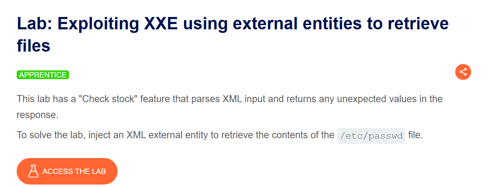
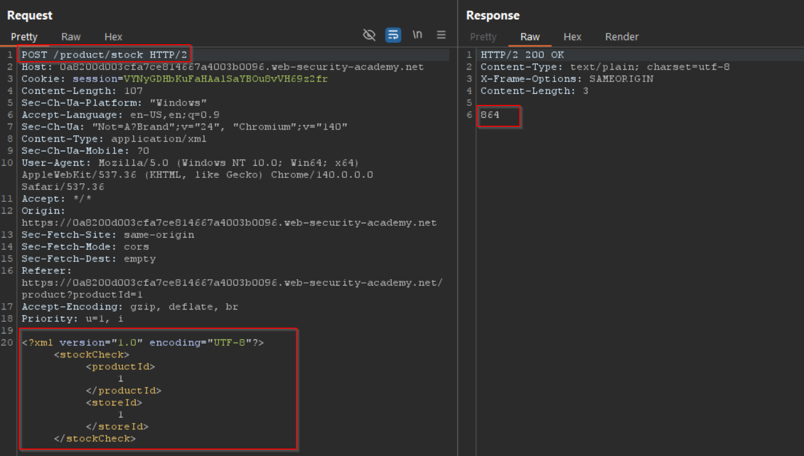
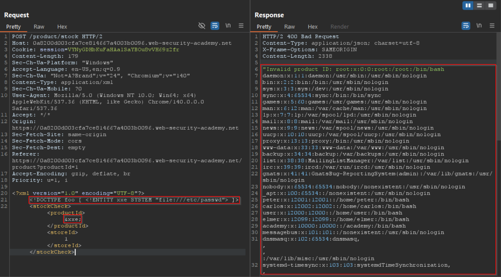
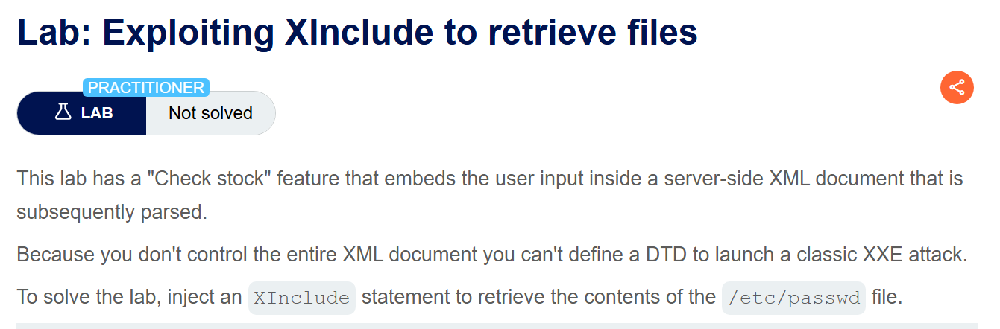
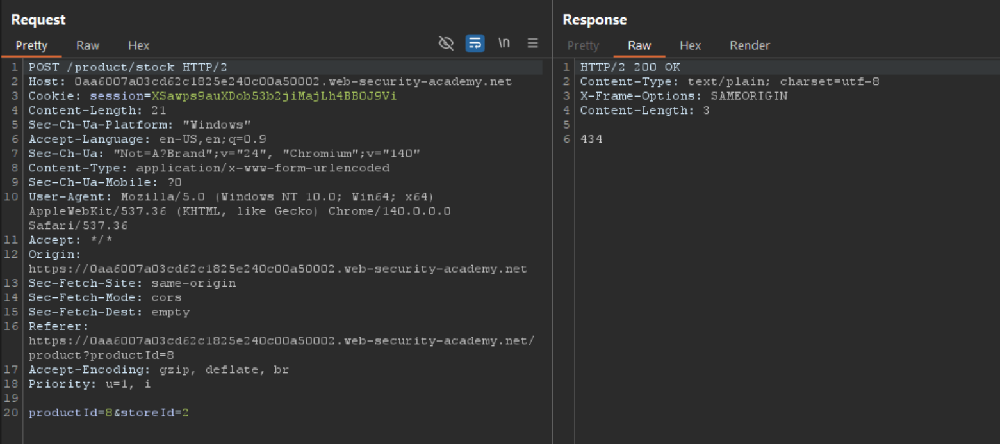

## การใช้ XXE เพื่อดึงไฟล์

ในการโจมตี XXE injection เพื่อดึงไฟล์ใดๆ จากระบบไฟล์ของเซิร์ฟเวอร์ คุณต้องปรับเปลี่ยน XML ที่ส่งไปในสองวิธี:

1. เพิ่ม (หรือแก้ไข) element DOCTYPE ที่กำหนด external entity ซึ่งมี path ไปยังไฟล์
2. แก้ไขค่าข้อมูลใน XML ที่ถูกส่งกลับในการตอบสนองของแอปพลิเคชัน เพื่อใช้ external entity ที่กำหนดไว้

ตัวอย่างเช่น สมมติว่าแอปพลิเคชันช็อปปิ้งตรวจสอบระดับสต็อกของสินค้าโดยส่ง XML ต่อไปนี้ไปยังเซิร์ฟเวอร์:

```xml
<?xml version="1.0" encoding="UTF-8"?>
<stockCheck><productId>381</productId></stockCheck>
```

หากแอปพลิเคชันไม่มีการป้องกัน XXE attack โดยเฉพาะ คุณสามารถใช้ช่องโหว่ XXE เพื่อดึงไฟล์ `/etc/passwd` โดยส่ง XXE payload ดังนี้:

```xml
<?xml version="1.0" encoding="UTF-8"?>
<!DOCTYPE foo [ <!ENTITY xxe SYSTEM "file:///etc/passwd"> ]>
<stockCheck><productId>&xxe;</productId></stockCheck>
```

XXE payload นี้กำหนด external entity `&xxe;` ที่มีค่าเป็นเนื้อหาของไฟล์ `/etc/passwd` และใช้ entity ดังกล่าวในค่า productId ทำให้การตอบสนองของแอปพลิเคชันรวมเนื้อหาของไฟล์:

```
Invalid product ID: root:x:0:0:root:/root:/bin/bash
daemon:x:1:1:daemon:/usr/sbin:/usr/sbin/nologin
bin:x:2:2:bin:/bin:/usr/sbin/nologin
...
```

**หมายเหตุ:** ในช่องโหว่ XXE ในโลกจริง มักจะมีค่าข้อมูลจำนวนมากภายใน XML ที่ส่งไป ซึ่งอาจมีค่าใดค่าหนึ่งที่ใช้ในการตอบสนองของแอปพลิเคชัน ในการทดสอบช่องโหว่ XXE อย่างเป็นระบบ โดยทั่วไปคุณจะต้องทดสอบแต่ละ data node ใน XML แยกกัน โดยใช้ entity ที่กำหนดไว้และดูว่าปรากฏในการตอบสนองหรือไม่


## เมื่อ XML Parser ทำงาน:

1. อ่าน DOCTYPE และสร้าง entity `xxe`
2. เมื่อเจอ `&xxe;` จะแทนที่ด้วยเนื้อหาของไฟล์ `/etc/passwd`
3. ส่งผลลัพธ์กลับมาในรูป:

```xml
<stockCheck><productId>root:x:0:0:root:/root:/bin/bash
daemon:x:1:1:daemon:/usr/sbin:/usr/sbin/nologin
bin:x:2:2:bin:/bin:/usr/sbin/nologin
...</productId></stockCheck>
```








## การใช้ XXE เพื่อโจมตี SSRF

นอกจากการดึงข้อมูลสำคัญแล้ว ผลกระทบหลักอีกอย่างของการโจมตี XXE คือสามารถใช้เพื่อโจมตีแบบ server-side request forgery (SSRF) ได้ นี่เป็นช่องโหว่ที่อาจร้าย ซึ่งแอปพลิเคชันฝั่งเซิร์ฟเวอร์สามารถถูกเหนี่ยวนำให้ส่ง HTTP request ไปยัง URL ใดๆ ที่เซิร์ฟเวอร์สามารถเข้าถึงได้

ในการใช้ช่องโหว่ XXE เพื่อโจมตี SSRF คุณต้องกำหนด external XML entity โดยใช้ URL ที่คุณต้องการโจมตี และใช้ entity ที่กำหนดไว้ภายในค่าข้อมูล หากคุณสามารถใช้ entity ที่กำหนดไว้ภายในค่าข้อมูลที่ถูกส่งกลับในการตอบสนองของแอปพลิเคชัน คุณจะสามารถดูการตอบสนองจาก URL ภายในการตอบสนองของแอปพลิเคชัน และได้รับการโต้ตอบสองทางกับระบบแบ็กเอนด์ หากไม่ได้ คุณจะสามารถโจมตี blind SSRF ได้เท่านั้น (ซึ่งยังคงอาจมีผลที่ร้ายแรง)

ในตัวอย่าง XXE ต่อไปนี้ external entity จะทำให้เซิร์ฟเวอร์ส่ง HTTP request ไปยังระบบภายในองค์กร:

```xml
<!DOCTYPE foo [ <!ENTITY xxe SYSTEM "http://internal.vulnerable-website.com/"> ]>
```





## ช่องโหว่ Blind XXE

ช่องโหว่ XXE หลายกรณีเป็นแบบ blind ซึ่งหมายความว่าแอปพลิเคชันไม่ส่งคืนค่าของ external entity ที่กำหนดไว้ในการตอบสนอง จึงไม่สามารถดึงไฟล์ฝั่งเซิร์ฟเวอร์โดยตรงได้

ช่องโหว่ blind XXE ยังคงสามารถตรวจพบและใช้ประโยชน์ได้ แต่ต้องใช้เทคนิคที่ซับซ้อนกว่า บางครั้งคุณสามารถใช้เทคนิค out-of-band เพื่อค้นหาช่องโหว่และใช้ประโยชน์เพื่อดึงข้อมูล และบางครั้งคุณสามารถกระตุ้น XML parsing error ที่นำไปสู่การเปิดเผยข้อมูลสำคัญในข้อความแสดงข้อผิดพลาด

## การค้นหาพื้นผิวการโจมตีที่ซ่อนอยู่สำหรับ XXE injection

พื้นผิวการโจมตีสำหรับช่องโหว่ XXE injection เห็นได้ชัดในหลายกรณี เพราะ HTTP traffic ปกติของแอปพลิเคชันรวม request ที่มีข้อมูลในรูปแบบ XML ในกรณีอื่นๆ พื้นผิวการโจมตีอาจไม่ค่อยมองเห็น แต่หากคุณมองในที่ที่ถูกต้อง คุณจะพบพื้นผิวการโจมตี XXE ใน request ที่ไม่มี XML

### การโจมตี XInclude

แอปพลิเคชันบางตัวรับข้อมูลจากไคลเอ็นต์ ฝังลงในเอกสาร XML ฝั่งเซิร์ฟเวอร์ จากนั้นแยกวิเคราะห์เอกสาร ตัวอย่างเช่น เมื่อข้อมูลจากไคลเอ็นต์ถูกใส่ลงใน SOAP request แบ็กเอนด์ ซึ่งจะถูกประมวลผลโดย backend SOAP service

ในสถานการณ์นี้ คุณไม่สามารถโจมตี XXE แบบคลาสสิกได้ เพราะคุณไม่ได้ควบคุมเอกสาร XML ทั้งหมด และไม่สามารถกำหนดหรือปรับเปลี่ยน DOCTYPE element ได้ อย่างไรก็ตาม คุณอาจใช้ XInclude แทนได้ XInclude เป็นส่วนหนึ่งของข้อกำหนด XML ที่ช่วยให้เอกสาร XML สร้างขึ้นจาก sub-document ได้ คุณสามารถใส่การโจมตี XInclude ภายในค่าข้อมูลใดๆ ในเอกสาร XML ดังนั้นการโจมตีจึงสามารถทำได้ในสถานการณ์ที่คุณควบคุมเพียงรายการข้อมูลเดียวที่ใส่ลงในเอกสาร XML ฝั่งเซิร์ฟเวอร์

ในการโจมตี XInclude คุณต้องอ้างอิง XInclude namespace และระบุ path ไปยังไฟล์ที่คุณต้องการรวม เช่น:

```xml
<foo xmlns:xi="http://www.w3.org/2001/XInclude">
<xi:include parse="text" href="file:///etc/passwd"/></foo>
```

### การโจมตี XXE ผ่านการอัปโหลดไฟล์

แอปพลิเคชันบางตัวอนุญาตให้ผู้ใช้อัปโหลดไฟล์ที่จะถูกประมวลผลฝั่งเซิร์ฟเวอร์ รูปแบบไฟล์ทั่วไปบางอย่างใช้ XML หรือมีส่วนประกอบ XML ตัวอย่างของรูปแบบ XML-based คือรูปแบบเอกสารออฟฟิศเช่น DOCX และรูปแบบภาพเช่น SVG

ตัวอย่างเช่น แอปพลิเคชันอาจอนุญาตให้ผู้ใช้อัปโหลดภาพ และประมวลผลหรือตรวจสอบบนเซิร์ฟเวอร์หลังจากอัปโหลด แม้ว่าแอปพลิเคชันจะคาดหวังให้ได้รับรูปแบบเช่น PNG หรือ JPEG แต่ไลบรารีประมวลผลภาพที่ใช้อาจรองรับภาพ SVG เนื่องจากรูปแบบ SVG ใช้ XML ผู้โจมตีสามารถส่งภาพ SVG ที่เป็นอันตรายและเข้าถึงพื้นผิวการโจมตีที่ซ่อนอยู่สำหรับช่องโหว่ XXE ได้

### การโจมตี XXE ผ่านการเปลี่ยนแปลง content type

POST request ส่วนใหญ่ใช้ content type เริ่มต้นที่สร้างโดย HTML form เช่น `application/x-www-form-urlencoded` เว็บไซต์บางแห่งคาดหวังให้ได้รับ request ในรูปแบบนี้ แต่จะยอมรับ content type อื่นๆ รวมถึง XML

ตัวอย่างเช่น หาก request ปกติมีเนื้อหาดังนี้:

```
POST /action HTTP/1.0
Content-Type: application/x-www-form-urlencoded
Content-Length: 7

foo=bar
```

คุณอาจส่ง request ดังนี้ได้ด้วยผลลัพธ์เดียวกัน:

```
POST /action HTTP/1.0
Content-Type: text/xml
Content-Length: 52

<?xml version="1.0" encoding="UTF-8"?><foo>bar</foo>
```

หากแอปพลิเคชันยอมรับ request ที่มี XML ในเนื้อหาข้อความ และแยกวิเคราะห์เนื้อหาเป็น XML คุณสามารถเข้าถึงพื้นผิวการโจมตี XXE ที่ซ่อนอยู่ได้โดยเพียงแค่จัดรูปแบบ request ใหม่เพื่อใช้รูปแบบ XML

## วิธีการค้นหาและทดสอบช่องโหว่ XXE

ช่องโหว่ XXE ส่วนใหญ่สามารถพบได้อย่างรวดเร็วและเชื่อถือได้โดยใช้ web vulnerability scanner ของ Burp Suite

การทดสอบช่องโหว่ XXE ด้วยตนเองโดยทั่วไปจะเกี่ยวข้องกับ:

- ทดสอบการดึงไฟล์โดยกำหนด external entity ตามไฟล์ระบบปฏิบัติการที่รู้จักกันดี และใช้ entity นั้นในข้อมูลที่ถูกส่งกลับในการตอบสนองของแอปพลิเคชัน
- ทดสอบช่องโหว่ blind XXE โดยกำหนด external entity ตาม URL ไปยังระบบที่คุณควบคุม และตรวจสอบการโต้ตอบกับระบบนั้น Burp Collaborator เหมาะสมสำหรับจุดประสงค์นี้
- ทดสอบการรวมข้อมูล non-XML ที่มีช่องโหว่จากผู้ใช้ภายในเอกสาร XML ฝั่งเซิร์ฟเวอร์ โดยใช้การโจมตี XInclude เพื่อพยายามดึงไฟล์ระบบปฏิบัติการที่รู้จักกันดี

**หมายเหตุ:** จำไว้ว่า XML เป็นเพียงรูปแบบการถ่ายทอดข้อมูล ตรวจสอบการทำงานที่ใช้ XML สำหรับช่องโหว่อื่นๆ เช่น XSS และ SQL injection ด้วย คุณอาจต้องเข้ารหัส payload โดยใช้ลำดับหลีกของ XML เพื่อหลีกเลี่ยงการทำลาย syntax แต่คุณอาจใช้สิ่งนี้เพื่อปิดบัง attack เพื่อบายพาสการป้องกันที่อ่อนแอได้

## วิธีการป้องกันช่องโหว่ XXE

ช่องโหว่ XXE เกือบทั้งหมดเกิดขึ้นเพราะไลบรารี XML parsing ของแอปพลิเคชันรองรับคุณสมบัติ XML ที่อาจเป็นอันตราย ซึ่งแอปพลิเคชันไม่จำเป็นต้องใช้หรือไม่ได้ตั้งใจจะใช้ วิธีที่ง่ายที่สุดและมีประสิทธิภาพที่สุดในการป้องกันการโจมตี XXE คือปิดใช้งานคุณสมบัติเหล่านั้น

โดยทั่วไป การปิดใช้งานการแก้ไข external entity และปิดใช้งานการรองรับ XInclude ก็เพียงพอแล้ว ซึ่งมักจะทำได้ผ่านตัวเลือกการกำหนดค่าหรือโดยการแทนที่พฤติกรรมเริ่มต้นโดยใช้โปรแกรม ปรึกษาเอกสารประกอบสำหรับไลบรารี XML parsing หรือ API ของคุณเพื่อดูรายละเอียดเกี่ยวกับวิธีการปิดใช้งานความสามารถที่ไม่จำเป็น