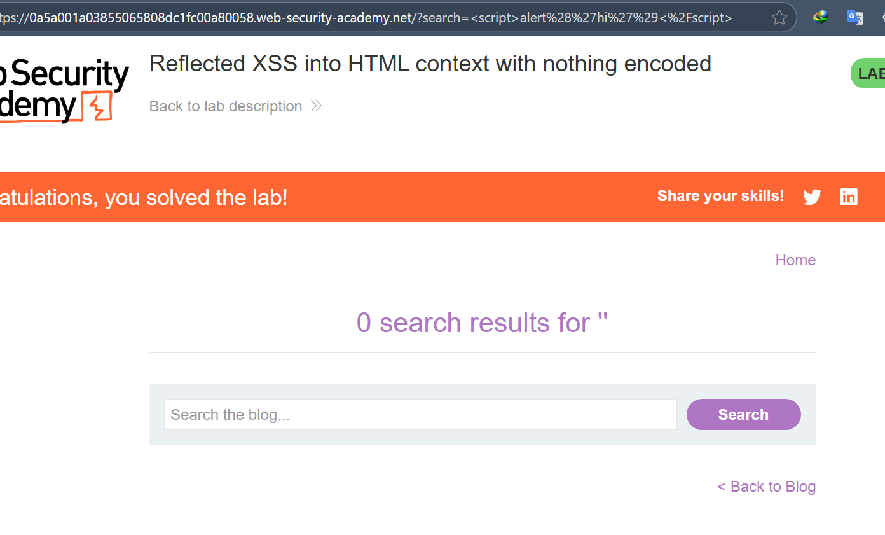
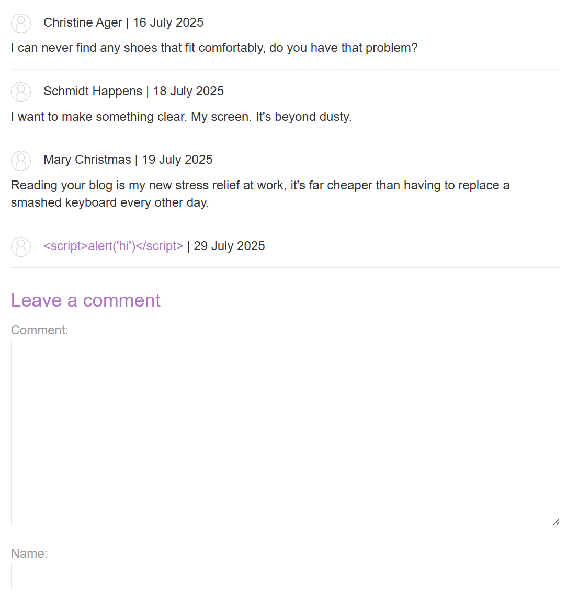
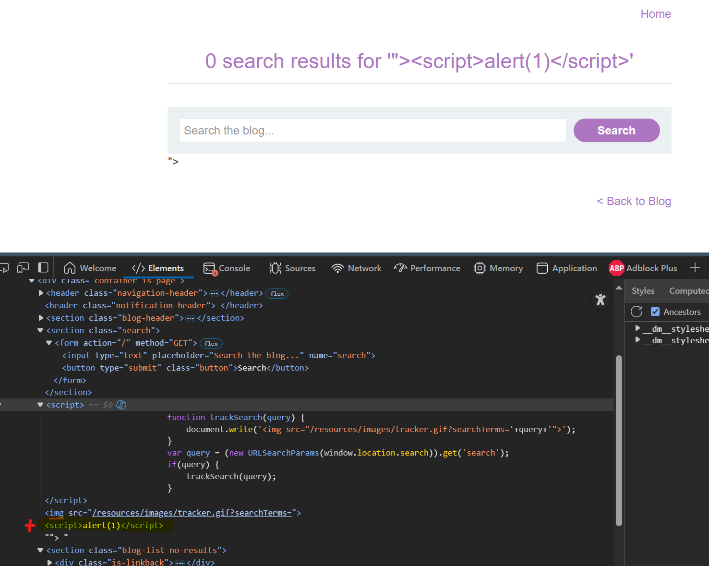
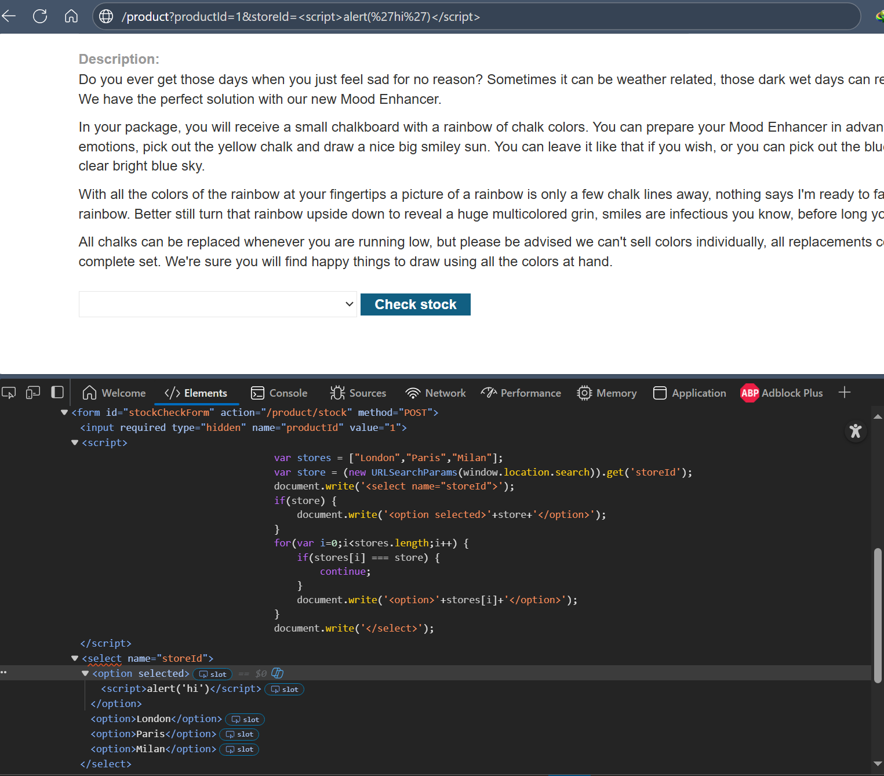
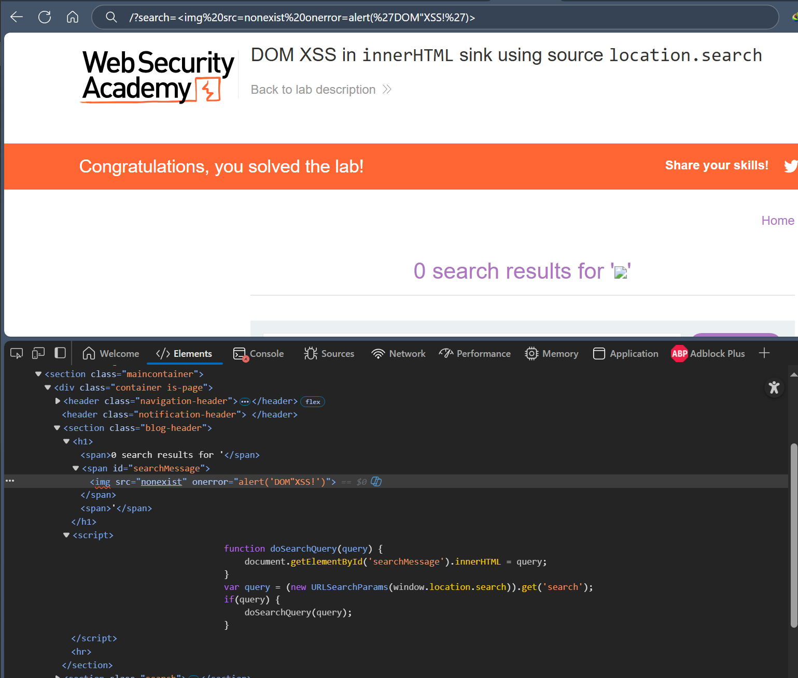
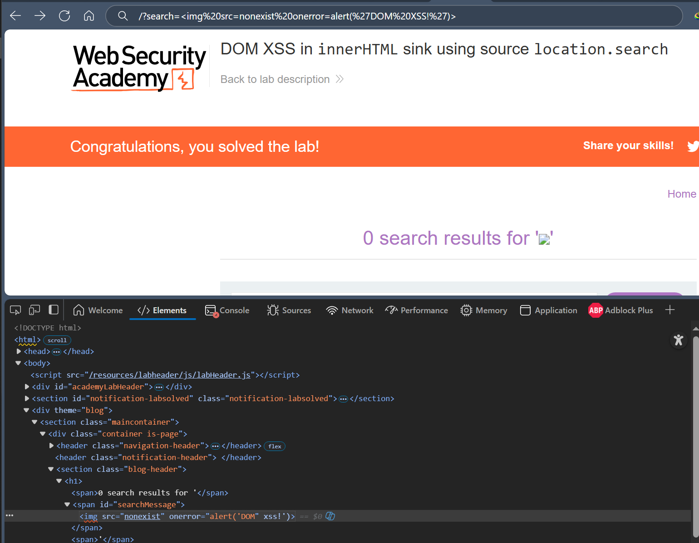

# Cross-Site Scripting (XSS) คืออะไร? 🔒

## XSS คือช่องโหว่ที่อันตรายมาก

**Cross-Site Scripting** หรือที่เรียกสั้นๆ ว่า **XSS** เป็นช่องโหว่ด้านความปลอดภัยในเว็บไซต์ที่ให้แฮกเกอร์สามารถแทรกโค้ด JavaScript ที่เป็นอันตรายเข้าไปในเว็บไซต์ได้

ลองนึกภาพง่ายๆ นะ - เหมือนกับว่าคนร้ายแอบใส่ยาพิษลงในน้ำดื่มของร้านอาหาร แล้วใครที่มาดื่มก็จะได้รับผลกระทบ

## XSS ทำงานยังไง? 🤔

เมื่อเราเข้าเว็บไซต์ที่มีช่องโหว่ XSS แฮกเกอร์จะสามารถ:
- **แอบอ้างตัวเป็นเรา** บนเว็บไซต์นั้น
- **ทำทุกอย่างที่เราทำได้** เหมือนกับเข้าใช้บัญชีของเราเลย
- **ขโมยข้อมูลส่วนตัว** รวมถึงรหัสผ่านด้วย
- **เปลี่ยนแปลงหน้าเว็บ** ให้ดูแปลกๆ

## มี 3 แบบหลักๆ

### 1. **Reflected XSS** (แบบสะท้อนกลับ)
- โค้ดอันตรายมาจากลิงก์ที่แฮกเกอร์ส่งให้เรา
- เหมือนกับส่งจดหมายที่มีระเบิดมาให้

**ตัวอย่าง:**
```
https://example.com/search?q=<script>alert('โดนแฮก!')</script>
```

### 2. **Stored XSS** (แบบเก็บไว้)
- โค้ดอันตรายถูกเก็บไว้ในฐานข้อมูลของเว็บไซต์
- เหมือนกับวางระเบิดเวลาไว้ในเว็บ

**ตัวอย่าง:** แฮกเกอร์โพสต์ความคิดเห็นที่มีโค้ดอันตราย ใครเข้ามาอ่านก็โดนหมด

### 3. **DOM-based XSS** (แบบ DOM)
- เกิดจากปัญหาในโค้ด JavaScript ของเว็บไซต์เอง
- เหมือนกับเว็บไซต์มีจุดอ่อนในตัวเอง

## อันตรายแค่ไหน? ⚠️

**ขึ้นอยู่กับประเภทเว็บไซต์:**
- **เว็บธรรมดา** = อันตรายน้อย
- **เว็บธนาคาร/อีเมล** = อันตรายมาก อาจโดนขโมยเงิน
- **เว็บของแอดมิน** = อันตรายสุดๆ แฮกเกอร์ควบคุมได้หมด

## จะป้องกันยังไง? 🛡️

### สำหรับผู้ใช้ทั่วไป:
- **อย่าคลิกลิงก์ต้องสงสัย** โดยเฉพาะที่มาจากอีเมลแปลกๆ
- **ใช้เบราว์เซอร์ที่อัพเดทแล้ว** เพราะมีระบบป้องกันในตัว
- **ระวังเว็บไซต์ที่ดูไม่น่าเชื่อถือ**

### สำหรับนักพัฒนา:
1. **กรองข้อมูลตั้งแต่เข้ามา** - ตรวจสอบทุกอย่างที่ผู้ใช้ส่งมา
2. **เข้ารหัสก่อนแสดงผล** - ทำให้โค้ดอันตรายไม่สามารถทำงานได้
3. **ใช้ Content Security Policy (CSP)** - เหมือนติดระบบกันขโมยเพิ่มอีกชั้น
4. **ใส่ Header ที่ถูกต้อง** - บอกเบราว์เซอร์ว่าจะแสดงข้อมูลยังไง

## สรุป 📝

XSS เป็นช่องโหว่ที่พบได้บ่อยมากในเว็บไซต์ แต่ถ้าเราระวังตัวและนักพัฒนาทำระบบป้องกันที่ดี ก็สามารถลดความเสี่ยงได้เยอะเลย

**จำไว้นะ:** อย่าเชื่อใจลิงก์แปลกๆ และใช้เว็บไซต์ที่น่าเชื่อถือเท่านั้น! 🔐

# Reflected XSS เจาะลึก 🎯

## Reflected XSS คืออะไร?

**Reflected XSS** เป็นประเภทหนึ่งของช่องโหว่ XSS ที่เกิดขึ้นเมื่อเว็บไซต์รับข้อมูลจากผู้ใช้แล้วเอาข้อมูลนั้นไปแสดงผลทันทีโดยไม่ได้ตรวจสอบหรือกรองก่อน

ลองจินตนาการง่ายๆ นะ - เหมือนกับเราพูดอะไรเข้าไปในไมโครโฟน แล้วเสียงก็ดังออกมาจากลำโพงทันที แต่ถ้าเราใส่เสียงแปลกๆ เข้าไป ก็จะมีเสียงแปลกๆ ออกมาด้วย

## ตัวอย่างที่เข้าใจง่าย 📝

สมมติเว็บไซต์มีระบบค้นหา:

**URL ปกติ:**
```
https://example.com/search?term=ของขวัญ
```

**หน้าเว็บจะแสดง:**
```html  
<p>คุณค้นหา: ของขวัญ</p>
```

แต่ถ้าแฮกเกอร์ใส่โค้ดเข้าไป:

**URL อันตราย:**
```
https://example.com/search?term=<script>alert('โดนแฮก!')</script>
```

**หน้าเว็บจะแสดง:**
```html
<p>คุณค้นหา: <script>alert('โดนแฮก!')</script></p>
```

เมื่อใครก็ตามคลิกลิงก์นี้ โค้ด JavaScript ก็จะทำงานในเบราว์เซอร์ของเขาทันที!

## ผลกระทบที่เกิดขึ้น ⚠️

เมื่อแฮกเกอร์ควบคุมโค้ดที่รันในเบราว์เซอร์ของเหยื่อได้ เขาจะสามารถ:

- **แอบทำทุกอย่างแทนเรา** - ส่งข้อความ, โอนเงิน, เปลี่ยนรหัสผ่าน
- **ดูข้อมูลทั้งหมดที่เราเห็น** - อีเมล, ข้อมูลส่วนตัว, เอกสารสำคัญ  
- **แก้ไขข้อมูล** - เปลี่ยนโปรไฟล์, ลบข้อมูล
- **ส่งข้อความไปหาคนอื่นในนามของเรา** - หลอกเพื่อนๆ ต่อไป

## วิธีที่แฮกเกอร์หลอกให้เราคลิก 🎣

แฮกเกอร์จะส่งลิงก์อันตรายผ่าน:
- **อีเมล** - แกล้งเป็นธนาคารหรือเว็บไซต์ที่เราไว้ใจ
- **โซเชียลมีเดีย** - โพสต์ลิงก์น่าสนใจ
- **เว็บไซต์อื่น** - ฝังลิงก์ไว้ในเว็บที่พวกเขาควบคุม
- **แชท/ข้อความ** - ส่งมาทาง LINE, Facebook Messenger

## Reflected XSS vs Stored XSS 🤔

| **Reflected XSS** | **Stored XSS** |
|-------------------|-----------------|
| โค้ดอันตรายอยู่ในลิงก์ | โค้ดอันตรายถูกเก็บไว้ในเซิร์ฟเวอร์ |
| ต้องหลอกให้คลิกลิงก์ | ใครเข้าเว็บก็โดนอัตโนมัติ |
| อันตรายน้อยกว่า | อันตรายมากกว่า |

## วิธีตรวจหาช่องโหว่ 🔍

### สำหรับนักพัฒนา:

1. **ทดสอบทุกจุดที่รับข้อมูล**
   - ช่องค้นหา, ฟอร์มต่างๆ
   - Parameter ใน URL
   - HTTP Header

2. **ส่งข้อมูลทดสอบ**
   - ใส่ข้อความสุ่ม เช่น `abc12345`
   - ดูว่าข้อความนี้ไปปรากฏที่ไหนในหน้าเว็บ

3. **ทดสอบโค้ด JavaScript**
   - ลองใส่ `<script>alert('test')</script>`  
   - ดูว่าเบราว์เซอร์แสดง popup หรือไม่

4. **ทดสอบในเบราว์เซอร์จริง**
   - อย่าเพิ่งใจแค่เครื่องมือทดสอบ
   - ลองเปิดในเบราว์เซอร์ดูจริงๆ

## วิธีป้องกัน 🛡️

### สำหรับผู้ใช้:
- **อย่าคลิกลิงก์น่าสงสัย** โดยเฉพาะที่มี `<script>` ใน URL
- **ดู URL ก่อนคลิก** ถ้าดูแปลกๆ อย่าเสี่ยง
- **ใช้เบราว์เซอร์ที่อัพเดท** มีระบบป้องกันในตัว

### สำหรับนักพัฒนา:
- **เข้ารหัสข้อมูลก่อนแสดงผล** - ทำให้ `<script>` กลายเป็นข้อความธรรมดา
- **ตรวจสอบและกรองข้อมูล** - ไม่ให้โค้ดอันตรายผ่านเข้ามา
- **ใช้ Content Security Policy** - เพิ่มชั้นการป้องกัน

## Self-XSS คืออะไร? 🤷‍♂️

**Self-XSS** เป็นแบบพิเศษที่แฮกเกอร์ต้องหลอกให้เหยื่อเอาโค้ดอันตรายไปวางเองในเบราว์เซอร์ 

**ตัวอย่าง:** หลอกให้ copy-paste โค้ดลงใน Console ของเบราว์เซอร์ โดยอ้างว่าจะได้สิทธิพิเศษ

**ข้อควรระวัง:** อย่าเอาโค้ดแปลกๆ ไป paste ใน Console ของเบราว์เซอร์เด็ดขาด!

## สรุป 📋

Reflected XSS เป็นช่องโหว่ที่พบได้บ่อย แต่ป้องกันได้ไม่ยาก สำคัญที่สุดคือ:

- **ผู้ใช้:** ระวังลิงก์แปลกๆ 
- **นักพัฒนา:** เข้ารหัสข้อมูลก่อนแสดงผล
- **ทุกคน:** ใช้เครื่องมือที่อัพเดทแล้ว

จำไว้นะ - ความปลอดภัยในโลกดิจิทัลต้องใช้ความระมัดระวังของทุกฝ่าย! 🔐



# Stored XSS เจาะลึก 💾

## Stored XSS คืออะไร?

**Stored XSS** (หรือที่เรียกว่า **Persistent XSS**) เป็นช่องโหว่ที่อันตรายกว่า Reflected XSS เพราะโค้ดอันตรายจะถูก**เก็บไว้ในฐานข้อมูล**ของเว็บไซต์ แล้วแสดงให้ผู้ใช้ทุกคนที่เข้ามาดูเห็น

ลองจินตนาการว่า เหมือนกับแฮกเกอร์วางระเบิดเวลาไว้ในร้านอาหาร แล้วใครที่เข้าไปกินข้าวก็จะเจอระเบิดนั้นโดยไม่รู้ตัว

## ตัวอย่างที่เข้าใจง่าย 📝

สมมติเว็บบล็อกมีระบบคอมเมนต์:

### ขั้นตอนการโจมตี:

**1. แฮกเกอร์โพสต์คอมเมนต์อันตราย:**
```http
POST /post/comment HTTP/1.1
comment=<script>/* โค้ดอันตราย */</script>&name=แฮกเกอร์
```

**2. เว็บไซต์เก็บคอมเมนต์นี้ไว้ในฐานข้อมูล**

**3. เมื่อใครมาอ่านบล็อก จะเห็น:**
```html
<p><script>/* โค้ดอันตราย */</script></p>
```

**4. โค้ด JavaScript ทำงานในเบราว์เซอร์ของทุกคนที่เข้ามาอ่าน! 💥**

## ความแตกต่างจาก Reflected XSS 🆚

| **Reflected XSS** | **Stored XSS** |
|-------------------|-----------------|
| โค้ดอยู่ในลิงก์ | โค้ดเก็บไว้ในเซิร์ฟเวอร์ |
| ต้องหลอกให้คลิก | ทุกคนโดนอัตโนมัติ |
| โจมตีครั้งเดียว | โจมตีต่อเนื่อง |
| เหยื่อน้อย | เหยื่อเยอะ |
| อันตรายปานกลาง | **อันตรายมาก** |

## ทำไม Stored XSS ถึงอันตรายกว่า? ⚠️

### 1. **ไม่ต้องหลอกใคร**
- แฮกเกอร์แค่โพสต์โค้ดอันตรายหนึ่งครั้ง
- ใครมาอ่านก็โดนหมด ไม่ต้องส่งลิงก์หลอก

### 2. **ผู้ใช้ที่ล็อกอินโดนแน่นอน**
- คนที่มาอ่านคอมเมนต์มักจะล็อกอินอยู่แล้ว
- แฮกเกอร์ได้ข้อมูลสำคัญง่ายขึ้น

### 3. **โจมตีได้ต่อเนื่อง**
- โค้ดอันตรายอยู่ในเว็บนานๆ
- ทุกคนที่เข้ามาในอนาคตก็ยังโดน

## จุดที่มักเจอ Stored XSS 🎯

### Entry Points (จุดที่ใส่ข้อมูล):
- **ฟอร์มคอมเมนต์** - บล็อก, ฟอรั่ม
- **โปรไฟล์ผู้ใช้** - ชื่อ, รูปโปรไฟล์, ข้อมูลส่วนตัว  
- **อัพโหลดไฟล์** - ชื่อไฟล์, คำอธิบาย
- **ข้อความแชท** - ระบบแชทในเว็บ
- **รีวิวสินค้า** - เว็บอีคอมเมิร์ซ
- **ฟีดโซเชียล** - โพสต์, การแชร์

### Exit Points (จุดที่แสดงข้อมูล):
- หน้าแสดงคอมเมนต์
- หน้าโปรไฟล์
- ผลการค้นหา
- แดชบอร์ดแอดมิน
- รายงานระบบ

## วิธีตรวจหาช่องโหว่ 🔍

### ขั้นตอนการทดสอบ:

**1. หาจุดที่รับข้อมูล**
- ลองกรอกข้อมูลทดสอบ เช่น `TEST123XYZ`
- ดูว่าข้อมูลนี้ไปปรากฏที่ไหนบ้าง

**2. ตรวจสอบว่าข้อมูลถูกเก็บจริงๆ**
- ล็อกเอาต์แล้วล็อกอินใหม่
- เปิดหน้าเว็บในเบราว์เซอร์อื่น
- ถ้าข้อมูลยังเห็น = ถูกเก็บไว้แล้ว

**3. ทดสอบโค้ด XSS**
- ลองใส่ `<script>alert('XSS Test')</script>`
- ดูว่าเบราว์เซอร์แสดง popup หรือไม่

**4. ทดสอบในบริบทต่างๆ**
- ใส่โค้ดในช่องต่างๆ (ชื่อ, อีเมล, คอมเมนต์)
- บางครั้งช่องที่ดูไม่เป็นอันตรายกลับมีช่องโหว่

## ตัวอย่าง Payload ที่ใช้ทดสอบ 🧪

```html
<!-- พื้นฐาน -->
<script>alert('XSS')</script>

<!-- ในกรณีที่กรอง script -->

<svg onload=alert('XSS')>

<!-- ใน attribute -->
" onmouseover="alert('XSS')"

<!-- ใน JavaScript -->
';alert('XSS');//
```

## วิธีป้องกัน 🛡️

### สำหรับนักพัฒนา:

**1. Input Validation (ตรวจสอบข้อมูลที่เข้ามา)**
- กรองเครื่องหมายพิเศษ `< > " ' &`
- ใช้ whitelist แทน blacklist
- ตรวจสอบประเภทข้อมูล (ตัวเลข, อีเมล)

**2. Output Encoding (เข้ารหัสก่อนแสดงผล)**
```php
// PHP
echo htmlspecialchars($userInput, ENT_QUOTES, 'UTF-8');

// JavaScript  
element.textContent = userInput; // ปลอดภัยกว่า innerHTML
```

**3. Content Security Policy (CSP)**
```html
<meta http-equiv="Content-Security-Policy" 
      content="script-src 'self'; object-src 'none';">
```

**4. ใช้ Library ที่เชื่อถือได้**
- DOMPurify สำหรับทำความสะอาด HTML
- Template engine ที่มี auto-escaping

### สำหรับผู้ใช้:
- **ระวังเว็บไซต์ที่ดูไม่น่าเชื่อถือ**
- **อัพเดทเบราว์เซอร์เป็นประจำ**
- **ใช้ Ad Blocker** - ป้องกัน malicious ads
- **ออกจากระบบเมื่อใช้งานเสร็จ** - ลดผลกระทบ

## ผลกระทบในชีวิตจริง 💀

### กรณีศึกษา:
- **เว็บโซเชียล:** แฮกเกอร์โพสต์ข้อความที่มีโค้ดอันตราย ทุกคนที่เห็นโดนขโมยบัญชี
- **เว็บขายของ:** ใส่โค้ดในรีวิวสินค้า ลูกค้าที่มาดูโดนขโมยข้อมูลบัตรเครดิต
- **ฟอรั่ม:** โพสต์ที่มีโค้ดอันตราย สมาชิกทุกคนที่เข้ามาอ่านโดนควบคุมบัญชี

## สรุป 📋

**Stored XSS เป็นช่องโหว่ที่อันตรายที่สุด** เพราะ:

✅ **เหยื่อเยอะ** - ใครเข้าเว็บก็โดน  
✅ **ไม่ต้องหลอก** - โค้ดอยู่ในเว็บแล้ว  
✅ **ติดทนนาน** - จนกว่าจะมีคนมาแก้ไข  
✅ **ผู้ใช้มักล็อกอิน** - ได้ข้อมูลสำคัญง่าย  

**การป้องกัน:**
- **นักพัฒนา:** เข้ารหัสทุกอย่างก่อนแสดงผล
- **ผู้ใช้:** ระวังเว็บไซต์แปลกๆ และอัพเดทเบราว์เซอร์

จำไว้ - ความปลอดภัยในโลกดิจิทัลไม่มีวันจบ ต้องระวังตัวตลอดเวลา! 🔐



# DOM-based XSS เจาะลึก 🎯

## DOM-based XSS คืออะไร?

**DOM-based XSS** เป็นช่องโหว่ที่เกิดขึ้นฝั่ง**ไคลเอนต์** (เบราว์เซอร์) เมื่อ JavaScript อ่านข้อมูลจากแหล่งที่แฮกเกอร์ควบคุมได้ (เช่น URL) แล้วนำไปใส่ในส่วนที่อันตราย (เช่น `innerHTML`) โดยไม่ได้กรองก่อน

คิดง่ายๆ นะ - เหมือนกับเรามีหุ่นยนต์ที่อ่านคำสั่งจากป้าย แล้วทำตามโดยไม่คิด ถ้าแฮกเกอร์เปลี่ยนป้ายเป็น "ทำลายทุกอย่าง" หุ่นยนต์ก็จะทำตาม!

## ความแตกต่างจาก XSS แบบอื่น 🔄

| | **Reflected XSS** | **Stored XSS** | **DOM XSS** |
|---|---|---|---|
| **ที่เกิด** | เซิร์ฟเวอร์ | เซิร์ฟเวอร์ | เบราว์เซอร์ |
| **ข้อมูลผ่าน** | HTTP Request/Response | ฐานข้อมูล | JavaScript ในเบราว์เซอร์ |
| **ตรวจจับ** | ง่าย | ง่าย | **ยาก** |

## แนวคิด Source และ Sink 🔄

### Sources (แหล่งข้อมูล):
```javascript
// ข้อมูลที่แฮกเกอร์ควบคุมได้
window.location.search    // ?param=value
window.location.hash      // #fragment  
window.location.href      // URL เต็ม
document.referrer         // หน้าที่มาก่อน
document.cookie           // คุกกี้
localStorage/sessionStorage
```

### Sinks (จุดอันตราย):
```javascript
// ฟังก์ชันที่ทำให้โค้ดทำงาน
document.write()          // เขียนลง HTML
element.innerHTML         // ใส่ HTML เข้า element
element.outerHTML
eval()                    // รันโค้ด JavaScript
setTimeout()              // รันโค้ดหลังจากเวลาผ่าน
setInterval()
```

## ตัวอย่างพื้นฐาน 📝

### ตัวอย่างที่ 1: document.write
```javascript
// โค้ดในหน้าเว็บ
var search = new URLSearchParams(window.location.search).get('q');
document.write('<p>คุณค้นหา: ' + search + '</p>');
```

**URL อันตราย:**
```
https://example.com/search.html?q=<script>alert('DOM XSS!')</script>
```

**ผลลัพธ์:**
```html
<p>คุณค้นหา: <script>alert('DOM XSS!')</script></p>
```

### ตัวอย่างที่ 2: innerHTML
```javascript
// โค้ดในหน้าเว็บ
var name = window.location.hash.substring(1);
document.getElementById('welcome').innerHTML = 'สวัสดี ' + name;
```

**URL อันตราย:**
```
https://example.com/profile.html#
```

## วิธีทดสอบหาช่องโหว่ 🔍

### 1. ทดสอบ HTML Sinks

**ขั้นตอน:**
1. **ใส่ข้อความทดสอบใน URL:**
   ```
   https://example.com/page.html?test=ABC123XYZ
   ```

2. **เปิด Developer Tools (F12)**
   - กด `Ctrl+F` (Windows) หรือ `Cmd+F` (Mac)
   - ค้นหา `ABC123XYZ` ใน DOM
   - **หมายเหตุ:** อย่าใช้ "View Source" เพราะไม่เห็นการเปลี่ยนแปลงจาก JavaScript

3. **ดูบริบทที่ข้อความปรากฏ:**
   ```html
   <!-- ถ้าอยู่ใน attribute -->
   <input value="ABC123XYZ">
   
   <!-- ถ้าอยู่ใน text -->
   <p>ABC123XYZ</p>
   ```

4. **ทดสอบ Payload ตามบริบท:**
   ```javascript
   // ใน attribute
   ?test=" onmouseover="alert('XSS')"
   
   // ใน HTML
   ?test=
   ```

### 2. ทดสอบ JavaScript Execution Sinks

**ขั้นตอน:**
1. **หา Source ในโค้ด JavaScript:**
   - กด `Ctrl+Shift+F` (Windows) หรือ `Cmd+Alt+F` (Mac)
   - ค้นหา `location.search`, `location.hash` ฯลฯ

2. **ใช้ Debugger ติดตาม:**
   - วาง breakpoint ที่จุดที่อ่าน source
   - ติดตามว่าข้อมูลไปถึง sink ยังไง

3. **ทดสอบ Payload:**
   ```javascript
   // ถ้าไปถึง eval()
   ?param=';alert('XSS');//
   
   // ถ้าไปถึง setTimeout()
   ?param=alert('XSS')
   ```

## Payload ตัวอย่าง 🧪

### สำหรับ document.write:
```html
<script>alert(document.domain)</script>
```

### สำหรับ innerHTML:
```html

<svg onload=alert(document.domain)>
<iframe src=javascript:alert(document.domain)>
```

### สำหรับ JavaScript:
```javascript
';alert(document.domain);//
";alert(document.domain);//
```

## DOM XSS ใน Framework 🛠️

### jQuery
```javascript
// ช่องโหว่ใน attr()
$('#link').attr('href', new URLSearchParams(location.search).get('url'));
// โจมตี: ?url=javascript:alert(document.domain)

// ช่องโหว่ใน $() selector
$(location.hash).hide();
// โจมตี: #
```

### AngularJS
```html
<!-- ถ้ามี ng-app -->
<div ng-app>
    {{constructor.constructor('alert(1)')()}}
</div>
```

## DOM XSS แบบผสม 🔗

### Reflected DOM XSS:
```javascript
// เซิร์ฟเวอร์ส่ง URL parameter มาใน JavaScript
var data = "<?php echo $_GET['data']; ?>";
document.getElementById('output').innerHTML = data;
```

### Stored DOM XSS:
```javascript
// ข้อมูลจากฐานข้อมูล
var comment = getCommentFromServer();
document.getElementById('comment').innerHTML = comment.text;
```

## วิธีป้องกัน 🛡️

### 1. หลีกเลี่ยง Dangerous Sinks
```javascript
// อันตราย ❌
element.innerHTML = userInput;

// ปลอดภัย ✅  
element.textContent = userInput;
```

### 2. เข้ารหัสข้อมูล
```javascript
function htmlEncode(str) {
    return str.replace(/[&<>"']/g, function(match) {
        return {
            '&': '&amp;',
            '<': '&lt;',
            '>': '&gt;',
            '"': '&quot;',
            "'": '&#x27;'
        }[match];
    });
}

element.innerHTML = htmlEncode(userInput);
```

### 3. ใช้ Content Security Policy
```html
<meta http-equiv="Content-Security-Policy" 
      content="script-src 'self'; object-src 'none';">
```

### 4. Validate Input
```javascript
// ตรวจสอบก่อนใช้
function isValidInput(input) {
    // อนุญาตแค่ตัวอักษรและตัวเลข
    return /^[a-zA-Z0-9\s]+$/.test(input);
}

if (isValidInput(userInput)) {
    element.textContent = userInput;
}
```

## เครื่องมือช่วยทดสอบ 🔧

### DOM Invader (ใน Burp Suite):
- หาและทดสอบ DOM XSS อัตโนมัติ
- แสดง source และ sink ที่เป็นไปได้
- ลดเวลาการทดสอบแบบ manual

### Browser Developer Tools:
- **Console** - ทดสอบโค้ด JavaScript
- **Sources** - ดู source code และวาง breakpoint
- **Elements** - ตรวจสอบ DOM

## สิ่งที่ควรระวัง ⚠️

### 1. URL Encoding:
- Chrome, Firefox, Safari จะ encode `location.search` และ `location.hash`
- IE11/Edge เก่าจะไม่ encode
- ถ้า encode แล้วอาจโจมตีไม่ได้

### 2. Modern Browser Protection:
- เบราว์เซอร์ใหม่มีการป้องกันบาง sink
- เช่น `innerHTML` ไม่รัน `<script>` tag

### 3. Framework Protection:
- jQuery ใหม่ป้องกัน HTML injection ใน selector ที่ขึ้นต้นด้วย `#`
- แต่ยังอาจมีช่องโหว่อื่นๆ

## สรุป 📋

**DOM-based XSS มีความพิเศษ:**

✅ **เกิดฝั่งไคลเอนต์** - ไม่ผ่านเซิร์ฟเวอร์  
✅ **ยากต่อการตรวจจับ** - ต้องดู JavaScript  
✅ **หลากหลาย Source/Sink** - มีจุดเสี่ยงเยอะ  
✅ **Framework ก็มีช่องโหว่** - jQuery, AngularJS  

**การป้องกัน:**
- หลีกเลี่ยง dangerous sinks เช่น `innerHTML`, `eval()`
- ใช้ `textContent` แทน `innerHTML` 
- เข้ารหัสข้อมูลก่อนใช้
- ตรวจสอบ input validation

**สำหรับนักพัฒนา:** ระวังทุกครั้งที่ใช้ข้อมูลจาก URL หรือ user input ใน JavaScript!

จำไว้ - DOM XSS ซ่อนตัวอยู่ใน JavaScript หากไม่ระวังจะพลาดง่ายมาก! 🔐









 `alert()` **ห้ามมีช่องว่าง (space)** ระหว่าง `alert` กับวงเล็บเปิด `(` เด็ดขาด! 

## ❌ ผิด - มีช่องว่าง
```javascript
alert ('Hello World');     // ❌ Error!
alert  ('XSS Test');       // ❌ Error!
alert( 'DOM XSS' );        // ❌ Error! (space หลัง alert)
```

## ✅ ถูก - ไม่มีช่องว่าง
```javascript
alert('Hello World');      // ✅ ทำงาน
alert("XSS Test");         // ✅ ทำงาน  
alert(document.domain);    // ✅ ทำงาน
alert(1);                  // ✅ ทำงาน
```

## ทำไมถึงห้ามมีช่องว่าง? 🤔

ในภาษา JavaScript (และภาษาโปรแกรมส่วนใหญ่) การเรียกใช้ฟังก์ชัน **ต้องเขียนติดกัน** ระหว่างชื่อฟังก์ชันกับวงเล็บ

```javascript
// Syntax ที่ถูกต้อง
functionName(parameters)

// ถ้ามีช่องว่าง JavaScript จะเข้าใจผิดว่า
// - alert เป็นตัวแปร
// - ('hello') เป็นการจัดกลุ่ม expression แยกต่างหาก
```

## ในการทดสอบ XSS 🎯

เวลาเขียน payload ต้องระวังมาก:

```html
<!-- ❌ ใช้ไม่ได้ -->
<script>alert ('XSS')</script>


<!-- ✅ ใช้ได้ -->
<script>alert('XSS')</script>

```

## ข้อยกเว้น - ช่องว่างที่อนุญาต ✅

```javascript
// ภายในวงเล็บมีช่องว่างได้
alert( 'hello' );          // ✅ ทำงาน
alert(  'hello'  );        // ✅ ทำงาน

// ก่อนหน้าชื่อฟังก์ชัน
    alert('hello');        // ✅ ทำงาน (indentation)

// หลังจาก ;  
alert('hello'); alert('world');  // ✅ ทำงาน
```

## ตัวอย่างอื่นๆ ที่เหมือนกัน 📝

```javascript
// ❌ ผิดหมด
console.log ('test');
document.write ('hello');  
setTimeout ('code', 1000);
eval ('1+1');

// ✅ ถูกหมด
console.log('test');
document.write('hello');
setTimeout('code', 1000);
eval('1+1');
```

**สรุป:** ไม่ว่าจะเป็น `alert()`, `console.log()`, `eval()` หรือฟังก์ชันไหนก็แล้วแต่ **ห้ามมีช่องว่างระหว่างชื่อกับวงเล็บเปิดเด็ดขาด!** 

ขอบคุณที่ถามนะครับ เพราะนี่เป็นข้อผิดพลาดที่มือใหม่มักทำกัน! 😊